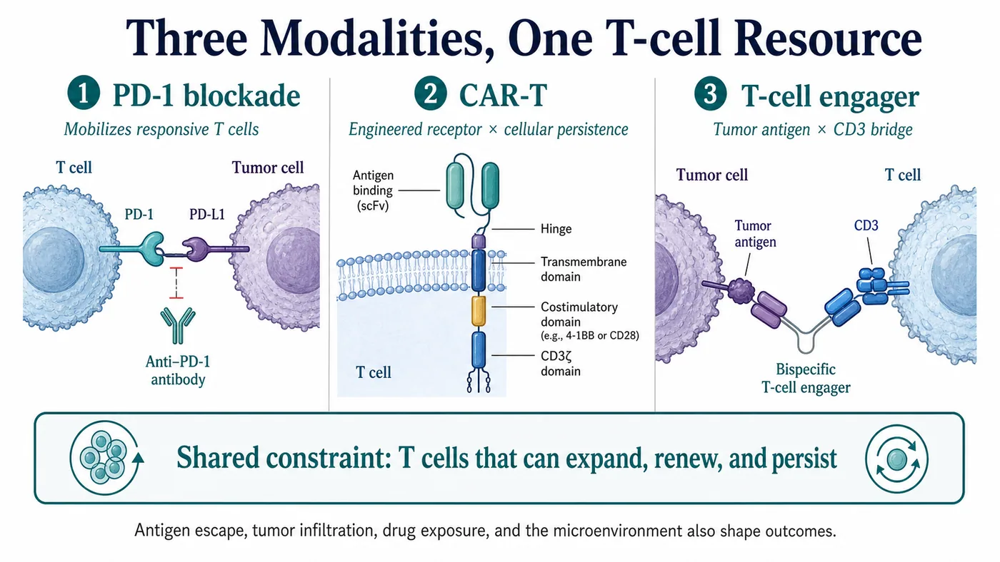
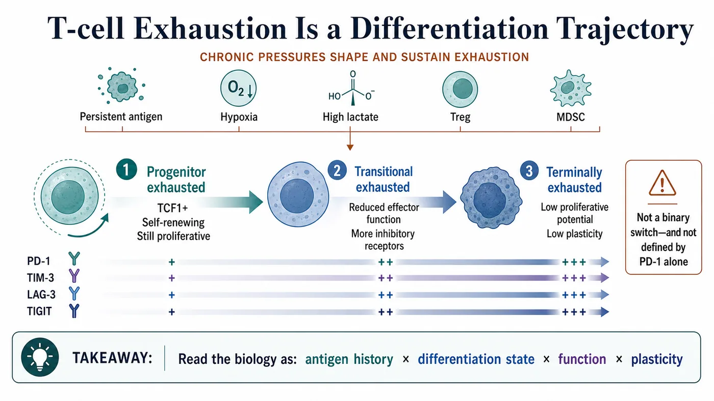
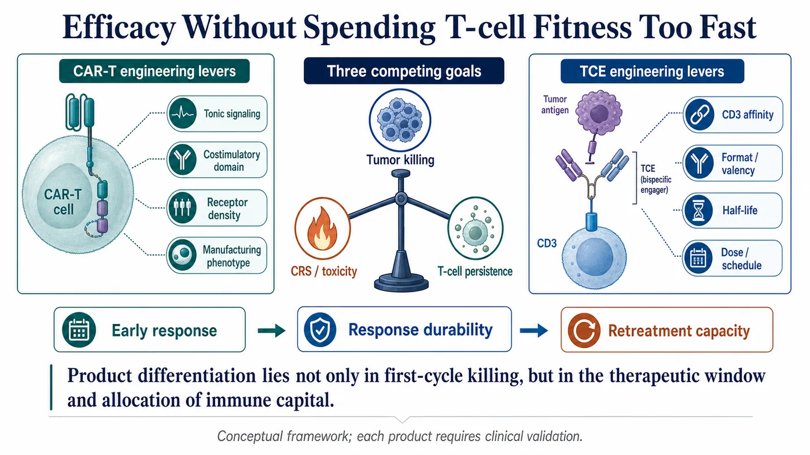
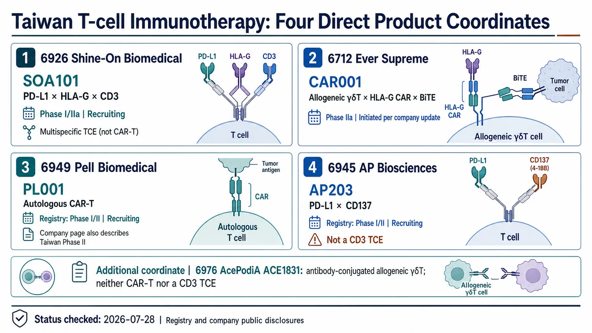

# T-cell Exhaustion Across PD-1, CAR-T and TCE: Immunotherapy's Next Contest Is Durability

A tumor cell being killed makes for a striking image.

The harder question is what remains on day 30, day 90, and beyond: how many T cells can still expand, find the tumor, and complete another round of killing?

PD-1 antibodies, CAR-T cells, and T-cell engagers, or TCEs, take three different routes. All three ultimately rely on the functional state, differentiation quality, and persistence of T cells.

1. PD-1 blockade releases an inhibitory signal and reactivates T cells that still retain the capacity to respond.
2. CAR-T therapy removes T cells, engineers them with a tumor-recognition receptor, and returns them to the patient.
3. A TCE binds a tumor antigen at one end and CD3 at the other, drawing the patient's existing T cells into close proximity with the tumor.

Drugnews' central judgment is that these modalities depend on the same underlying asset: a pool of T cells with sustained proliferative capacity. The next round of competition in immunotherapy will be decided by which product can preserve this "immune capital" rather than spending it all on the first day.

This does not mean that every treatment failure should be attributed to exhaustion. Antigen loss, abnormal antigen presentation, poor tumor infiltration, inadequate drug exposure, and alternative escape pathways can all stop a response. The value of an exhaustion framework is that it changes how the data are read. Beyond asking how much the tumor shrank, investors and developers should ask which T-cell population performed the killing, whether that population can be replenished, and how long its function lasted.

Similar early response rates do not imply similar durability. Distinguishing products requires response duration, cellular kinetics, and antigen status at relapse to be examined together. A single scan can show that a tumor became smaller; it cannot show which T-cell population sustained that effect.

## 01 | Exhaustion Is Not Simply Fatigue; It Is a Differentiation Trajectory

When a tumor persists, antigen stimulation does not disappear after one immune response. T cells repeatedly encounter antigen while also facing hypoxia, nutrient deprivation, high lactate, inhibitory cytokines, regulatory T cells, and myeloid-derived suppressor cells. Their function changes progressively under these pressures.

Common features include reduced proliferative capacity, altered secretion of IL-2, TNF, and IFN-gamma, and co-expression of inhibitory receptors such as PD-1, LAG-3, TIM-3, and TIGIT. The underlying biology includes TOX-associated exhaustion programs, epigenetic remodeling, and metabolic reprogramming. TCF1 is frequently used to identify a progenitor-like population that retains self-renewal capacity.[1][2]

Exhaustion, however, is not one uniform endpoint and cannot be diagnosed from one marker.

The same tumor can contain progenitor exhausted T cells that retain proliferative potential and more deeply exhausted, terminal populations. The former often express TCF1, can self-renew, and can generate downstream effector cells. The latter have less proliferative potential and more fixed functional and epigenetic states.

That distinction matters. The clinical reality is not an army aging in synchrony. It is a mixed cellular reservoir containing a renewable reserve, cells being consumed, and cells that are becoming increasingly difficult to replenish.

Exhaustion is not necessarily a biological error message. When antigen persists, reducing some effector functions can limit uncontrolled immune injury. The trade-off is that tumors can exploit this regulatory state and hold cytotoxic activity below the level required for disease clearance. This is why researchers should avoid describing cells only as "young" or "old." Antigen history, differentiation position, function, and plasticity need to be read together.[1]

The sampling site changes the answer as well. Peripheral blood is easy to collect repeatedly and useful for tracking numbers and kinetics. Tumor tissue is required to determine whether cells actually enter the lesion, which cells they are near, and how intense local inhibitory signals are. A single pretreatment blood draw and one PD-1 measurement cannot characterize the full intratumoral T-cell reservoir.

## 02 | PD-1 Releases the Brake, but the Remaining Engine Still Matters

A 2016 Nature study identified a TCF1-positive progenitor exhausted CD8 T-cell population in a chronic infection model. After PD-1 blockade, the major proliferative burst came from this self-renewing population, not from the restoration of every PD-1-positive T cell.[2]

A Science study published the same year blocked the PD-1/PD-L1 axis in a chronic LCMV mouse model. It found that the epigenetic architecture of exhausted T cells was relatively stable. Treatment could improve some functions temporarily, but it did not fully reset deeply exhausted cells into conventional memory T cells. When antigenic pressure persisted, dysfunction could recur.[3]

High PD-1 expression therefore cannot be translated directly into either "definitely exhausted" or "definitely sensitive to a PD-1 antibody." PD-1 is also expressed on activated T cells. What matters is its combination with TCF1, TIM-3, CD39, tumor specificity, spatial location, and functional state.

This helps explain a clinical contrast in checkpoint therapy. Two patients may both have visible T cells and visible PD-1, yet possess very different reserves of cells that can still be mobilized.

No single biomarker can resolve the whole problem. Response also depends on antigen presentation, tumor infiltration, the tumor microenvironment, tumor burden, and other resistance mechanisms.

The clinically important question is where a response comes from. Tumor shrinkage after treatment may reflect reinvigoration of cells already inside the tumor, or the recruitment of new clones from the periphery. Subsequent progression can also arise through several routes: the proliferative reservoir may be depleted, the tumor may lose antigen, or the lesion may develop a new exclusionary environment. Calling every case of acquired resistance "exhaustion" risks selecting the wrong combination strategy.

Good translational design therefore requires paired, longitudinal sampling. Baseline samples define the starting reservoir. On-treatment samples show whether particular clones expand. Samples at progression reveal whether the cells remain present and whether antigen has been retained. Only that timeline can distinguish a brake being reapplied from a change in the vehicle, the road, or the destination.

## 03 | CAR-T Exhaustion Risk May Be Engineered Before Infusion

CAR-T therapy has a clear advantage: tumor-recognition capacity is installed directly into the T cell. Its limitation arises from the same intervention. Receptor architecture, signaling intensity, and manufacturing can determine how far the cell will travel before it ever enters the patient.

A 2015 Nature Medicine study showed that some CARs aggregate and generate persistent, antigen-independent activity known as tonic signaling. T cells were repeatedly stimulated during ex vivo expansion, expressed more PD-1, LAG-3, and TIM-3, and subsequently showed impaired killing and in vivo persistence.[4]

In the particular models used in that study, CD28 costimulation aggravated exhaustion caused by tonic signaling, while 4-1BB alleviated it. That finding cannot be simplified into a claim that every 4-1BB CAR is superior to every CD28 CAR. The antigen, antibody fragment, hinge, transmembrane domain, receptor density, and manufacturing process all influence the result. Each product still has to be validated on its own data.

CAR-T development should therefore not be judged only by how quickly the first round of killing occurs.

- Does the receptor aggregate without antigen?
- How many stem-memory or central-memory T cells remain at the end of manufacturing?
- Can the product expand and persist after infusion, and retain function when it encounters antigen again?

These questions are directly connected to the long clinical tail. Strong short-term killing in vitro does not guarantee durable activity in vivo.

The number of viable cells is only one component of release testing. Starting material, culture duration, cytokine conditions, and expansion pressure can all change the final differentiation composition. Memory phenotype, exhaustion markers, metabolic state, and polyfunctionality may be useful research characterizations, but not all are statutory release specifications. Clinical studies have associated characteristics of the preinfusion product with subsequent response, but those findings come from particular diseases and products and cannot be converted into universal pass-fail thresholds.[17] When a company claims that a shorter process or a more stem-like phenotype is an advantage, that claim still needs to be validated by batch consistency, in vivo expansion, and the durability of remission.

Clinically, cellular dysfunction also has to be separated from antigen escape. Declining CAR-T numbers, declining cellular function, and loss of the target antigen can all cause relapse, but they require different development responses. The first two may point toward cell quality, signaling design, or the microenvironment. Antigen loss may require dual targeting, sequential therapy, or another antigen strategy. The word "relapse" alone does not reveal where the product failed.

## 04 | A T-cell Engager Creates Proximity, but Excessive Signaling Has a Cost

A TCE does not require manufacturing a new batch of patient-specific cells. It uses the patient's existing T cells and brings them next to malignant cells through the CD3-binding arm.

That enables rapid killing, but it also makes the patient's baseline T-cell condition part of the efficacy equation. The same molecule can behave differently after multiple prior therapies, in a patient with low lymphocyte counts or impaired cellular function, or in a tumor with few usable T cells.

Tighter CD3 binding is not automatically better. A 2021 study spanning several tumor targets showed that tuning CD3 affinity simultaneously altered in vitro cytotoxicity, cytokine release, and in vivo biodistribution. This is a therapeutic-window problem, not a simple contest of signal strength.[5]

Dosing cadence matters too. A 2022 Blood study observed declining T-cell function during continuous blinatumomab infusion in some patients with relapsed or refractory B-cell precursor acute lymphoblastic leukemia. The investigators then tested prolonged exposure using AMG 562 models. Continuous stimulation progressively induced exhaustion features, while treatment-free intervals restored portions of function, metabolism, and killing capacity.[6]

This work provides valuable proof of concept, but it cannot be generalized to every TCE. Molecular format, half-life, target, disease, dose, and regimen differ. The more precise question is how each product balances tumor killing, cytokine-release syndrome, exposure time, and T-cell durability.

Two timescales are often conflated. Cytokine-release syndrome is usually an early-treatment concern and can be managed through step-up dosing, pretreatment, and other strategies. Exhaustion concerns whether function can be maintained after repeated or sustained stimulation. Lower early cytokine release does not prove the absence of long-term exhaustion. A strong initial response does not prove that the usable T-cell reservoir will remain available.

Convincing TCE data place drug concentration, cytokines, T-cell activation and differentiation, and tumor response on one timeline. A first response scan cannot show whether a molecule is mobilizing the immune system efficiently or exchanging greater intensity for a short-lived peak. Dosing intervals, half-life, and functional recovery should therefore be interpreted together.

## 05 | Exhaustion Management Is Becoming Part of Product Design

"Reversing exhaustion" sounds like switching something off. The biology is better understood as layered management.

The first layer is the starting cellular reservoir. Research programs can examine CD8 T-cell differentiation, TCF1, the co-expression of PD-1, LAG-3, TIM-3, and TIGIT, and cytokine secretion, proliferation, and cytotoxic capacity. These measurements have not become a universal routine assay across cancers. No single panel should be marketed as a mature companion diagnostic without disease-specific validation.

The second layer is product engineering. CAR-T programs must manage tonic signaling, costimulatory architecture, receptor density, and manufacturing phenotype. TCE programs must manage CD3 affinity, molecular valency and format, half-life, dose, and schedule.

The third layer is clinical context. Tumor burden, the microenvironment, lymphocyte damage caused by prior therapy, and the availability of tumor-specific T cells can all change efficacy. Debulking disease before T-cell-directed therapy may be biologically rational in some settings, but it must be determined by each disease and clinical study. It is not a universal treatment recommendation.

The language of immunotherapy development will need to change accordingly. Saying that a product "activates T cells" is no longer enough. Developers should specify which population is activated, for how long, what phenotype remains, and which cells sustain the response.

Even the most sophisticated flow cytometer provides only a snapshot if a program samples one time point. Exhaustion is a process. The data should at least define the starting state, the peak, and the decline: which clones expand, which phenotypes disappear, and whether function returns after treatment interruption or lower stimulation. Longitudinal data are more expensive, but they move a project from a plausible mechanism to evidence that the product actually behaves as intended.

## 06 | Taiwan Has More Than One Relevant Company: Four Direct Product Coordinates

Focusing on Pell Biomedical alone would omit the clinical-stage TCE most directly related to this framework in Taiwan. A product-based view, rather than a loosely assembled "concept stock" list, yields at least four public-market coordinates.

The first is SOA101 from Shine-On Biomedical (6926). It is a nanobody-based PD-L1 x HLA-G x CD3 trispecific T-cell engager. The formal title of ClinicalTrials.gov study NCT07055594 identifies it as a Phase I/IIa trial with Recruiting status in advanced or metastatic solid tumors.[10][11] It is the most direct Taiwan TCE in this analysis: two arms engage immune checkpoints while the CD3 arm recruits T cells. The next evidence should show whether dose escalation, cytokine release, exposure, antitumor activity, and T-cell function can coexist within an acceptable therapeutic window.

The second is CAR001 from Ever Supreme (6712). NCT06150885 describes it as an allogeneic gamma-delta T-cell product combining an HLA-G CAR with a BiTE for relapsed or refractory solid tumors. On July 1, 2026, Ever Supreme reported that the program had passed its Phase I safety monitoring committee review, completed the first dose-escalation and safety stage, and formally initiated Phase IIa.[12][13] This product combines cellular engineering and an engager in one design. Repeat dosing, in vivo changes in CAR-positive gamma-delta T cells, and the balance between transient and sustained signaling deserve more attention than a generic CAR-T label.

The third is PL001 from Pell Biomedical (6949). The company's current product page says that the program has entered Phase II, while ClinicalTrials.gov NCT05326243 lists a Phase I/II study with Recruiting status in relapsed or refractory B-cell lymphoma.[7][9] The company and Taiwan Stock Exchange materials emphasize a short manufacturing process and a higher proportion of stem-memory T cells, but these remain process claims.[8] The essential validation is whether release specifications and batch consistency, post-infusion expansion, cellular persistence, and the proposed phenotypes translate into durable remission.

The fourth is AP203 from AP Biosciences (6945). AP203 is a PD-L1 x CD137 bispecific antibody without an anti-CD3 arm and is therefore not a CD3-directed TCE. According to the company product page and preclinical research, the design activates CD137 under PD-L1-binding and clustering conditions. Whether that conditional design reduces systemic activation risk in humans remains a clinical question. NCT05473156 is registered as a Recruiting Phase I/II study covering lung, head-and-neck, esophageal, and other solid tumors. The company page still describes a Taiwan Phase I program. Those sources reflect different fields and update points and should not be simplified into a claim that the company has already initiated Phase II.[14][15]

ACE1831 from AcePodiA-KY (6976) is another direct T-cell product coordinate. It uses antibody-cell conjugation technology to attach a CD20 antibody to allogeneic gamma-delta T cells. It is neither CAR-T nor a CD3 TCE and is better treated as an adjacent comparison rather than merged mechanistically with the four products above.[16]

None of these five companies should be described as having "proven reversal of T-cell exhaustion." They represent five different design questions: CD3 recruitment, a CAR/BiTE hybrid, CAR-T manufacturing, conditional costimulation, and antibody-armed allogeneic gamma-delta T cells. The clinical evidence still needs to establish whether effective cells remain, renew, and persist within an acceptable safety range.

They should not be placed in one efficacy ranking. SOA101 first needs to show that its three binding functions create a manageable window at human exposure. CAR001 must separate the persistence of the infused gamma-delta T cells from the contribution of immune cells recruited by the BiTE. PL001 must show that its manufacturing phenotype translates into in vivo expansion and durable remission. AP203 must show how much conditional CD137 costimulation adds inside the tumor and how much systemic risk remains. These evidence lines will mature on different timelines and cannot be interpreted with one early-news yardstick.

## 07 | Four Data Sets Investors Should Watch Next

Immunotherapy narratives are easily dominated by early response rates. Once exhaustion is connected to product value, at least four additional groups of data become essential.

- **Starting phenotype:** What proportions of the cell population are progenitor-like, stem-memory, or terminally differentiated?
- **Expansion and persistence:** What is the post-infusion or post-dose expansion peak, how long do cells remain detectable, and what function remains after re-encountering antigen?
- **Therapeutic window:** How do cytokine-release syndrome, neurotoxicity, dose interruption, and dosing cadence relate to stable long-term exposure?
- **Depth and durability of remission:** Does short-term killing translate into durable remission, progression-free survival, or overall survival rather than one attractive early time point?

For the Taiwan programs, SOA101 should be read through dose, cytokine, and efficacy data that mature together. CAR001 should be read through repeat dosing and changes in CAR-positive gamma-delta T cells. PL001 should be read through batch characteristics, expansion, and persistence. AP203 should be read through whether conditional costimulation creates an adequate therapeutic window. Those variables reveal more about product value than whether immunotherapy is a fashionable market theme.

Percentages in early trials always need a time dimension. Dose-escalation cohorts are small, follow-up differs across patients, and one response rate can combine newly treated patients with people followed for months. For products that depend strongly on T cells, when responses appear, how long they last, whether cells remain detectable, and under what toxicity or interruption conditions patients complete treatment can be more informative than one cutoff. When a company updates its data, find the median follow-up and evaluable population before reading the response percentage.

A useful sequence is to ask whether the mechanism operated as expected, whether exposure, batch characteristics, cellular kinetics, and toxicity can be reproduced, and only then whether response depth and durability justify a valuation change. Without the intermediate product evidence, several responses do not prove that the durability problem has been solved.

Consider two hypothetical products. One produces a high expansion peak and substantial early toxicity, followed by rapid cellular disappearance. The other has a lower peak but more persistent cells. A single peak cannot establish which is better; the answer depends on disease, dose, tumor burden, and remission durability. That is the analytical value of an exhaustion framework: it forces the market to replace "the drug produced a response" with "which cells produced the response, and how long did they remain functional?"

## Conclusion | The Scarce Asset Is a Renewable T-cell Force

PD-1 releases the brake. CAR-T changes the steering system. A TCE forces two lanes to merge. All three still depend on the same underlying asset: T cells that retain sustained proliferative capacity and can execute cytotoxic activity over time.

Cancer is a long war. Killing rapidly in the first round does not solve the later problem of an unreplenished cellular reservoir, declining function, and continuing microenvironmental pressure.

The next generation of immunotherapy competition will increasingly move from "how to make the signal stronger" toward "how to keep effective cells present, renewable, and durable." That is the product threshold rewritten by T-cell exhaustion.

## References

1. Blank et al., Defining T cell exhaustion, Nature Reviews Immunology, 2019: https://www.nature.com/articles/s41577-019-0221-9
2. Im et al., Defining CD8+ T cells that provide the proliferative burst after PD-1 therapy, Nature, 2016: https://www.nature.com/articles/nature19330
3. Pauken et al., Epigenetic stability of exhausted T cells limits durability of reinvigoration by PD-1 blockade, Science, 2016: https://pmc.ncbi.nlm.nih.gov/articles/PMC5484795/
4. Long et al., 4-1BB costimulation ameliorates T cell exhaustion induced by tonic signaling of chimeric antigen receptors, Nature Medicine, 2015: https://pmc.ncbi.nlm.nih.gov/articles/PMC4458184/
5. Haber et al., Generation of T-cell-redirecting bispecific antibodies with differentiated profiles of cytokine release and biodistribution by CD3 affinity tuning, Scientific Reports 11, 14397, 2021: https://pmc.ncbi.nlm.nih.gov/articles/PMC8277787/
6. Philipp et al., T-cell exhaustion induced by continuous bispecific molecule exposure is ameliorated by treatment-free intervals, Blood, 2022: https://pmc.ncbi.nlm.nih.gov/articles/PMC10652962/
7. Pell Biomedical, PL001 product page: https://www.pellbmt.com/service_info.asp?id=1081
8. Taiwan Stock Exchange, Newly listed company: Pell Biomedical (6949): https://www.twse.com.tw/market_insights/zh/detail/ff8080818d397607018e11bd8c380277
9. ClinicalTrials.gov, NCT05326243, PL001 Phase I/II: https://clinicaltrials.gov/study/NCT05326243
10. Shine-On Biomedical, SOA101 product page: https://www.shineon-bio.com/products2_detail/5
11. ClinicalTrials.gov, NCT07055594, SOA101 Phase I/IIa: https://clinicaltrials.gov/study/NCT07055594
12. Ever Supreme, CAR001 Phase IIa initiation update: https://www.ever-supreme.com.tw/news_detail/39
13. ClinicalTrials.gov, NCT06150885, CAR001 Phase I/II: https://clinicaltrials.gov/study/NCT06150885
14. AP Biosciences, AP203 product page: https://www.apbioinc.com/en/pipeline-detail1.htm
15. ClinicalTrials.gov, NCT05473156, AP203 Phase I/II: https://clinicaltrials.gov/study/NCT05473156
16. AcePodiA, ACE1831 Phase I completion update: https://www.acepodia.com/tw/newsroom-detail/ACE1831_CSR/
17. Fraietta et al., Determinants of response and resistance to CD19 CAR T cell therapy of chronic lymphocytic leukemia, Nature Medicine, 2018: https://pubmed.ncbi.nlm.nih.gov/29713085/

## Disclaimer

This article is an analysis of biopharmaceutical science and industry trends. It does not constitute medical diagnosis, treatment advice, investment advice, or a recommendation to buy or sell securities. Treatment decisions should be made by qualified healthcare professionals based on each patient's condition and the full clinical evidence.
