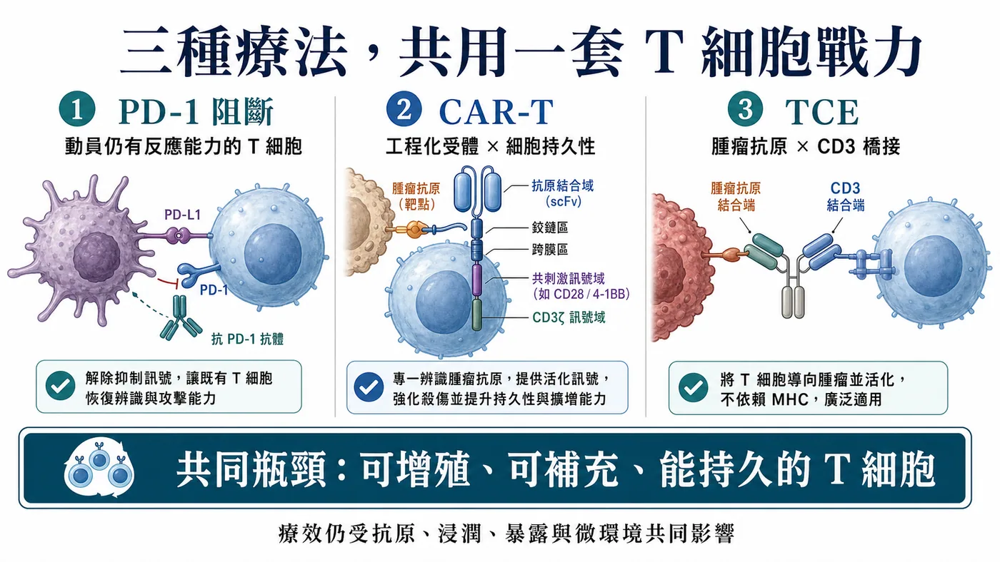
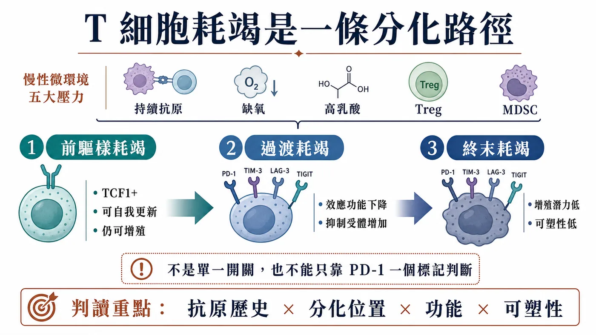
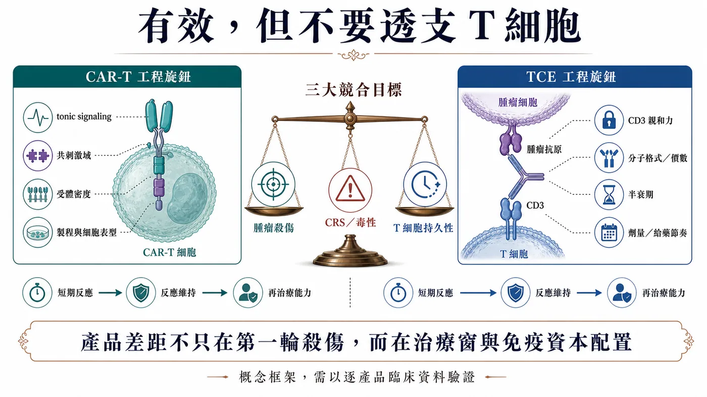
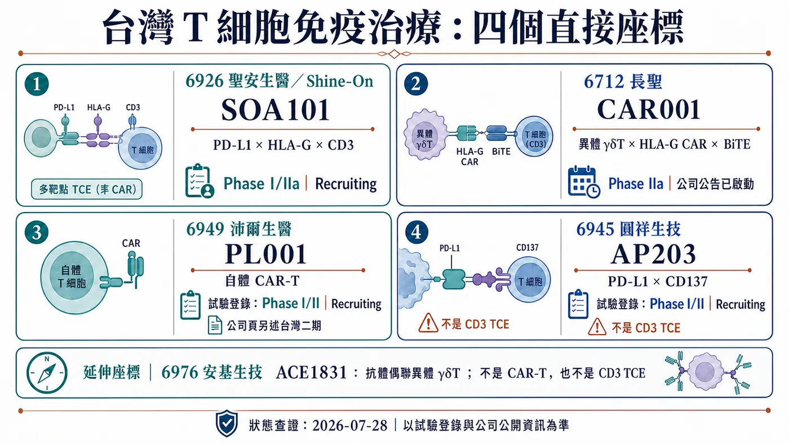

# T 細胞耗竭卡住 PD-1、CAR-T 與 TCE：免疫治療下半場，拼的是誰能撐到最後

一顆腫瘤細胞被殺掉，畫面很有衝擊力。

真正困難的是第 30 天、第 90 天，甚至更久以後，還剩多少 T 細胞能繼續擴增、找到腫瘤，再完成下一輪殺傷。

PD-1 抗體、CAR-T 與 T-cell engager（TCE，T 細胞銜接器）走的是三條路，最後都得靠 T 細胞的功能狀態、分化品質與持久性完成殺傷。

1️⃣ PD-1 阻斷解除抑制訊號，讓仍有反應能力的 T 細胞重新動起來。

2️⃣ CAR-T 把 T 細胞取出改造，裝上辨識腫瘤的受體，再送回體內作戰。

3️⃣ TCE 一端抓腫瘤抗原、一端抓 CD3，把患者現有的 T 細胞拉到腫瘤旁邊。

藥時事團隊的判斷是：這三類療法共同依賴同一種底層資產——具有持續增殖能力的 T 細胞戰力。免疫治療下一輪的產品差距，會落在誰能把這筆「免疫資本」用得久，而不是第一天就燒完。

這個判斷不等於把所有治療失敗都歸因於耗竭。抗原消失、抗原呈現異常、T 細胞進不了腫瘤、藥物暴露不足，以及腫瘤以其他路徑逃脫，都可能讓療效停下來。耗竭真正改變的是我們讀數據的方式：除了問腫瘤縮了多少，還要追問是哪一群 T 細胞完成殺傷、這群細胞能不能補充，以及功能維持了多久。

早期反應率相近，不代表產品續航相同。要分辨差異，得把反應維持時間、細胞動力學與復發時的抗原狀態放在一起看；一次掃描只看得到腫瘤縮小，看不到是哪一批 T 細胞把效果撐住。

## 01｜耗竭不是「累了」而已，而是一條分化路徑

腫瘤長期存在，抗原刺激不會在一次免疫反應後消失。T 細胞反覆接觸抗原，同時承受缺氧、養分不足、高乳酸、抑制性細胞激素、Treg 與髓源抑制細胞等壓力，功能會逐步改變。

常見現象包括增殖能力下降，IL-2、TNF、IFN-γ 等細胞激素分泌受影響，並共同表現 PD-1、LAG-3、TIM-3、TIGIT 等抑制性受體。背後牽涉 TOX 相關的耗竭程式、表觀遺傳與代謝重塑；TCF1 則常用來辨識仍保有自我更新能力的前驅樣族群。[1][2]

但「耗竭」不是一個整齊的終點，也不能只靠一個標記下判斷。

同一個腫瘤裡，可以同時存在保有增殖能力的前驅耗竭 T 細胞，也有更深、更終末的耗竭族群。前者常見 TCF1 表現，仍能自我更新並產生後續效應細胞；後者的增殖潛力較低，功能與表觀遺傳狀態也更固定。

這個差別很重要。臨床上看到的不是一支整齊老化的軍隊，而是一個仍有後備、正在消耗、以及幾乎難以補充的混合細胞庫。

耗竭本身也不是生物學的「故障訊息」。在抗原長期存在時，降低部分效應功能可以減少失控的免疫傷害；代價是腫瘤可能利用這套調節，讓殺傷反應停在不足以清除疾病的程度。這也是為什麼研究者不宜只用「年輕／老化」描述細胞，而要把抗原歷史、分化位置、功能與可塑性放在一起看。[1]

採樣位置同樣會改變答案。外周血容易重複取得，適合追蹤數量與動態；腫瘤組織才能告訴我們細胞是否真正進入病灶、靠近哪些細胞，以及局部抑制訊號有多強。若只在治療前抽一次血、只量一個 PD-1，就很難替整個腫瘤內的 T 細胞庫下結論。

## 02｜PD-1 鬆開煞車，還要看引擎剩多少力

2016 年的 Nature 研究在慢性感染模型中辨識出一群 TCF1 陽性的前驅耗竭 CD8 T 細胞。PD-1 阻斷後，主要的增殖爆發來自這群仍有自我更新能力的細胞，而非所有 PD-1 陽性 T 細胞一起恢復。[2]

同年的 Science 研究在慢性 LCMV 小鼠模型中阻斷 PD-1／PD-L1 軸，結果指出耗竭 T 細胞的表觀遺傳圖譜相對穩定。治療可以短期改善部分功能，卻不會把深度耗竭的細胞完整重置成典型記憶 T 細胞；抗原壓力持續存在時，也可能再次走向功能失調。[3]

所以，PD-1 高表現不能直接翻譯成「一定耗竭」，更不能當成「一定對 PD-1 抗體敏感」。PD-1 也會出現在活化中的 T 細胞上，真正有意義的是它和 TCF1、TIM-3、CD39、腫瘤特異性、空間位置與功能狀態的組合。

這也解釋了免疫檢查點治療的一個臨床反差：同樣看見 T 細胞、同樣看見 PD-1，患者能被動員的後備細胞庫可能完全不同。

單一生物標記很難把這件事講完。療效還會被抗原呈現、T 細胞能不能進入腫瘤、腫瘤微環境、腫瘤負荷與其他抗藥機制共同決定。

把這段機制帶回臨床，最值得注意的是「反應來自哪裡」。治療後腫瘤縮小，可能代表原有腫瘤內 T 細胞被重新動員，也可能有新的克隆從周邊進入病灶。若後來再次進展，原因也不只一種：可增殖的細胞庫可能被耗盡，腫瘤可能失去抗原，或病灶形成新的排斥環境。把所有續發性抗藥都叫作耗竭，反而會讓下一個聯合療法選錯靶點。

因此，好的轉譯設計需要前後配對。治療前知道起始細胞庫，治療中看到克隆是否擴增，進展時再判斷細胞還在不在、抗原是否保留。只有這條時間軸，才能分辨「煞車重新踩下去」與「車、路或目的地已經變了」。

## 03｜CAR-T 的耗竭風險，可能在輸注前就被設計進去了

CAR-T 的優勢，是把辨識能力直接裝進 T 細胞。它的限制也來自同一件事：受體結構、訊號強度與製程，可能在細胞進入患者體內前，先決定它能跑多遠。

2015 年 Nature Medicine 的研究顯示，部分 CAR 會因受體聚集產生不依賴抗原的持續訊號，也就是 tonic signaling。細胞在體外擴增階段就被反覆刺激，PD-1、LAG-3、TIM-3 等標記上升，後續殺傷與體內持久性也受到影響。[4]

該研究的特定模型中，CD28 共刺激加重持續訊號造成的耗竭，4-1BB 則有所緩解。但這不能簡化成「所有 4-1BB CAR 都優於 CD28」。抗原、抗體片段、鉸鏈區（hinge）、跨膜區、受體密度與製程都會改變結果，產品仍要逐一驗證。

CAR-T 開發因此不能只比較第一輪殺得多快。

🔧 受體會不會在沒有抗原時自行聚集？

🧬 製程最後留下多少幹記憶型或中央記憶型 T 細胞？

📈 輸注後能否擴增、持續存在，並在再次遇到抗原時保留功能？

這三題直接連到臨床長尾。體外做出很強的短期殺傷，不代表體內能維持同樣的戰力。

活細胞數量只是放行的一部分。起始原料、培養天數、細胞激素條件與擴增壓力，都可能改變最終分化組成；記憶表型、耗竭標記、代謝狀態與多功能性可以作為研究性產品表徵，但未必都是法定放行規格。已有臨床研究觀察到輸注前細胞產品的表型與功能特徵和後續反應相關，但結果來自特定疾病與產品，仍不能直接跨產品設定及格線。[17] 若公司主張短製程或較高幹性帶來優勢，還是要用批次一致性、體內擴增與緩解維持驗證。

臨床上還要把細胞耗竭和抗原逃脫分開。CAR-T 數量下降、功能下降，與腫瘤失去標的抗原，都會造成復發，研發對策卻完全不同。前者可能指向細胞品質、訊號設計或微環境；後者則可能需要雙標的、序列治療或其他抗原策略。只看「復發」兩個字，判斷不了產品真正卡在哪裡。

## 04｜TCE 把細胞拉到一起，訊號太猛也會付出代價

TCE 不需要先替患者製造一批新細胞。它借用患者體內既有的 T 細胞，透過 CD3 端把它們拉到腫瘤細胞旁邊。

這讓藥物可以快速啟動殺傷，也把患者原本的 T 細胞狀態帶進療效方程式。經過多線治療、淋巴球數量偏低、功能較差或腫瘤內缺乏可用 T 細胞時，同一個分子可能得到不同結果。

CD3 端也不是抓得越緊越好。2021 年一項跨多個腫瘤標的的雙特異性抗體研究顯示，調整 CD3 親和力會同時改變體外殺傷、細胞激素釋放與體內分布。這是一個治療窗問題，而非單純的強弱競賽。[5]

給藥節奏同樣重要。Blood 在 2022 年發表的研究觀察到，接受 blinatumomab 連續輸注的部分復發／難治性 B 細胞前驅急性淋巴性白血病患者，其 T 細胞功能在治療期間下降；研究團隊再以 AMG 562 的長期暴露模型測試，持續刺激會逐步出現耗竭特徵，加入停藥間隔後，部分功能、代謝與殺傷能力得到恢復。[6]

這項結果提供很好的概念驗證，卻不能直接外推到所有 TCE。分子格式、半衰期、標的、疾病、劑量與療程都不同。更精確的問題應該是：每一款 TCE 如何在殺傷、CRS、暴露時間與 T 細胞續航之間找到自己的區間？

這裡很容易把兩種時間尺度混在一起。CRS 多半在治療早期成為焦點，開發上會使用階梯式給藥、前處置或其他方式管理；耗竭討論的是反覆或持續刺激之後，細胞能否維持功能。早期細胞激素較低，不足以證明長期不耗竭；初期反應強，也不保證可用的 T 細胞庫能一路撐到後面。

一款 TCE 真正有說服力的資料，會把藥物濃度、細胞激素、T 細胞活化與分化、腫瘤反應放在同一條時間線。若只有第一個療效掃描，還看不出分子是在有效調動免疫系統，或只是用較高強度換到短暫峰值。這也是給藥間隔、半衰期與可恢復性值得一起追的原因。

## 05｜耗竭管理，會變成產品設計的一部分

「逆轉耗竭」聽起來像把一個開關關掉，真實生物學更接近分層管理。

第一層是起始細胞庫。研究可以評估 CD8 T 細胞分化組成、TCF1、PD-1、LAG-3、TIM-3、TIGIT 的共同表現，以及細胞激素、增殖與殺傷能力。這些指標尚未形成跨癌別通用的常規檢測，不能把任一組合包裝成成熟伴隨式診斷。

第二層是產品工程。CAR-T 要管理 tonic signaling、共刺激結構、受體密度與製程表型；TCE 要管理 CD3 親和力、分子價態、半衰期、劑量與給藥節奏。

第三層是臨床情境。腫瘤負荷、微環境、前線治療造成的淋巴球影響，以及是否存在足夠的腫瘤特異性 T 細胞，都會改變療效。先降低腫瘤負荷再導入 T 細胞療法，在部分疾病可能有生物學合理性，但仍要由各癌別與臨床試驗決定，不能當成普遍治療建議。

免疫治療的研發語言也會跟著改變。未來只說「活化 T 細胞」已經不夠，還要交代活化哪一群、刺激多久、留下什麼表型，以及療效靠哪一批細胞維持。

如果一個專案只在單一時間點收樣，再精密的流式細胞儀也只能提供快照。耗竭是一段過程，資料至少要回答起點、峰值與回落：哪些克隆擴增、哪些表型消失、停藥或降低刺激後能否恢復。這種縱向資料成本更高，卻能把「機制看起來合理」推進到「產品確實照預期運作」。

## 06｜台灣不是只有一家公司：四個直接產品座標

若只寫沛爾生醫，會漏掉台灣最貼近本文的臨床期 TCE。依產品、技術與臨床角色，而不是用「概念股」硬湊，至少有四個公開市場座標。

第一個是聖安生醫（6926）的 SOA101。它是以奈米抗體打造的 PD-L1 × HLA-G × CD3 三特異性 T-cell engager，ClinicalTrials.gov NCT07055594 的正式試驗名稱標示為 Phase I/IIa，狀態為 Recruiting，適應症是晚期或轉移性實體瘤。[10][11] 這是本文最直接的台灣 TCE：它一邊抓雙免疫檢查點，一邊透過 CD3 銜接 T 細胞。接下來要看劑量遞增、細胞激素釋放、暴露、療效與 T 細胞功能能否一起落在可接受的治療窗。

第二個是長聖（6712）的 CAR001。NCT06150885 將它登錄為結合 HLA-G CAR 與 BiTE 的異體 γδT 細胞產品，治療復發或難治性實體瘤；長聖在 2026 年 7 月 1 日公告，已通過第一期安全監測委員會（SMC）審查、完成第一階段劑量遞增與安全性評估，並正式啟動 Phase IIa。[12][13] 這個產品把細胞工程與 engager 放在同一套設計裡，因此重複給藥、CAR 陽性 γδT 細胞的體內變化、短暫與持續訊號之間的平衡，都比一句「CAR-T 題材」更值得追。

第三個是沛爾生醫（6949）的 PL001。公司現行產品頁稱已進入第二期，ClinicalTrials.gov NCT05326243 則登錄為第一／二期、Recruiting，適應症為復發或難治性 B 細胞淋巴癌。[7][9] 公司與臺灣證券交易所把短製程、較高比例幹記憶型 T 細胞列為技術重點，但這仍是製程主張。[8] 真正要驗證的是放行規格與批次一致性、輸注後擴增、細胞持續時間，以及這些表型能否轉成持久緩解。

第四個是圓祥生技（6945）的 AP203。它是 PD-L1 × CD137 雙特異性抗體，不含 anti-CD3 作用端，因此不屬於 CD3 型 TCE。依公司產品頁與臨床前研究，其設計是在 PD-L1 結合與聚集條件下活化 CD137；能否在人體降低全身性活化風險，仍待臨床資料驗證。NCT05473156 登錄為第一／二期、Recruiting，涵蓋肺癌、頭頸癌與食道癌等實體瘤；公司產品頁仍標示台灣第一期進行中，兩個資料來源反映的欄位與更新節點不同，不能直接寫成公司已啟動第二期。[14][15]

育世博-KY（6976）的 ACE1831 也是直接的 T 細胞產品座標，但它用抗體細胞連結技術把 CD20 抗體接到異體 γδ T 細胞，並不是 CAR-T 或 CD3 TCE，適合列為延伸觀察，不和前四家公司混成同一機制。[16]

這五家公司都不能被寫成「已證明逆轉 T 細胞耗竭」。它們代表的是五種不同設計題：CD3 銜接、CAR／BiTE 混合、CAR-T 製程、條件式共刺激，以及抗體武裝的異體 γδT。臨床資料最後要回答的，仍是有效細胞能不能留下、補上，並在安全範圍內撐得久。

它們也不適合被塞進同一張療效排名表。SOA101 要先證明三個作用端在人體暴露下形成可管理的治療窗；CAR001 要分清輸注的 γδT 細胞自身持久性，以及 BiTE 招募其他免疫細胞各自貢獻多少；PL001 的核心證據是製程表型能否轉成體內擴增與緩解維持；AP203 則要看條件式 CD137 共刺激在腫瘤內提供多少增益，又留下多少全身性風險。這四條資料線成熟的時間不會一致，早期新聞也不能用同一把尺解讀。

## 07｜投資人接下來要盯的四組資料

免疫治療文章很容易被早期反應率帶走。若把耗竭放回產品價值，至少還要追四組指標。

📍 起始細胞表型：前驅樣、幹記憶型與終末分化細胞各占多少？

📈 擴增與持久性：輸注或給藥後的擴增峰值、持續時間，以及再次遇到抗原時的功能。

⚠️ 治療窗：CRS、神經毒性、劑量中斷與給藥節奏，是否換來更穩定的長期暴露。

⏳ 緩解深度與維持：短期殺傷能不能轉成持久緩解、PFS 或 OS，而非只在第一個時間點漂亮。

放回台灣公司，SOA101 要看劑量、細胞激素與療效是否同步成形；CAR001 要看重複給藥與 CAR 陽性 γδT 細胞的變化；PL001 要看批次、擴增與持久性；AP203 要看條件式共刺激能否換來足夠的治療窗。這些資料比「免疫治療題材熱不熱」更能回答產品價值。

讀早期臨床時，百分比一定要和時間一起看。劑量遞增階段人數少、追蹤長短不同，同一個反應率可能混合剛開始治療與已追蹤多月的患者。對高度依賴 T 細胞的產品，反應出現多久、維持多久、細胞是否仍可測得，以及患者在什麼毒性與停藥條件下完成治療，往往比單一截點更有資訊。當公司更新資料，先找中位追蹤時間與可評估人數，再看反應率，較不容易被漂亮但尚未成熟的分子帶走。

公司更新可先看機制是否照預期運作，再查暴露、批次、細胞動力學與毒性能否重複，最後才判斷緩解深度與維持；少了中間的產品證據，幾個反應個案還不能證明續航問題已解決。

例如，一項治療同時出現高擴增峰值與明顯早期毒性，後續細胞迅速消失；另一項峰值較低，細胞卻維持更久。兩者誰更好，不能靠單一峰值回答，還得放回疾病、劑量、腫瘤負荷與緩解維持。耗竭視角的價值就在這裡：它迫使市場把「很有反應」改問成「反應由誰完成，又維持了多久」。

## 結語｜免疫治療下半場，真正稀缺的是能補上的兵

PD-1 鬆開的是煞車，CAR-T 換的是方向盤，TCE 做的是強制併線。三條路最後都依賴同一種底層資產：具有持續增殖能力、能長期執行殺傷的 T 細胞戰力。

腫瘤是長期戰。第一輪殺得很快，解決不了後續細胞補不上、功能掉下來、微環境持續施壓的問題。

下一代免疫治療的競爭，會逐漸從「如何把訊號做強」轉向「如何讓有效細胞留得住、補得上、撐得久」。這才是耗竭問題真正改寫的產品門檻。

## 參考資料

1. Blank et al., Defining T cell exhaustion, Nature Reviews Immunology, 2019：https://www.nature.com/articles/s41577-019-0221-9
2. Im et al., Defining CD8+ T cells that provide the proliferative burst after PD-1 therapy, Nature, 2016：https://www.nature.com/articles/nature19330
3. Pauken et al., Epigenetic stability of exhausted T cells limits durability of reinvigoration by PD-1 blockade, Science, 2016：https://pmc.ncbi.nlm.nih.gov/articles/PMC5484795/
4. Long et al., 4-1BB costimulation ameliorates T cell exhaustion induced by tonic signaling of chimeric antigen receptors, Nature Medicine, 2015：https://pmc.ncbi.nlm.nih.gov/articles/PMC4458184/
5. Haber et al., Generation of T-cell-redirecting bispecific antibodies with differentiated profiles of cytokine release and biodistribution by CD3 affinity tuning, Scientific Reports 11, 14397, 2021：https://pmc.ncbi.nlm.nih.gov/articles/PMC8277787/
6. Philipp et al., T-cell exhaustion induced by continuous bispecific molecule exposure is ameliorated by treatment-free intervals, Blood, 2022：https://pmc.ncbi.nlm.nih.gov/articles/PMC10652962/
7. 沛爾生醫 PL001 產品頁：https://www.pellbmt.com/service_info.asp?id=1081
8. 臺灣證券交易所，新上市公司：沛爾生醫（6949）：https://www.twse.com.tw/market_insights/zh/detail/ff8080818d397607018e11bd8c380277
9. ClinicalTrials.gov，NCT05326243，PL001 Phase 1/2：https://clinicaltrials.gov/study/NCT05326243
10. 聖安生醫，SOA101 產品頁：https://www.shineon-bio.com/products2_detail/5
11. ClinicalTrials.gov，NCT07055594，SOA101 Phase 1/2：https://clinicaltrials.gov/study/NCT07055594
12. 長聖，CAR001 啟動 Phase IIa 公告：https://www.ever-supreme.com.tw/news_detail/39
13. ClinicalTrials.gov，NCT06150885，CAR001 Phase 1/2：https://clinicaltrials.gov/study/NCT06150885
14. 圓祥生技，AP203 產品頁：https://www.apbioinc.com/en/pipeline-detail1.htm
15. ClinicalTrials.gov，NCT05473156，AP203 Phase 1/2：https://clinicaltrials.gov/study/NCT05473156
16. 育世博，ACE1831 血液癌症第一期結案公告：https://www.acepodia.com/tw/newsroom-detail/ACE1831_CSR/
17. Fraietta et al., Determinants of response and resistance to CD19 CAR T cell therapy of chronic lymphocytic leukemia, Nature Medicine, 2018：https://pubmed.ncbi.nlm.nih.gov/29713085/

## 免責聲明

本文僅為生技醫藥與產業趨勢整理，不構成醫療診斷、治療建議、投資建議或買賣建議。實際治療選擇應由專業醫療團隊依個別病況與臨床證據判斷。
