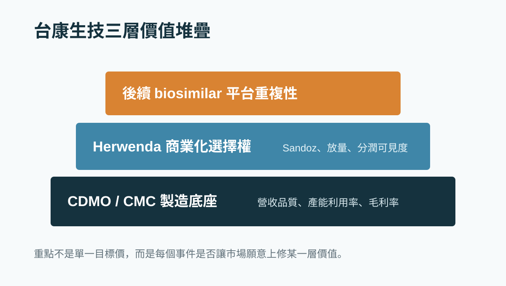
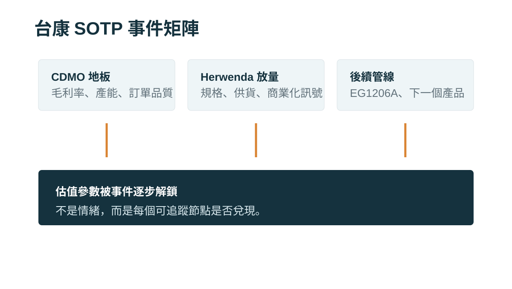

# 台康生技不是純 CDMO：Herwenda、Sandoz 和 420 mg vial 到底該怎麼估？

台康生技最容易被誤判的地方，是它不是純 CDMO，也不是典型新藥股。

如果把它當成純 CDMO，就會只看營收、毛利率、產能利用率，然後覺得它目前還在虧損，估值不該太高。

但如果把它當成新藥股，又很容易把 EG12014 / Herwenda 對應的 trastuzumab biosimilar 市場想得太滿，甚至把整個終端市場直接算回台康。

這兩種看法都不夠精準。

## 台康要拆成三層看

我會把台康拆成三層來看：

1. CDMO / CMC 製造底座
2. EG12014 / Herwenda 商業化選擇權
3. EG1206A 與後續 biosimilar 平台重複性

也就是說，台康的重點不是靜態本益比，而是這三層資產能不能一層一層被市場重新承認。

## 第一層：CDMO 是估值地板

台康有抗體藥開發、製程放大、GMP 生產與國際查廠經驗。

這些能力不是一般早期新藥公司可以很快複製的。生物藥的製造牽涉細胞株、培養條件、純化、品質系統、批次一致性與法規要求，所以 CDMO / CMC 能力本身就有價值。

但問題是，台康目前還沒有完全用穩定獲利證明這層價值。

所以我不會直接給它成熟 CDMO 的高倍數，而是先把 CDMO 當作估值地板。如果未來營收品質改善、毛利率改善、產能利用率提高，這層地板才會往上移。

## 第二層：Herwenda 是重估開關

EG12014 / Herwenda 是台康最重要的產品選擇權。

Herwenda 是 trastuzumab biosimilar，已取得歐盟上市許可，合作方是 Sandoz。

這裡的重點是 Sandoz。台康不需要自己從零建立歐洲銷售隊伍，而是透過 Sandoz 的商業化能力推進市場。

但也因為如此，台康不能把整個終端銷售額都算回自己。真正該算的是：Sandoz 能拿多少市場份額，台康又能透過供貨、里程碑、權利金或合約安排分到多少經濟利益。

所以 Herwenda 的估值要折價，而不是直接全額計入。

## 為什麼 420 mg vial 不是小事？

很多人看到 420 mg vial，可能會覺得只是包裝規格。

但對 biosimilar 來說，規格不是小事。

醫院採購不只看有沒有藥證，也會看價格、供貨穩定、臨床使用便利性、藥局配製流程、醫師切換成本。

如果 420 mg vial 讓產品更貼近真實世界使用場景，它就不只是行政變更，而是商業化放量前的產品配置補強。

這不代表營收一定爆發，但代表市場可以更認真觀察：Sandoz 是否真的準備把 Herwenda 推向更完整的商業化階段。

## 第三層：後續管線決定是不是平台公司

如果台康只有 EG12014，那估值彈性有限。

真正能讓市場給更高溢價的，是台康能不能證明它不是單一產品公司，而是能反覆開發、製造、送件、授權 biosimilar 的平台公司。

第一個產品送出去，是能力驗證。第二個產品能接上，是流程驗證。第三個產品能授權或商業化，市場才會開始把公司從專案公司改看成平台公司。

所以 EG1206A 和後續管線很重要。它們不是現在就能算滿，但會決定台康的長期估值天花板。

## 台康不能直接和保瑞、藥華藥比

台康最容易被市場誤判的地方，是大家會拿它去和保瑞或藥華藥比較。

但三家公司本質完全不同。

保瑞的核心是併購整合、製造、通路與現金流複利。

藥華藥的核心是孤兒藥商業化、全球權利與定價權。

台康則是 CDMO 底座、Herwenda biosimilar 選擇權與後續平台重複性。

所以台康不能直接套保瑞的成熟現金流倍數，也不能直接套藥華藥的 peak sales 模型。

模型用錯，比參數算錯更危險。

## 接下來我會看六件事

台康後續不是看情緒，而是看事件。

我會追：

1. Herwenda 420 mg vial 的 EMA 變更申請結果
2. Sandoz 是否有更明確的商業化訊號
3. 台康月營收品質，而不只是營收數字
4. 毛利率與產能利用率是否改善
5. 現金流與融資風險是否下降
6. EG1206A 或下一個 biosimilar 是否能接上

如果這些事件兌現，模型參數才有上修理由。

如果沒有兌現，台康就不能只靠「Sandoz」和「歐洲藥證」享有高估值。

## 結論

台康不是靜態低估股，而是事件型重估股。

它的底座是 CDMO / CMC 製造能力。

它的開關是 Herwenda 能不能透過 Sandoz 走向真實放量。

它的天花板，是後續 biosimilar 管線能不能證明平台重複性。

所以台康真正要追的不是單一目標價，而是每個事件能不能改變估值參數。

本文僅供產業研究與知識分享，不構成投資、醫療、募資或個股建議。
