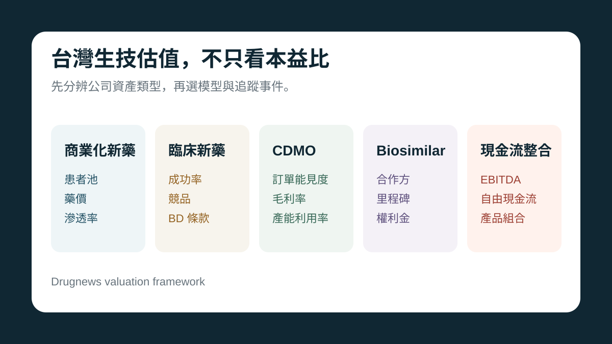

# 台灣生技估值第一步：不要把所有公司都塞進同一個本益比

很多人分析生技股，一開始就問本益比、EPS、目標價。

但生技股真正麻煩的地方，是公司類型完全不同。同樣叫生技股，實際上可能是五種完全不同的資產。

## 五種生技資產

- 已商業化新藥公司：看患者池、滲透率、藥價、毛利率與銷售效率。
- 臨床開發型新藥公司：看臨床階段、成功率、競爭格局與 BD 條款。
- CDMO / 製造平台公司：看訂單能見度、毛利率、產能利用率與查廠能力。
- biosimilar / 授權合作型公司：看合作方、供貨、里程碑、權利金與放量。
- 併購整合現金流公司：看 EBITDA、自由現金流、產品組合與整合能力。

> 模型用錯，比參數算錯更危險。

## 為什麼本益比不夠

本益比適合已經有穩定獲利、商業模式成熟的公司。

但很多生技公司正在跨越研發、製造、授權、商業化或固定成本門檻。這時候真正要問的不是「現在 EPS 多少」，而是公司價值會不會因為下一個事件而重新定價。

## 台康這類公司為什麼難估

台康不能只放在單一類型。它至少同時有三層：

- CDMO / CMC 製造底座。
- EG12014 / Herwenda 的 biosimilar 商業化選擇權。
- EG1206A 與後續管線的平台重複性。

所以台康不能直接用保瑞的成熟現金流倍數，也不能直接用藥華藥的孤兒藥 peak sales 模型。

更合理的方式是先給 CDMO 地板，再對 Herwenda 的分潤可見度和後續管線重複性給選擇權價值。

本文僅供產業研究與知識分享，不構成投資、醫療、募資或個股建議。
