# Tavneos 危機：20 例死亡通報、資料完整性疑雲，Amgen 罕病明星藥站上撤市邊緣

罕病藥物的價值高度依賴可信資料與安全性信任，一旦死亡通報與資料完整性疑雲浮現，估值邏輯就會被迫重估。

## 罕病明星藥最怕信任被打破

罕病藥常因患者少、治療選擇有限、價格高，而被市場賦予較高估值。但這種估值建立在一個前提上：臨床資料可信，安全性可控，醫師願意長期使用。

當死亡通報、資料完整性或監管質疑浮現，市場擔心的不是單一事件，而是這個藥物原本的風險效益比是否需要重新評估。

- 罕病藥估值高度依賴醫師與監管信任。
- 安全性事件會影響使用意願與給付態度。
- 資料完整性疑雲會放大所有不確定性。

## 死亡通報不等於一定撤市，但一定要重估風險

藥品上市後出現死亡通報，不代表必然由藥物造成，也不代表一定撤市。但它會觸發更嚴格的安全性分析，包括背景疾病風險、用藥族群、時間關聯與不良事件模式。

若同時伴隨資料完整性疑慮，監管機關就可能要求補充資料、限制使用、更新標籤，甚至重新評估上市資格。

- 要區分關聯性與因果性。
- 上市後真實世界資料很重要。
- 監管反應會直接影響商業化曲線。

## Drugnews 的判斷

Tavneos 事件提醒投資人：罕病藥不是只看價格與小市場壟斷，也要看安全性、資料品質與監管韌性。越是高價藥，越承受更高的證據要求。

- 罕病藥估值不能忽略上市後風險。
- 資料品質是高價藥商業化的底線。

## 小結

這篇文章的重點不是把單一新聞看成短線題材，而是回到 Drugnews 一直強調的分析方法：從臨床證據、商業定位、競爭格局與監管風險四個面向，判斷一個生技醫藥事件是否真的會改變公司價值。

本文僅供產業研究與知識分享，不構成投資、醫療、募資或個股建議。
