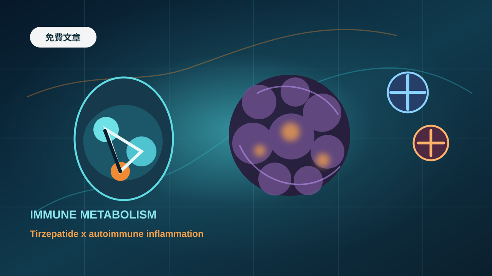

# 神藥猛健樂 Tirzepatide 進軍自體免疫，只差臨門一腳？

自體免疫疾病，一直是全球製藥業最肥沃、也最難攻下的戰場之一。

它不像急性感染，用藥幾天或幾週就結束。類風濕性關節炎、乾癬、乾癬性關節炎、發炎性腸道疾病、氣喘、異位性皮膚炎，這些疾病往往跟著患者一輩子。用藥時間長，換藥路徑清楚，醫師黏著度高，支付體系也早已習慣為有效的免疫藥物買單。

這也是為什麼自體免疫疾病能孕育出 Humira 這種史詩級藥王，也能讓 Skyrizi、Rinvoq、Taltz、Dupixent 這些產品持續放大。

但現在，這個長期由 TNF、IL-17、IL-23、JAK、IL-4R 等傳統免疫通路主導的市場，出現了一個跨界者。

它不是傳統免疫藥。它來自代謝領域。它就是 Eli Lilly 的 tirzepatide，商品名包括糖尿病用的 Mounjaro，以及肥胖治療用的 Zepbound。

過去，tirzepatide 的故事很清楚：它是 GLP-1 / GIP 雙重受體促效劑，用來治療第二型糖尿病與肥胖。現在，Lilly 正在把它推進自體免疫疾病的邊界。

這不只是多一個適應症。它代表一個更大的趨勢：肥胖、代謝異常與免疫發炎，正在被放進同一張疾病地圖裡。

## 01｜Zepbound + Taltz：Lilly 把減重藥放進免疫疾病治療框架

最近 Eli Lilly 公布了兩項非常有代表性的 Phase 3b 臨床研究：TOGETHER-PsA 與 TOGETHER-PsO。

這兩項研究都不是單純看 tirzepatide 能不能減重，而是把 Zepbound 與 Taltz 放在一起，治療同時合併超重或肥胖的免疫發炎疾病患者。

Taltz 是 Lilly 旗下的 IL-17A 抑制劑，已用於乾癬、乾癬性關節炎等疾病。Zepbound 則是 GLP-1 / GIP 雙重受體促效劑，核心優勢是強力體重管理。

TOGETHER-PsA 針對的是乾癬性關節炎患者。研究結果顯示，在第 36 週時，Taltz 與 Zepbound 併用組達到主要終點，也就是同時達成乾癬性關節炎疾病活動度 ACR50 改善，以及至少 10% 體重下降。

更重要的是，Taltz + Zepbound 組有 33.5% 患者達到 ACR50，而 Taltz 單藥組為 20.4%。這項研究納入 271 名合併超重或肥胖、且至少有一項體重相關共病的活動性乾癬性關節炎成人患者。

TOGETHER-PsO 針對的是中重度斑塊型乾癬患者。同樣在第 36 週，Taltz + Zepbound 組在「皮膚完全清除」與「至少 10% 體重下降」的複合終點上，顯著優於 Taltz 單藥。

PASI 100，也就是皮損完全清除的比例，併用組為 40.6%，Taltz 單藥組為 29.0%。達到 PASI 100 且減重至少 10% 的比例，併用組為 27.1%，單藥組僅 5.8%。

這組資料的意義，不只是「減重藥讓患者變瘦」。而是：在傳統免疫藥已經控制部分疾病活動的基礎上，加入 tirzepatide 仍能進一步提高皮膚與關節治療效果。

Tirzepatide 不是要取代 IL-17A 抑制劑，但它可能成為免疫疾病中「肥胖與代謝發炎族群」的治療加成工具。

## 02｜為什麼是乾癬與乾癬性關節炎？

Lilly 選擇乾癬與乾癬性關節炎，不是偶然。

這兩個疾病本來就和肥胖、代謝異常、心血管風險高度重疊。乾癬不是單純皮膚病，而是一種全身性免疫發炎疾病。患者可能出現皮膚紅斑、脫屑、搔癢，也可能進一步發展為乾癬性關節炎，造成關節疼痛、僵硬、腫脹與功能下降。

這些患者常常合併肥胖、脂肪肝、高血壓、胰島素阻抗與心血管風險。脂肪組織也不是單純儲存熱量的倉庫。肥胖狀態下，脂肪組織會釋放多種發炎介質，讓全身處於慢性低度發炎狀態。

換句話說，在這類患者身上，免疫疾病和代謝疾病不是兩條平行線，而是互相拉扯的惡性循環。

體重越高，發炎負荷可能越高。發炎越強，疾病活動度越難控制。疾病越難控制，活動量下降，體重又更難管理。

這就是 TOGETHER 系列研究的臨床邏輯。如果只用 Taltz 抑制 IL-17A，可以處理免疫發炎的一部分。但如果同時用 Zepbound 改善體重、代謝狀態與發炎背景，是否能讓患者達到更完整的治療目標？

目前資料顯示，答案至少值得繼續往前推進。

## 03｜真正賣點不是減肥，而是免疫代謝

Zepbound 在自體免疫疾病裡的角色，不應該只被理解成「讓患者順便瘦一點」。

真正的新概念，是 immune-metabolism，也就是免疫代謝。

免疫系統和代謝系統本來就彼此相連。發炎會影響胰島素敏感性、脂肪組織功能、肝臟代謝與肌肉功能。肥胖也會影響免疫細胞、細胞激素、脂肪因子與全身發炎狀態。

所以，當 tirzepatide 讓患者體重下降、改善胰島素阻抗、降低部分代謝發炎指標時，它可能不是單純改變體重計上的數字，而是在改變免疫疾病背後的土壤。

不過，這裡仍然有一個關鍵問題沒有完全回答：tirzepatide 在乾癬與乾癬性關節炎中的增益，主要是來自體重下降後的間接改善，還是它本身對免疫發炎路徑具有更直接的調節作用？

如果主要收益來自減重，那 Zepbound 的定位會相對清楚：它適用於合併肥胖或超重的免疫疾病患者。

如果未來能證明 tirzepatide 對免疫發炎有更直接作用，例如影響發炎細胞激素、脂肪組織免疫環境、腸道免疫或巨噬細胞樣路徑，那麼它的免疫疾病想像空間會更大。

現階段最穩妥的說法是：Zepbound 已經在合併肥胖的乾癬與乾癬性關節炎患者中，證明能為標準免疫治療帶來額外臨床價值。至於它能否真正成為免疫調節藥物，還需要更多生物標記、組織研究與長期臨床資料證明。

## 04｜Lilly 沒有只押乾癬，下一站是腸道發炎疾病

Lilly 的布局不只在皮膚與關節。

它也正在把 tirzepatide 帶進發炎性腸道疾病。Lilly 已經啟動 Omvoh 與 tirzepatide 併用的研究，用於合併超重或肥胖的中重度克隆氏症與潰瘍性結腸炎患者。

Omvoh 是 Lilly 的 IL-23p19 抗體，已用於發炎性腸道疾病。Lilly 試驗登錄資料顯示，COMMIT-CD 研究評估的是 mirikizumab 與 tirzepatide 併用，對比 mirikizumab 加安慰劑，用於中重度克隆氏症且合併肥胖或超重的成人患者；COMMIT-UC 則針對潰瘍性結腸炎患者。

這個方向很值得看。因為發炎性腸道疾病和肥胖之間的關係比乾癬更複雜。

有些患者會因疾病活動與營養吸收問題變瘦，也有相當一部分患者合併肥胖或代謝異常。肥胖可能影響腸道發炎、藥物分布、生物製劑反應、手術風險與疾病控制。

Lilly 如果能證明 tirzepatide 加 Omvoh 在這些患者中不只是減重，還能改善腸道症狀、黏膜癒合或長期復發風險，那麼 tirzepatide 的自免故事就會從乾癬疾病譜，進一步走向免疫發炎疾病平台。

這會是很大的事情。自體免疫疾病市場最有價值的地方，不只是單一適應症，而是多適應症擴張。

Humira 當年之所以成為藥王，不是因為只做一個疾病，而是橫跨類風濕性關節炎、乾癬、乾癬性關節炎、克隆氏症、潰瘍性結腸炎、僵直性脊椎炎等多個免疫疾病。

Tirzepatide 若能在多個「肥胖合併免疫發炎」族群中證明價值，它就可能從代謝藥，變成一個跨領域治療平台。

## 05｜自免市場從來不缺錢，缺的是下一個能接棒的邏輯

自體免疫疾病的商業價值，Humira 已經證明過。

Humira 曾經是全球最賺錢的藥物之一。2022 年，Humira 全球銷售額仍超過 210 億美元，支撐 AbbVie 免疫學業務高峰。Humira 專利懸崖後，市場一度擔心 AbbVie 會斷崖式下滑。

但事實證明，自免市場的價值不是 Humira 一個藥創造的，而是慢性免疫疾病本身創造的。2025 年，AbbVie 免疫學產品組合全球收入達 304.06 億美元，其中 Skyrizi 收入 175.62 億美元，Rinvoq 收入 83.04 億美元。

這說明 TNF-alpha 時代之後，IL-23、JAK 等新機制仍能接棒，讓免疫學業務繼續放大。

這也是 Lilly 看上自免市場的原因。它本來就有 Taltz，也有 Omvoh，現在又有 Zepbound。Lilly 不是從零進入免疫疾病，而是把自己的代謝藥物與免疫產品線接起來。

AbbVie 是用免疫學產品接力 Humira。Lilly 則可能用代謝藥物打開免疫疾病的新入口。

前者是傳統免疫靶點換代。後者是免疫代謝交叉。

如果成功，Lilly 不需要在每一個經典免疫靶點上都和 AbbVie、J&J、Novartis、Amgen、Sanofi 正面硬碰硬。它可以先從合併肥胖或超重的患者切入，打造一個「代謝加免疫」的新治療類別。

這就是差異化。

## 06｜不是多賣一點藥，而是重新定義 Zepbound 的邊界

Tirzepatide 已經是 Lilly 最重要的成長引擎之一。

Mounjaro 與 Zepbound 在糖尿病與肥胖市場快速放大，讓 Lilly 站上全球製藥市值高峰。但如果 tirzepatide 只能停留在糖尿病與肥胖，它仍然是一個代謝超級藥。

如果它能延伸到自體免疫疾病，意義就不同了。

第一，它能擴大患者池。肥胖與自體免疫疾病重疊比例很高。乾癬、乾癬性關節炎、發炎性腸道疾病、氣喘等疾病中，合併肥胖或超重的患者並不少。

第二，它能強化支付邏輯。單純減重，支付方可能會問：這是醫療必需，還是生活品質改善？但如果能證明 Zepbound 同時改善免疫疾病活動度、關節功能、皮膚清除率、生活品質與代謝風險，支付價值會更強。

第三，它能讓 Lilly 的產品組合互相加成。Zepbound 搭 Taltz，Zepbound 搭 Omvoh，未來甚至可能搭其他免疫藥物。這種組合策略能讓 Lilly 在代謝與免疫兩個大市場形成交叉火力。

第四，它能延長產品生命週期。Tirzepatide 若能不斷增加高價值適應症，就不只是肥胖藥物，而是慢性疾病平台。

所以，tirzepatide 進軍自免不是「多開一條支線」。它其實是在重新定義 Zepbound 的估值邊界。

## 07｜但還不能說 GLP-1 已經正式成為自免藥

這裡也要冷靜。

Tirzepatide 在 TOGETHER-PsA 與 TOGETHER-PsO 中的資料很強，但它還不能讓我們直接下結論：GLP-1 / GIP 藥物已經成為自體免疫藥物。

原因有三個。

第一，研究對象是合併超重或肥胖的患者。這代表 Zepbound 的受益族群目前仍然和體重管理高度相關。它不是對所有乾癬或乾癬性關節炎患者都適用。

第二，聯合藥物是 Taltz。免疫治療的基礎仍然是 IL-17A 抑制劑。Zepbound 是加成，不是替代。

第三，機制仍需釐清。目前最確定的是臨床結果：併用組更好。但更深的問題是，這種改善是因為體重下降、代謝改善、全身發炎下降，還是 tirzepatide 對免疫路徑有直接作用？

這需要更多資料，包括發炎指標、脂肪組織變化、細胞激素、皮膚或關節組織活檢、腸道免疫變化、長期隨訪等。

所以，現在最合理的定位是：tirzepatide 正在打開自體免疫疾病中的免疫代謝新類別，但還沒有完全證明自己是傳統意義上的免疫藥。

這個界線很重要，因為它會影響未來監管標籤、醫師使用、支付策略和商業預期。

## 08｜台灣可以怎麼看？

台灣目前沒有直接對應 Zepbound + Taltz 這種組合療法的公司。但這個趨勢仍然值得台灣投資人注意。

第一個可以想到的是安成生技。

安成生技的 AC-1101 是外用 tofacitinib 凝膠，屬於 JAK 抑制劑外用製劑，用於自體免疫與發炎性皮膚疾病。它不是 GLP-1，也不是代謝藥物，但同樣站在皮膚免疫疾病治療升級的方向上。

當國際市場開始把乾癬、乾癬性關節炎、肥胖與慢性發炎放在同一張圖裡看，皮膚免疫疾病不再只是「皮膚表面問題」，而是全身性免疫與代謝管理的一部分。

第二個可以觀察的是康霈。

康霈的 CBL-514 主要切入脂肪細胞凋亡與局部脂肪管理。它不是自體免疫藥，但在 GLP-1 後時代，體重管理、脂肪組織、慢性發炎與代謝健康會被更緊密連結。

如果未來市場更重視「減重後維持」與「脂肪組織管理」，康霈這類公司就有機會被放進 GLP-1 外溢需求裡重新理解。

第三個是奧孟亞。

奧孟亞主打口服胜肽平台。Tirzepatide 這類胜肽藥物若未來持續跨入更多慢性疾病，給藥便利性會越來越重要。注射藥有效，但口服化、長效化與劑型升級會是下一波競爭點。

台灣公司不一定要做出下一個 Zepbound。更實際的路，是從皮膚免疫、脂肪管理、口服胜肽、長期體重維持與慢性病管理裡，找出可以補位的切口。

真正要看的，不是有沒有蹭到 GLP-1 題材，而是能不能把外溢需求變成臨床資料、產品定位、商業收入與國際合作。

## 結語｜Zepbound 進軍自免，不是跨界噱頭，而是疾病分類正在重寫

Tirzepatide 進入乾癬與乾癬性關節炎，不是一場簡單跨界。它反映的是醫學認知的變化。

肥胖不是單純體重問題。自體免疫疾病也不只是免疫細胞失控。兩者之間有代謝、脂肪組織、慢性發炎、細胞激素、心血管風險與生活型態交織而成的共同底層。

Lilly 現在做的，是把這些原本分開治療的問題，放進一個更整合的治療框架。

Taltz 負責打免疫發炎。Zepbound 負責處理肥胖與代謝發炎。Omvoh 則可能成為腸道免疫疾病裡的另一個組合底盤。

這不是傳統意義上的「一個藥多做幾個適應症」。這是肥胖藥物從代謝疾病，走向免疫代謝疾病的第一步。

真正的問題，已經不是 Zepbound 能不能減重。而是：當患者同時有肥胖、慢性發炎、自體免疫疾病與心血管風險時，未來的治療是否應該一次處理多個病理根源？

如果答案是肯定的，那 tirzepatide 的邊界，可能比今天市場想像得更大。

自體免疫疾病市場過去靠 TNF、IL-17、IL-23、JAK 撐起一代又一代重磅藥物。下一代變數，可能來自代謝藥。

而 Lilly，已經把球踢到門前。

## 參考資料

[Reuters: Lilly's Zepbound plus Taltz boosts arthritis relief, weight loss in late-stage trial](https://www.reuters.com/business/healthcare-pharmaceuticals/lillys-zepbound-plus-taltz-boosts-arthritis-relief-weight-loss-late-stage-trial-2026-01-08/)

[Eli Lilly / PR Newswire: Taltz and Zepbound used together delivered superior efficacy](https://www.prnewswire.com/news-releases/lillys-taltz-ixekizumab-and-zepbound-tirzepatide-used-together-delivered-superior-efficacy-in-first-of-its-kind-phase-3b-trial-for-adults-with-psoriasis-and-obesity-or-overweight-302691124.html)

[Lilly trial listing: COMMIT-CD](https://trials.lilly.com/en-US/trial/600156)

[Reuters: AbbVie's Rinvoq shows superiority over Humira in head-to-head study](https://www.reuters.com/business/healthcare-pharmaceuticals/abbvies-rinvoq-shows-superiority-over-humira-head-to-head-study-2025-10-20/)

[AbbVie 2025 financial results](https://news.abbvie.com/2026-02-04-AbbVie-Reports-Full-Year-and-Fourth-Quarter-2025-Financial-Results)

本文僅供產業研究與知識分享，不構成投資、醫療、募資或個股建議。
