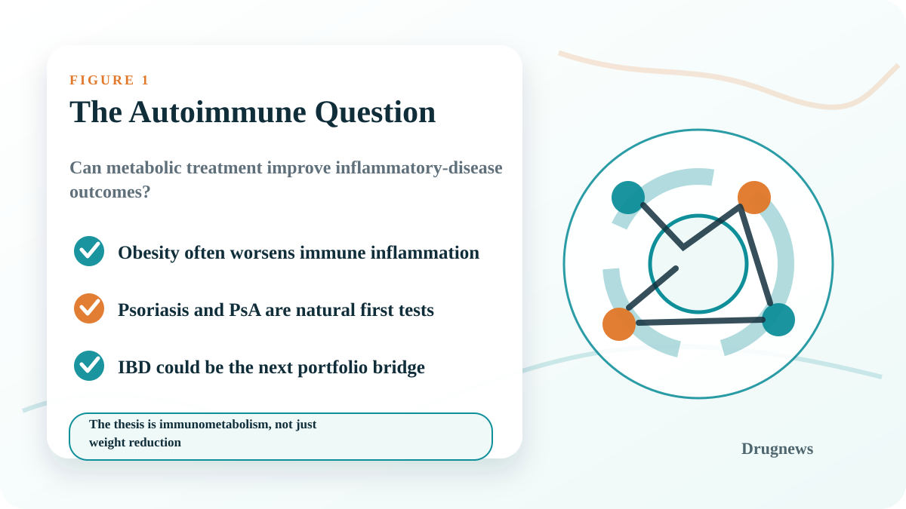
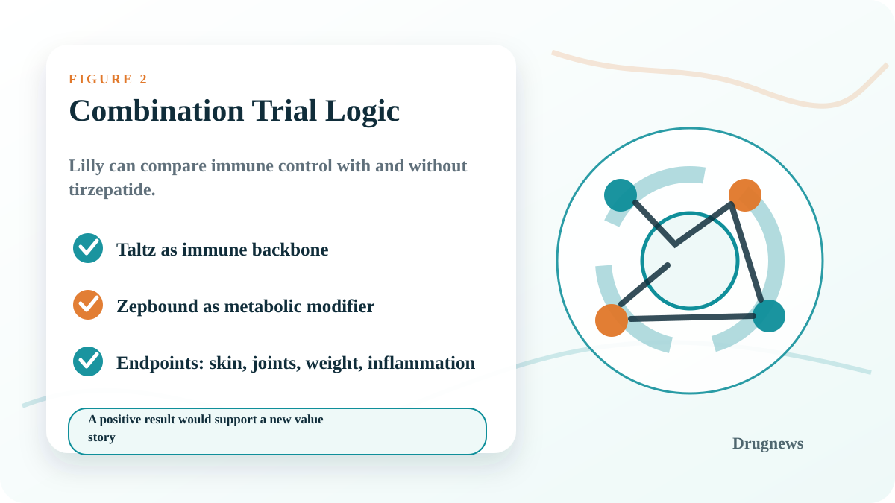
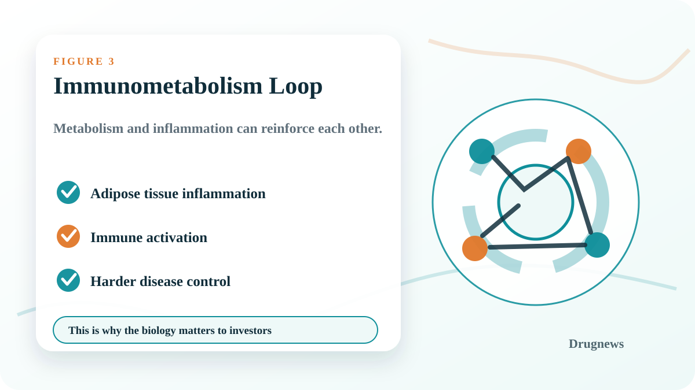
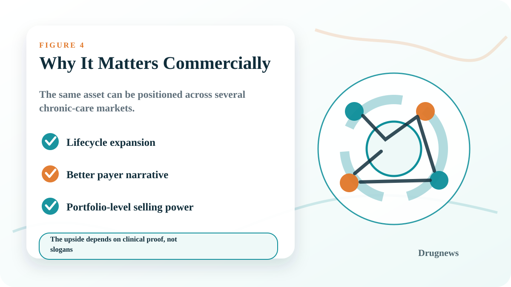

# Tirzepatide Enters Autoimmune Disease: Is Immunometabolism Lilly's Next Expansion Path?

Tirzepatide is usually discussed as an obesity and diabetes drug. But Lilly's next strategic question may be larger: can a metabolic therapy become part of the treatment architecture for immune-inflammatory diseases?

The reason this matters is simple. Autoimmune and inflammatory diseases are chronic. Psoriasis, psoriatic arthritis, inflammatory bowel disease, asthma, atopic dermatitis, and rheumatoid arthritis do not behave like short-course infections. Patients often remain inside the treatment system for years. That makes the market large, sticky, and commercially valuable.

## 1. Zepbound plus Taltz is not just a weight-loss study

Lilly is testing Zepbound together with Taltz in people with obesity or overweight and psoriatic arthritis. On the surface, this looks like a combination study. Strategically, it is a test of whether metabolic intervention can improve the control of immune disease.

Taltz provides the immune-disease backbone. Zepbound adds a metabolic lever. If the combination improves joint, skin, weight, and inflammatory outcomes at the same time, Lilly can tell a story that is much bigger than "another obesity drug."

## 2. Why psoriasis and psoriatic arthritis are natural first tests

Psoriasis and psoriatic arthritis are useful test cases because immune inflammation and metabolic burden often overlap. Obesity can worsen inflammatory status, complicate disease control, and reduce the practical effectiveness of treatment.

That is why the investor question is not whether tirzepatide can simply make patients lighter. The more interesting question is whether reducing metabolic stress can make immune disease easier to control.

## 3. The real thesis is immunometabolism

The important word is immunometabolism. The idea is that metabolism and immune signaling are not two isolated systems. Fat tissue, chronic inflammation, insulin resistance, and immune activation can form a feedback loop.

If tirzepatide can interrupt part of that loop, Lilly may be able to extend the commercial boundary of Zepbound. The product would no longer be framed only as weight management. It could become an enabling therapy across several chronic-care settings.

## 4. Lilly is not stopping at skin and joints

Lilly is also studying Omvoh in inflammatory bowel disease. If Zepbound can be paired with inflammatory-disease assets across skin, joints, and gut, the company's portfolio becomes more powerful than a set of separate products.

This is the commercial logic investors should pay attention to: large markets are valuable, but integrated portfolios can be even more valuable when they give physicians and payers a coherent treatment narrative.

## 5. Autoimmune disease is still a market with money

Autoimmune disease has already created some of the world's largest drug franchises. Humira, Rinvoq, Skyrizi, Dupixent, Taltz, and other chronic inflammatory-disease products show why the category matters: patients stay on therapy, indications can expand, and successful products can build long lifecycle value.

For Lilly, the question is whether tirzepatide can add another layer to that market logic.

## 6. What tirzepatide could give Lilly

If the clinical data work, tirzepatide gives Lilly at least four commercial advantages:

- A broader chronic-disease positioning for Zepbound.
- A stronger payer story around multi-system health impact.
- A way to connect obesity, inflammation, and autoimmune treatment.
- A portfolio-level narrative that is harder for single-product competitors to copy.

## 7. What investors should not overstate

This does not mean GLP-1/GIP drugs are already "autoimmune drugs." That would be too aggressive. The clinical evidence still has to prove that metabolic intervention creates meaningful immune-disease benefit beyond weight loss.

The right framing is more disciplined: tirzepatide is testing whether immunometabolism can become a real therapeutic and commercial category.

## 8. Taiwan angle

For Taiwan investors, the lesson is not to copy Lilly's scale. The lesson is to watch how a company connects biology, clinical endpoints, portfolio strategy, and payer logic into one investable story.

Companies with assets in obesity, immune inflammation, dermatology, gastrointestinal disease, or metabolic disease should be evaluated not only by single-trial headlines, but by whether their pipeline can create a coherent platform.

## Bottom line

Tirzepatide's next act may not be only about weight loss. If the data support it, Lilly could use Zepbound to enter a broader immunometabolism conversation. That would change how investors value the asset, the portfolio, and the future competitive map.

## References

1. Lilly. Zepbound prescribing information. https://uspl.lilly.com/zepbound/zepbound.html#pi
2. Lilly. Taltz prescribing information. https://uspl.lilly.com/taltz/taltz.html#pi
3. Lilly. COMMIT-CD clinical trial page. https://trials.lilly.com/en-US/trial/600156
4. Lilly. Omvoh prescribing information. https://uspl.lilly.com/omvoh/omvoh.html#pi
5. AbbVie. Rinvoq prescribing information. https://www.rxabbvie.com/pdf/rinvoq_pi.pdf

This article is intended for industry research and knowledge sharing only. It does not constitute investment, medical, fundraising, or individual stock advice.
