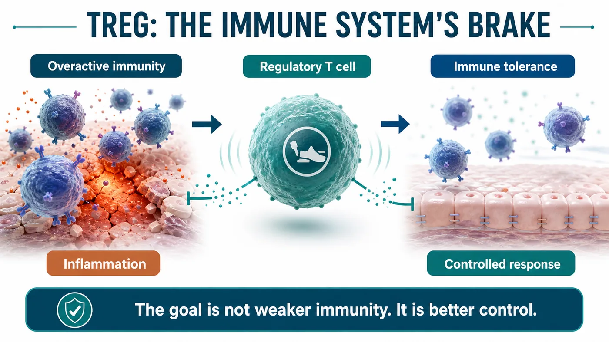
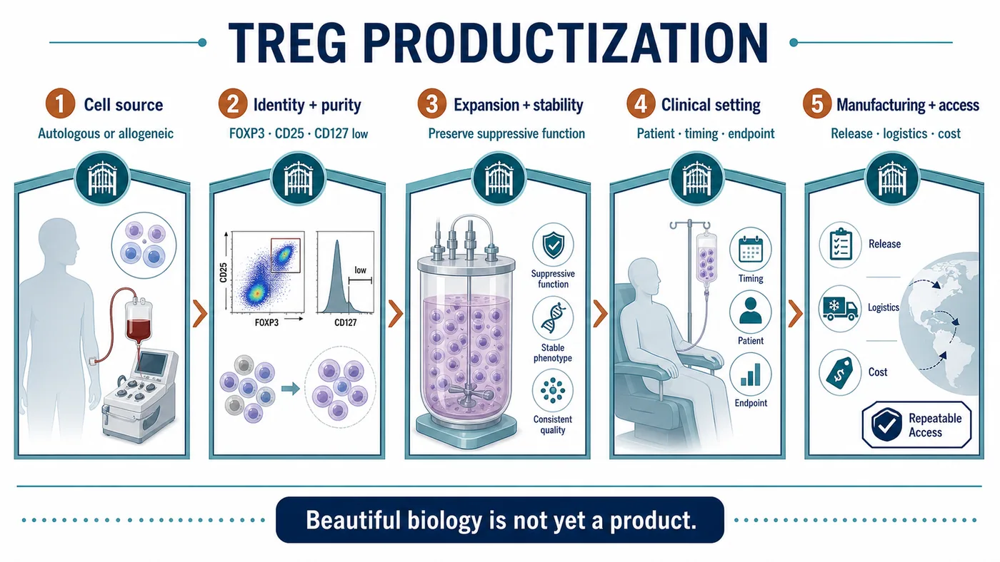
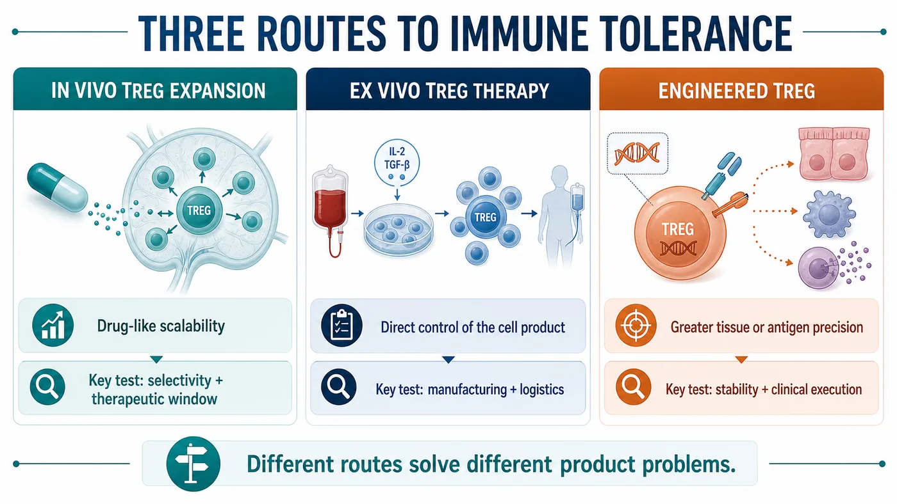
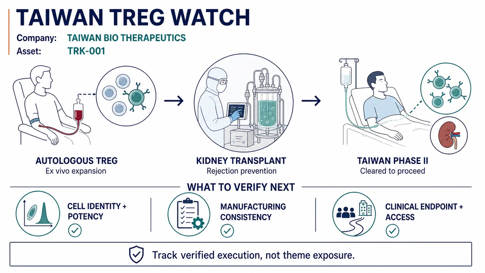

# After the Nobel Prize, Do Not Rush the First-Approved Treg Story: The Real Test Is Turning Immune Tolerance Into a Product

For some scientific themes, the most dangerous moment comes just after they are discovered by the wider market.

That is when conclusions arrive too quickly.

Regulatory T cells have returned to the spotlight. The 2025 Nobel Prize in Physiology or Medicine was awarded to Mary E. Brunkow, Fred Ramsdell and Shimon Sakaguchi for discoveries concerning peripheral immune tolerance. A term that once belonged mainly to the inner circle of immunology has now been pulled to the front of industry and capital-market conversations.

Treg stands for regulatory T cell.

Its story is very different from the aggressive language associated with CAR-T. CAR-T is described through finding, targeting and killing. Treg uses a quieter vocabulary: braking, tolerating and rebuilding order.

Quiet does not mean unimportant.

The underlying problem in many diseases is not that the immune system is too weak. It is that the immune system is too willing to damage the body it is meant to protect. Autoimmune disease, transplant rejection and uncontrolled inflammation cannot be solved simply by pressing harder on the accelerator. The more valuable question is whether the immune system can be taught to recover restraint.

Our view is that the industrial value of Treg does not rest on the attention generated by a phrase such as "the first approved Treg drug." It rests on whether immune tolerance can be turned into a product that can be released, tracked, priced, delivered and reproduced.

The Nobel Prize illuminated the science. The market's next questions concern manufacturing, quality, clinical setting and commercialization.

## 01｜What the Nobel Prize Illuminated: The Immune System's Brake

An immune system that only knows how to attack does not make the body safer.

Every day, the immune system must identify external pathogens while sparing the body's own tissues. That act of restraint is not passive. It is a highly organized biological system, and Treg cells are among its most important components.

NobelPrize.org described the 2025 medicine award as recognizing discoveries concerning peripheral immune tolerance. In plain language, it concerns how the immune system avoids losing control in peripheral tissues and how it applies a brake when necessary.

The drug-development implications are considerable.

If CAR-T asks whether immune cells can be engineered into more precise weapons, Treg asks the opposite but equally consequential question: can immune cells be trained to maintain order?

The idea sounds gentle. Product development is not.

Once Treg becomes a therapeutic product, investors, pharmaceutical companies, physicians and regulators stop listening only to the immunology narrative. They ask harder questions. Where do the cells come from? How are they selected? How are they expanded? Is the phenotype stable? Can it change after infusion? Are batches consistent? Can a clinically meaningful endpoint be designed?

The challenge in Treg has never been making the concept sound compelling.

The challenge is that the modality operates close to the immune system's most precise control knobs.

## 02｜Why Treg Is Difficult: It Takes an Order-Engineering System, Not a Single Molecule

For a small molecule or antibody, the hardest problems often involve target choice, affinity, half-life and toxicity.

Treg cell therapy is different.

The product is a living cell. Living cells change. They respond to their environment, are selected during manufacturing and encounter inflammatory signals in patients that differ radically from those in a controlled production system.

Turning Treg into a product therefore involves at least five gates.

The first is cell source. Is the product autologous or allogeneic? An autologous product is aligned with the patient's immune context, but manufacturing is expensive and slow, and batch variability can be substantial. An allogeneic product may be more industrializable, but it must address immune compatibility, safety and persistence.

The second is Treg purity. A collection of T cells cannot be called a Treg product by assertion. Markers such as FOXP3, CD25 and low CD127 expression matter for the assessment of cellular identity and function. The closer a product moves toward the clinic, the less room there is to substitute a broad concept for specific characterization.

The third is expansion and stability. Producing enough cells while preserving regulatory function is a manufacturing examination in its own right. Too little expansion leaves the program without an adequate dose. Expansion without sufficient control may loosen the identity of the product.

The fourth is clinical setting. The choice of disease matters. Autoimmune disease, transplantation and inflammatory disease may all appear relevant, but each carries different endpoints, patient-selection criteria, dosing windows and competitive pressure.

The fifth is pricing. If cell therapy is to enter chronic immune disease, it cannot simply inherit the high-price logic of oncology cell therapy. It must show payers what long-term medication, hospitalization, organ damage or recurrence it can reduce.

Together, these questions form the real barrier to Treg development.

Many companies can participate in a Treg theme. The companies most likely to be repriced are those that connect immunology, manufacturing, clinical development and a viable commercial model.

## 03｜The Global Field Is Splitting Into Three Product Routes

The global Treg and immune-tolerance field can be organized into three broad routes.

The first route is in vivo induction or expansion of Treg cells.

Nektar's rezpegaldesleukin is a useful reference point for this model. It pursues immune modulation in vivo, using a Treg-biased mechanism to reshape immune balance inside the patient. The advantage is that the product remains closer to conventional drug development and can be understood through a more familiar clinical-development and scaling framework.

Its challenge is equally clear. The broader the in vivo immune modulation, the more the program must prove selectivity, dose and therapeutic window. The immune system is not a single switch. Too little modulation may have no effect; too broad an effect may create new safety risks.

The second route is ex vivo Treg cell therapy.

Sonoma Biotherapeutics provides a strong example. Its pipeline emphasizes engineered Treg cell therapeutics for autoimmune and inflammatory disease. The route has substantial potential because the localization, function and intended indication of the cell product can be designed with greater precision.

But the moment a program moves ex vivo, manufacturing, cost, logistics, batch release and the clinical administration workflow arrive together. A presentation may show one pipeline asset; a clinical site experiences an entire supply chain.

The third route is engineered Treg.

Quell Therapeutics represents a more engineered approach. The goal is to direct Treg cells more precisely toward selected tissues or antigen-associated settings and thereby address immune dysregulation.

This route is both elegant and exceptionally demanding.

It is elegant because it moves Treg beyond broad immune modulation toward a more precise product design. It is demanding because it must carry cell engineering, immune stability, manufacturing scale-up and clinical-endpoint design at the same time.

The global Treg race should therefore be read through product-route selection and execution. The key question is not who uses the term Treg, but who can choose a route and advance it to verifiable evidence.

## 04｜The Taiwan Read-Through: Taiwan Bio Therapeutics Belongs on the Watchlist

In Taiwan, Taiwan Bio Therapeutics belongs on the early productization watchlist for Treg and immune tolerance.

That does not justify presenting the company as an analogue of an unverified overseas approval, nor is the label "Treg concept stock" sufficient analysis. The substantive questions are whether the company can explain cell source, manufacturing, identity markers, clinical setting and delivery capability.

The company has publicly identified TRK-001 as an autologous, ex vivo-expanded Treg product intended to prevent rejection in living-donor kidney-transplant recipients. An official company disclosure stated that Taiwan's Ministry of Health and Welfare had agreed in principle to the Phase II study. This is a useful verified anchor, but it does not remove the need to evaluate execution.

The market should not stop at asking whether a company "has Treg." It should ask:

- Is the cell source and manufacturing process clearly described?
- Can Treg identity and functional markers be followed consistently?
- Do the expanded cells retain regulatory function?
- Is the intended clinical setting autoimmune disease, transplantation or inflammatory disease?
- Can the endpoint be understood by physicians, regulators and payers?
- Can the product move from laboratory work to repeatable delivery?

Those are the questions that matter when assessing Taiwan Bio Therapeutics.

A better approach is to bring the same industrial framework back to Taiwan: Which capabilities are required for a Treg product? Which data can the market understand? Which developments deserve attention?

Taiwan's biotech market can move quickly on a thematic phrase. Treg requires the opposite instinct.

Its central promise is stability and control.

## 05｜Risk: A First-Approved Claim Cannot Rest on Secondary Narratives

It is not surprising that the Treg theme is gaining attention.

The Nobel Prize provided scientific recognition. Global companies are advancing different product routes, and cell therapy is moving beyond tumor killing toward immune regulation. These are real signals.

The more real the signal, the less it should be distorted by an overextended headline.

A claim such as "the world's first approved Treg drug" cannot be treated as fact without support from the FDA, Drugs@FDA, an official company release, a prescribing label or another formal regulatory document. Regulatory approval is among the highest-risk categories of information. It should not be reconstructed from a secondary article or screenshot.

That is the reason for our caution.

Treg can and should be analyzed. It relates to an important next direction for cell therapy: moving from tumor killing to rebuilding immune order.

But the phrase "first approved" should not be rushed.

When a primary source is available, the event can be treated as approval news. Until then, the better approach is to place Treg on a productization map and distinguish scientific attention, clinical progress, manufacturing capability and distance from commercialization.

That does not weaken the story.

It makes the story more consistent with how the industry actually develops.

## Conclusion｜The Next Treg Test Is Turning Immunology Into a Controlled Product

The most compelling feature of Treg is that it changes the tone of cell therapy.

The market has spent years hearing how cell therapies attack, kill and clear disease. Treg elevates a different question: when disease is caused by immune dysregulation, can the system be taught to recover order?

The question is large and difficult.

That is why the next stage for Treg is not to make the terminology hotter.

It must turn immunology into a product.

Can developers select the right cells? Can they expand stable cells? Can those cells preserve function inside patients? Can clinical endpoints be accepted by regulatory and reimbursement systems? Can cost be reduced enough for repeatable delivery?

These questions matter more than who is first.

The Nobel Prize made Treg visible to a much wider audience. The industrial examination is only beginning.

For Taiwan, Taiwan Bio Therapeutics can be placed on the watchlist, but it should be evaluated using the same demanding framework. The market will ultimately reward companies that can turn immune tolerance into a controlled product.

## References

1. [NobelPrize.org｜The Nobel Prize in Physiology or Medicine 2025](https://www.nobelprize.org/prizes/medicine/2025/summary/)
2. [Nektar Therapeutics｜Our Pipeline](https://www.nektar.com/our-pipeline/)
3. [Sonoma Biotherapeutics｜Pipeline](https://sonomabio.com/platform-pipeline/pipeline/)
4. [Quell Therapeutics｜Pipeline](https://www.quell-tx.com/our-science/pipeline/)
5. [Quell Therapeutics｜Technology Platform](https://www.quell-tx.com/our-science/technology-platform/)
6. [Taiwan Bio Therapeutics｜TRK-001 Phase II study cleared to proceed in Taiwan](https://twbio-thera.com/tw/news/1/16)

## Disclaimer

This article is industry research and market commentary. It does not constitute investment advice, a recommendation to buy or sell securities, medical advice or an endorsement of any individual company. Cell therapy and biotech investing involve risks related to clinical trials, regulatory review, manufacturing scale-up, commercial competition, reimbursement and capital-market volatility. Readers should conduct their own due diligence and bear responsibility for their investment decisions.
