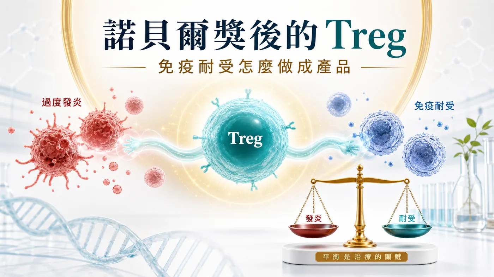
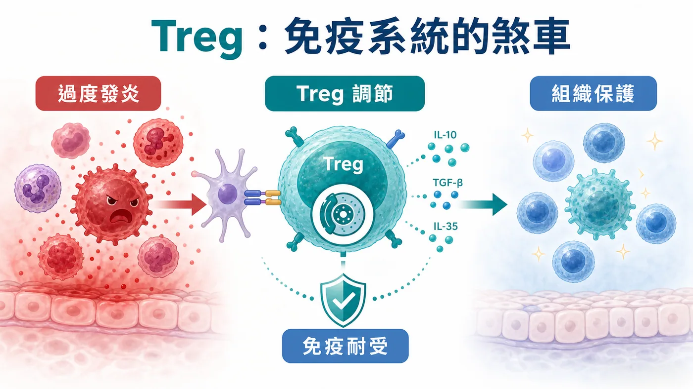
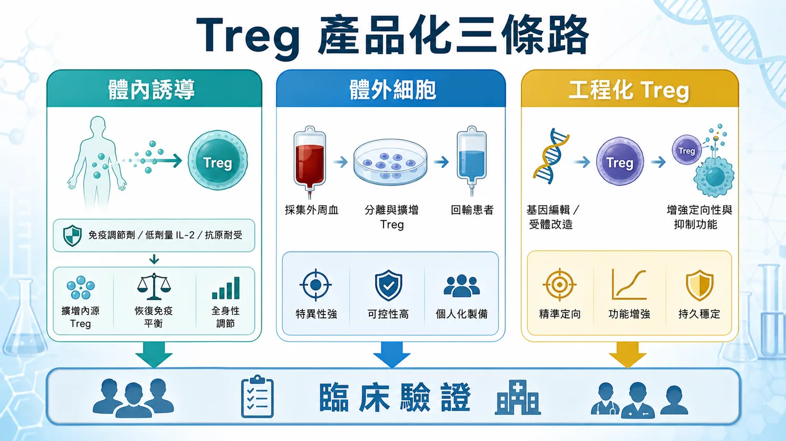
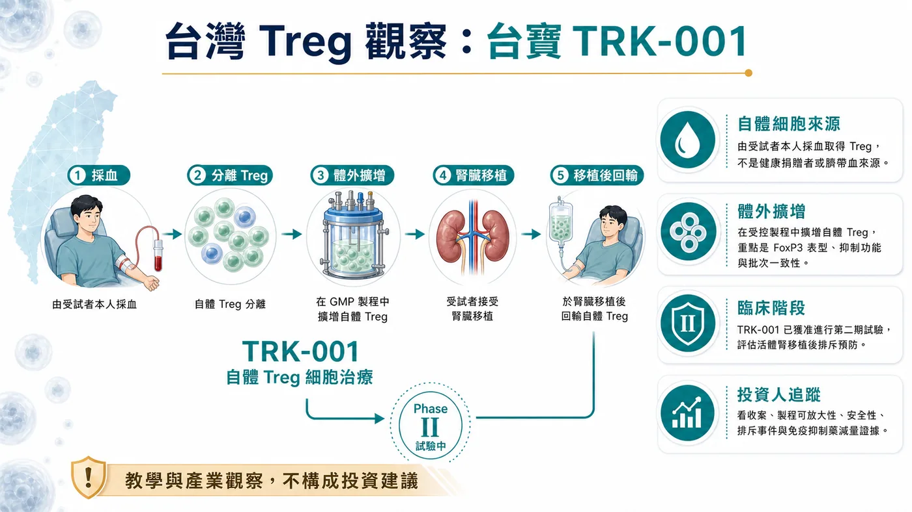

# 諾貝爾獎後，Treg 第一個獲批藥還不能急著喊：真正的考題是免疫耐受怎麼做成產品

有些題材，最危險的時刻，是剛被看見的時候。

是大家太快替它下結論。

Treg 最近重新站回聚光燈。2025 年諾貝爾生理學或醫學獎頒給 Mary E. Brunkow、Fred Ramsdell 與 Shimon Sakaguchi，表彰他們在 peripheral immune tolerance 上的發現。這件事讓一個原本偏免疫學核心圈的名詞，被拉回產業和資本市場前台。

Treg，全名 regulatory T cell，調節性 T 細胞。

它不像 CAR-T 那樣有很強的攻擊敘事。CAR-T 的語言是找到、鎖定、殺掉；Treg 的語言安靜得多，它談的是煞車、容忍、重建秩序。

可是安靜不代表不重要。

很多疾病的底層問題，並非免疫系統不夠強，常常是它太會誤傷自己。自體免疫疾病、移植排斥、發炎失控，單純多踩一腳油門解不了。這時候，真正有價值的問題變成：能不能讓免疫系統重新學會分寸？

藥時事團隊的判斷是：Treg 的產業價值，不在一句「第一個獲批藥」有多吸睛，而在免疫耐受能否被做成可放行、可追蹤、可定價、可複製的產品。

諾貝爾獎點亮的是科學。市場接下來要看的，是製程、品質、臨床場景和商業化。

## 01｜諾貝爾獎照亮的，是免疫系統的煞車

免疫系統如果只會攻擊，人不會活得比較安全。

我們每天都靠免疫系統辨識外來病原，也靠它放過自己的組織。這個「放過」不是消極，它是一套高度精密的秩序。Treg 就是在這套秩序裡很重要的細胞之一。

NobelPrize.org 對 2025 年醫學獎的說法很清楚：這次獲獎，是因為 peripheral immune tolerance 的發現。白話講，就是免疫系統如何在身體周邊組織裡避免失控，如何在必要時踩住煞車。

這個概念放進藥物開發，想像空間很大。

如果 CAR-T 是把免疫細胞改造成更精準的攻擊武器，Treg 則像是在問另一個方向：能不能把免疫細胞訓練成秩序維持者？

這句話看起來柔和，產品化卻一點也不柔和。

因為一旦要做成藥，市場就不會只聽免疫學故事。投資人、藥廠和醫師會追問更硬的細節：細胞從哪裡來？怎麼分選？怎麼擴增？表型穩不穩？進到病人體內後會不會變？批次之間能不能一致？臨床終點能不能設計得出來？

Treg 的難，從來不在概念漂亮。

難在它太接近免疫系統的精密旋鈕。

## 02｜Treg 為什麼難做：一顆分子解不了，一套秩序工程才解得動

小分子藥或抗體藥，最難的問題常常是靶點、親和力、半衰期、毒性。

Treg 細胞療法不一樣。

它要處理的是活細胞。活細胞會變，會受環境影響，會在製程裡被篩選，也會在病人體內面對完全不同的發炎訊號。

所以 Treg 產品化至少有五道關卡。

第一，細胞來源。是自體，還是異體？自體比較貼近個人免疫狀態，但製程昂貴、速度慢、批次差異大。異體有機會工業化，但免疫相容性、安全性和持久性都要回答。

第二，Treg 純度。Treg 不是隨便抓一群 T 細胞就能叫 Treg。FOXP3、CD25、CD127 low 這些表型，會牽動細胞身份和功能判斷。產品越接近臨床，越不能靠概念帶過。

第三，擴增與穩定。要把細胞擴到足夠劑量，同時維持調節功能，本身就是製程考試。擴太少，沒有劑量；擴太粗，身份可能鬆掉。

第四，臨床場景。Treg 要打哪裡很關鍵。自體免疫疾病、移植、發炎疾病，看起來都能講，但每個場景的終點、病人選擇、給藥時間和競品壓力都不同。

第五，定價。細胞療法如果要進入慢性病或免疫疾病，不能只套用腫瘤細胞療法的高價邏輯。它要說服支付方：這個產品到底能少掉多少長期用藥、住院、器官損傷或疾病復發。

這些問題合在一起，才是 Treg 的真正門檻。

碰到 Treg 的公司很多，真正能被重估的，是把免疫學、製程、臨床和商業模式接起來的公司。

## 03｜全球賽道正在分成三條路

現在全球 Treg / 免疫耐受賽道，大致可以看成三條路。

第一條，是體內誘導或擴增 Treg。

Nektar 的 rezpegaldesleukin 就屬於這類觀察座標。它選的是體內免疫調節，透過偏向 Treg 的作用方式，嘗試在人體內重塑免疫平衡。這條路的好處是比較接近藥物化、規模化，也比較容易被傳統臨床開發框架理解。

但它的問題也很清楚：體內調節越廣，越需要證明選擇性、劑量和安全窗。免疫系統不是單一開關，推得太弱沒有療效，推得太廣可能帶來新的安全性問題。

第二條，是 ex vivo Treg 細胞療法。

Sonoma Biotherapeutics 的管線，就是這條路很好的例子。它把重點放在 engineered Treg cell therapeutic，試圖用更精準的細胞工程去處理自體免疫與發炎疾病。這條路的想像空間大，因為它有機會把細胞的定位、功能和適應症設計得更精細。

可是只要走到 ex vivo，製程、成本、物流、批次放行和臨床給藥流程就會一起出現。它寫在簡報裡是一條管線，進到臨床現場就是一整套供應鏈。

第三條，是工程化 Treg。

Quell Therapeutics 代表的是更工程化的方向。它關注 engineered Treg cell therapy，核心想法是讓 Treg 更精準地到達特定組織或抗原相關場景，處理免疫失衡。

這條路很漂亮，也最硬。

漂亮，是因為它把 Treg 從「泛免疫調節」推向更精準的產品設計。硬，是因為它同時背負細胞工程、免疫穩定、製程放大和臨床終點四件事。

所以全球 Treg 賽道真正要看的，是誰能選對一條產品路徑，並且把它走到可驗證。

## 04｜台灣怎麼看：台寶先放進觀察座標

放回台灣，台寶可以先放進 Treg / 免疫耐受產品化的觀察名單。

但這個觀察不能被講成海外未查證核准產品的同型藥，也不能只用一句「Treg 概念股」帶過。真正要看的是：它能不能把細胞來源、製程、身份標記、臨床場景與交付能力說清楚。

也就是說，市場不該只問「有沒有 Treg」。

更該問這幾件事：

📌 細胞來源與製程是否說得清楚？

📌 Treg 身份與功能標記是否能穩定追蹤？

📌 擴增後的細胞是否仍維持調節能力？

📌 臨床場景是自體免疫、移植，還是發炎疾病？

📌 終點設計能不能讓醫師、監管單位和支付方理解？

📌 產品最後能不能從實驗室走向可重複交付？

這才是看台寶時真正該回到的問題。

更好的做法，是把同一套產業題目拿回來檢查：Treg 如果要變成產品，台灣公司需要補上哪些能力，哪些資料可以被市場讀懂，哪些進展才值得追。

台灣生技市場很容易被一句題材帶動。Treg 這題更需要慢一點。

因為它的核心在穩。

## 05｜風險：第一個獲批藥不能靠二手敘事

Treg 題材會熱，並不意外。

諾貝爾獎給了科學背書，全球公司開始推進不同產品路徑，細胞療法也正在從腫瘤攻擊走向免疫調節。這些都是真訊號。

但越是真訊號，越不能被一句過滿的話帶偏。

「全球第一個獲批 Treg 藥」這種說法，如果沒有 FDA、Drugs@FDA、公司官方新聞稿、仿單或正式監管文件支撐，就不能拿來當事實。監管核准是最高風險資訊，不適合用二手文章或截圖補。

這也是藥時事團隊這次更在意的點。

Treg 可以寫，而且應該寫。它關係到細胞療法下一個很重要的方向：從殺傷腫瘤，走向重建免疫秩序。

但「第一個獲批」不能急著喊。

等真正的一級來源出現，再把它當新聞事件處理。現在比較好的方式，是先把 Treg 放回產品化地圖裡看，分清楚科學熱度、臨床進度、製程能力和商業化距離。

這樣寫，沒有少掉故事。

反而更接近產業真正會發生的事。

## 結語｜Treg 的下一關，是把免疫學做成可控產品

Treg 最迷人的地方，是它改變了細胞療法的語氣。

過去幾年，市場習慣聽細胞療法怎麼攻擊、怎麼殺傷、怎麼清除病灶。Treg 讓另一個問題變得更重要：當疾病來自免疫系統失控，我們能不能讓它重新學會秩序？

這個問題很大，也很難。

所以 Treg 的下一關，不在把名詞講熱。

它要把免疫學做成產品。

能不能分選出對的細胞，能不能擴增出穩的細胞，能不能在病人體內保持功能，能不能設計出可被監管與支付系統接受的臨床終點，能不能把成本壓到可交付。

這些問題，比「誰第一個」更重要。

諾貝爾獎讓 Treg 被更多人看見。真正的產業考試，現在才開始。

對台灣來說，台寶可以先放進觀察座標，但也要用同一套嚴格問題檢查。市場最後會獎勵的，是最早把免疫耐受做成可控產品的公司。

## 參考資料

1. [NobelPrize.org｜The Nobel Prize in Physiology or Medicine 2025](https://www.nobelprize.org/prizes/medicine/2025/summary/)
2. [Nektar Therapeutics｜Our Pipeline](https://www.nektar.com/our-pipeline/)
3. [Sonoma Biotherapeutics｜Pipeline](https://sonomabio.com/platform-pipeline/pipeline/)
4. [Quell Therapeutics｜Pipeline](https://www.quell-tx.com/our-science/pipeline/)
5. [Quell Therapeutics｜Technology Platform](https://www.quell-tx.com/our-science/technology-platform/)
6. [台寶生醫｜TRK-001 取得衛福部原則同意執行第二期腎臟移植排斥預防臨床試驗](https://twbio-thera.com/tw/news/1/16)

## 免責聲明

本文為產業研究與市場觀察，不構成任何投資建議、買賣建議、醫療建議或個股推薦。細胞療法與生技醫藥投資涉及臨床試驗、法規審查、製程放大、商業化競爭、支付環境與資本市場波動，投資人應自行判斷並自負盈虧。
