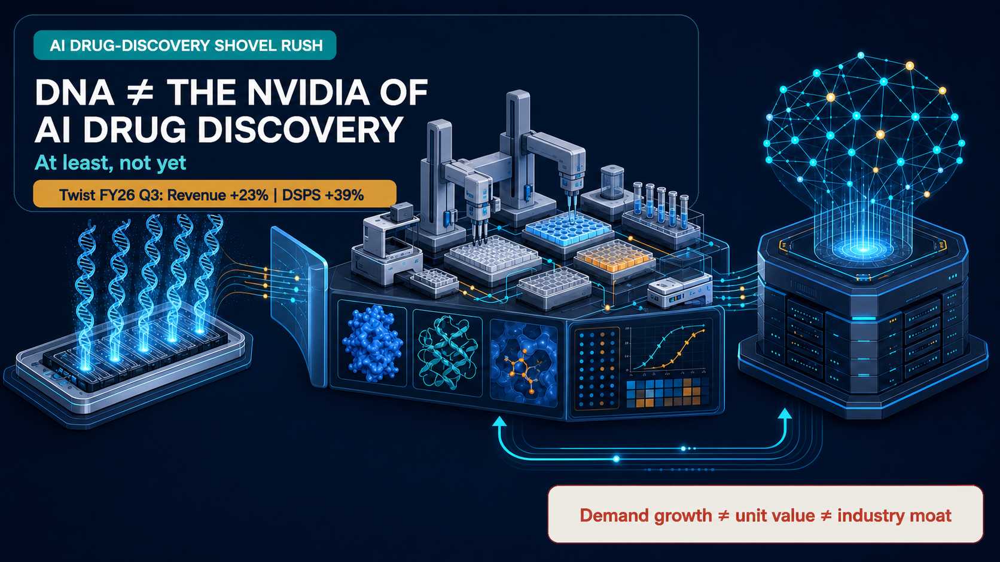
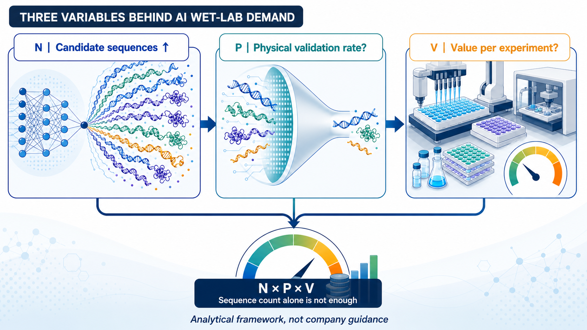
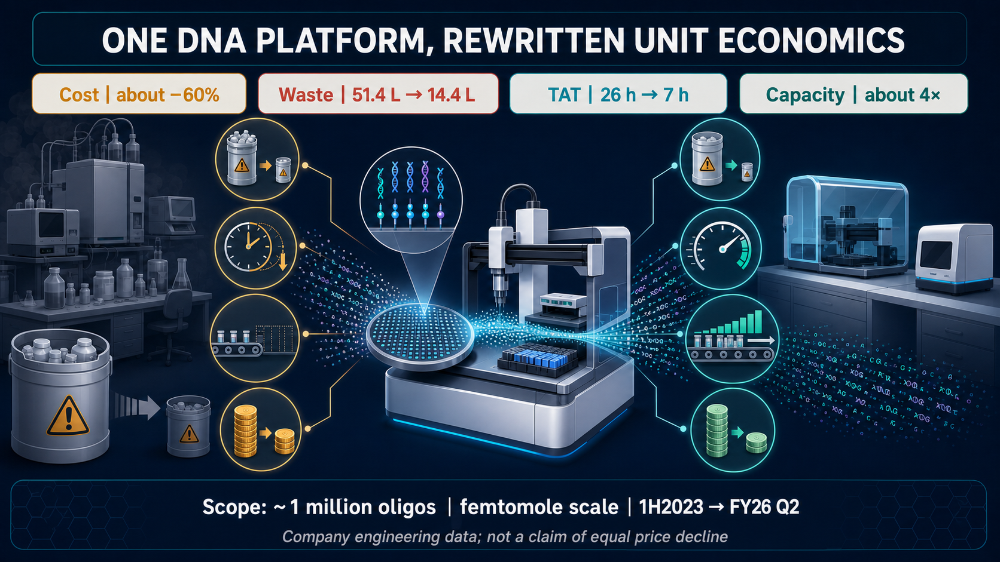
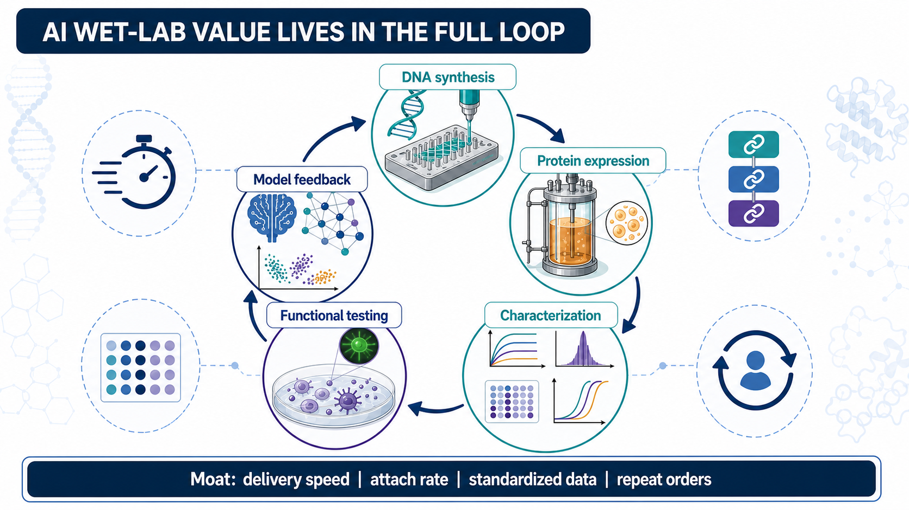

# DNA Is Not the Nvidia of AI Drug Discovery, At Least Not Yet

DNA synthesis has suddenly been elevated to the throne of “the Nvidia of AI drug discovery.”

Twist Bioscience’s latest results are undeniably strong. Fiscal third-quarter 2026 revenue reached $118.4 million, up 23% year over year. DNA Synthesis and Protein Solutions, or DSPS, generated $56.6 million, up 39%. Revenue from therapeutics customers, a customer-industry classification rather than a separate product segment, reached $40.4 million, up 49%.

The company also said orders tied to AI-enabled drug discovery are expected to grow at a triple-digit percentage in fiscal 2026 versus fiscal 2025, with another triple-digit increase visible for fiscal 2027.

That wording matters. Twist is describing order growth, not revenue already recognized in its financial statements. Likewise, the $40.4 million therapeutics figure groups customers by industry; it is neither a stand-alone product segment nor a disclosure of AI-specific revenue. Treating either number as a pure AI revenue line would overstate what the company has actually reported.

The demand cycle is real. But orders are not revenue, and revenue growth does not automatically become monopoly power. The market is collapsing three different propositions into one: more demand, greater value per unit and a supplier moat that is hard to replace.

Nvidia became formidable because all three were true at the same time. DNA synthesis has so far proved only the first.

## 01 | Faster AI Design Makes the Wet Lab Busier

Twist’s strongest evidence lies in actual orders and workflow. AI is channeling a flood of digital sequences into physical laboratories.

Models generate vast numbers of DNA or protein sequences. Selected molecules must then be synthesized, expressed as proteins and tested for binding, stability, developability and function. The resulting experimental data are fed back into the model, starting the next design cycle.

That is the Design-Build-Test-Learn loop. Twist describes customers moving through three stages: building the biological data needed to train models, repeatedly turning the design-build-test crank, and then iterating the model with new data while expanding into formats such as IgG and bispecific antibodies.

The company’s own description is direct: an AI-ready wet lab at scale.

AI has not eliminated experiments. It is turning experimentation into a higher-throughput industrial system.

## 02 | One Million Sequences Do Not Equal One Million Equivalent Orders

To understand the opportunity, it helps to set aside the catchy “picks and shovels” metaphor and look at three variables:

- **N: the number of candidates generated by AI**
- **P: the proportion that enters physical validation**
- **V: the economic value captured by each experiment**

The wet-lab opportunity can be framed roughly as `N × P × V`. This is an analytical framework, not company guidance, and the variables interact with one another.

N is almost certain to expand rapidly. Yet as models improve at eliminating low-probability candidates in silico, P could fall. Automation, miniaturization and platform improvements may also reduce the price or cost of each experiment, so V does not necessarily rise with N.

Twist’s own engineering data put this tension in plain view.

Across a company dataset of roughly one million oligonucleotides produced at femtomole scale, from the first half of 2023 through fiscal 2026’s second quarter:

- Manufacturing cost fell by about 60%.
- Chemical waste declined from 51.4 liters to 14.4 liters, a reduction of roughly 70%.
- Turnaround time fell from 26 hours to 7 hours, a reduction of roughly 73%.
- Capacity increased by about fourfold.

These figures show a platform becoming faster and less expensive to operate. They do not mean selling prices fell by the same amount. But they do underscore an important point: sequence volume, revenue and material consumption will not remain linearly linked forever.

For investors, this is the central unit-economics question. Higher sequence volume can expand platform utilization while lower cost per run changes the value captured from each order. The investment case therefore depends not only on how much work enters the factory, but also on what customers buy around that work and how much of the resulting productivity the supplier can retain.

When a platform completes more sequences with less time, reagent use and waste, the value may accrue first to the platform and its workflow rather than to each gram of input material.

## 03 | Twist Itself Is Already Reaching Beyond DNA Revenue

If DNA synthesis alone captured the value of AI drug discovery, Twist would have the strongest incentive to say so. Instead, its third-quarter presentation maps a much broader opportunity.

The company estimates that by 2030, the serviceable available market for DNA Synthesis and Protein Solutions will exceed $7 billion, within a total addressable market of roughly $18 billion. Its chart places the incremental serviceable market from AI-enabled drug discovery in antibody discovery services and protein expression, at roughly $500 million each. It does not add a separate AI increment to the DNA synthesis column.

That does not mean DNA will miss the upside. It means the share of wallet created by AI is extending into protein expression, characterization, functional testing and standardized data that can be fed back into models.

Twist’s product roadmap is moving downstream as well, with IgG characterization, yeast display, CHO expansion and high-throughput bispecific antibodies. The prize is a continuous stream of orders spanning genes, proteins and data.

That is why asking only whether a company can synthesize DNA is no longer enough.

## 04 | If This Is Not Nvidia, Where Could the Moat Be?

Nvidia’s GPUs combined scarce compute, high value per system and a software ecosystem. The life-science tool chain is longer and more fragmented, and automation can continue to push down unit costs at many points.

Investors should therefore look beyond sequence counts. Four indicators are harder to fake:

1. **Delivery speed:** Can complex sequences be delivered predictably, rather than through a single record-setting order?
2. **Attach rate:** After buying DNA, how many customers also purchase protein expression, characterization and functional testing?
3. **Data standardization:** Can each experimental round be compared under consistent conditions and become a high-quality label for the model?
4. **Repeat orders:** Does the customer’s design-experiment-learning wheel keep turning, embedding the supplier in routine R&D?

If all four improve together, a platform has a chance to move from contract manufacturing toward an R&D operating system. One quarter of rapid revenue growth is not enough to prove that degree of stickiness.

## Final Take

DNA matters. As AI moves deeper into antibody, protein and nucleic-acid drug design, demand for complex DNA and high-throughput synthesis has room to grow. Twist’s third-quarter results have moved that thesis from narrative into orders.

But DNA is only the first doorway through which a digital molecule enters the physical world. Beyond it lie protein expression, binding, stability, functional testing and model feedback. Value can be redistributed at every step.

The shovel rush may continue. The crown should wait.

The scarce asset in AI drug discovery may not be a single DNA sequence. It may be the entire experimental factory that can reliably turn massive sequence volumes into proteins and functional data, then send those data back into the model.

## Primary Sources

1. [Twist Bioscience | Fiscal Third Quarter 2026 Financial Results](https://investors.twistbioscience.com/static-files/09275eee-f3b8-45a6-b39c-4201339dbc8f)
2. [Twist Bioscience | Fiscal 2026 Q3 Financial Results Presentation](https://investors.twistbioscience.com/static-files/f4d8b908-ec67-4c0a-9b16-29271fda205a)
3. [Twist Bioscience | Investor Day 2026](https://investors.twistbioscience.com/static-files/b091befc-c055-44c7-a7ce-9becedaa4607)
4. [Twist Bioscience | Complex Genes offering expansion](https://investors.twistbioscience.com/news-releases/news-release-details/twist-bioscience-expands-clonal-genes-offering-include-long-and/)
5. [Twist Bioscience | Bispecific antibody discovery licensing agreement](https://investors.twistbioscience.com/news-releases/news-release-details/twist-bioscience-expands-antibody-discovery-offering-bispecific/)

Fact-check cutoff: August 12, 2026.

> Disclaimer: The company’s statements about AI-related order growth in fiscal 2026 and 2027 and its 2030 market estimates are forward-looking. This article is biotechnology business analysis based on public information and does not constitute investment, medical, fundraising or securities-trading advice.
