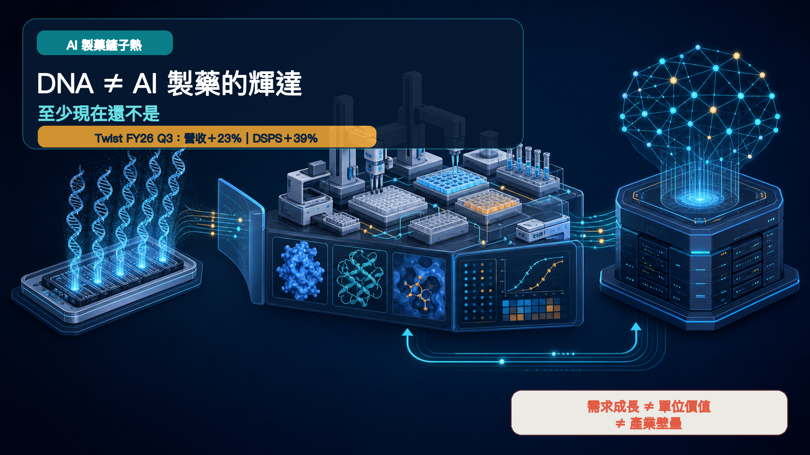
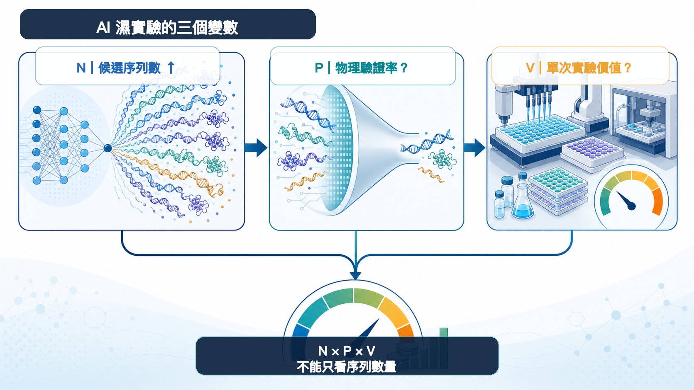
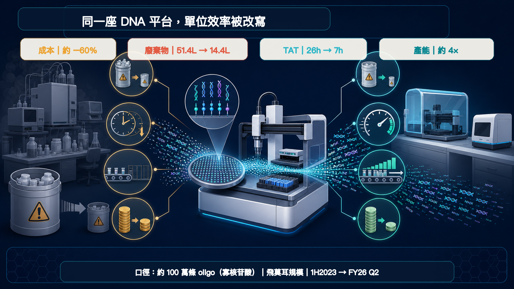
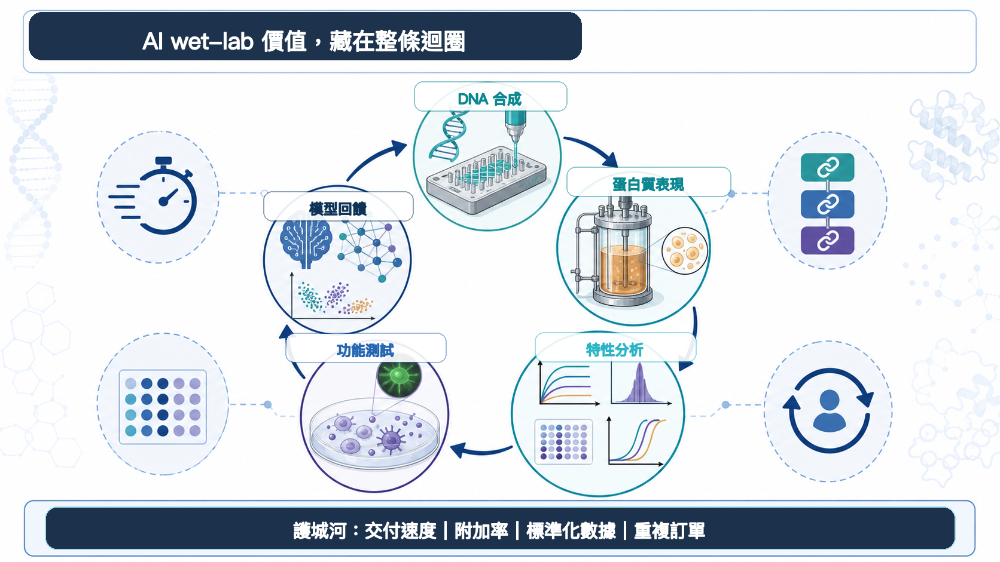

# DNA 不是 AI 製藥的輝達，至少現在還不是

DNA 合成，忽然被抬上了「AI 製藥的輝達」神壇。

Twist Bioscience 的財報確實亮眼。會計年度 2026 第三季營收 1.184 億美元，年增 23%；DNA 合成與蛋白質解決方案（DSPS）營收 5,660 萬美元，年增 39%。按客戶產業分類的治療領域營收則達 4,040 萬美元，年增 49%。

公司還表示，AI 輔助藥物發現的訂單，2026 會計年度對 2025 年預計出現三位數百分比成長；對 2027 年也看得到同等量級的訂單成長。

景氣來了，這點不必否認。但訂單不是營收，營收成長也不會自動長成壟斷。市場正把三個層次疊在一起：需求增加、單位價值上升、供應商擁有難以取代的壁壘。

輝達之所以可怕，是三件事曾在同一時間成立。DNA 合成才剛證明第一件。

## 01｜AI 設計得越快，濕實驗室反而越忙

Twist 給市場最有力的證據，落在實際訂單與工作流：AI 正把數位世界的序列洪水，引進真實實驗室。

模型先生成數不清的 DNA 或蛋白質序列；候選分子被合成、表現成蛋白質，再接受結合力、穩定性、可開發性與功能性測試。實驗數據回灌模型，開始下一輪設計。

這就是 Design–Build–Test–Learn 的循環。Twist 把客戶分成三個階段：先建立模型所需的生物資料；然後持續轉動設計、構建、測試；最後用新數據迭代模型，並擴充 IgG、雙特異性抗體等新類型。

公司對自己的定位也很直接：大規模、為 AI 準備好的濕實驗室。

AI 沒有消滅實驗。它把實驗變成更高吞吐量的工業系統。

## 02｜一百萬條序列，不等於一百萬份等價訂單

要看懂這波需求，可以先放下「鏟子」這個太順口的比喻，用三個變數重算一次：

- **N：AI 生成的候選數量**
- **P：進入物理驗證的比例**
- **V：每次實驗能捕捉的經濟價值**

濕實驗的機會大致取決於 `N × P × V`。這是分析框架，不是公司財測，三個變數也會彼此影響。

N 幾乎肯定快速放大。可是模型越懂得在電腦裡淘汰低機率候選，P 就有可能下降；自動化、微量化與平台改進則會壓低單次實驗的價格或成本，V 不一定跟著 N 上升。

Twist 自己的工程數據，已經把這個張力擺到桌上。

在約 100 萬條寡核苷酸（oligo）、飛莫耳（femtomole）規模的公司數據中，2023 上半年到 2026 會計年度第二季：

- 製造成本約下降 60%
- 化學廢棄物從 51.4 公升降到 14.4 公升，約少 70%
- 作業時間從 26 小時縮短到 7 小時，約少 73%
- 產能約提高 4 倍

這些數字證明平台正在加速、降本，不能被解讀成售價也下降同樣幅度。但它們至少提醒一件事：序列數量、營收與原料消耗，不會永遠線性同步。

當一座平台用更少時間、試劑與廢棄物完成更多條序列，最先變貴的可能是平台與工作流，不是每一克原料。

## 03｜Twist 自己，早就不只想收 DNA 的錢

若 DNA 合成足以獨佔 AI 製藥的價值，最應該大聲宣告的就是 Twist。可是它在第三季簡報裡，畫出的地圖更寬。

公司估計，2030 年 DNA 合成與蛋白質解決方案的可服務市場超過 70 億美元，總可觸及市場約 180 億美元。圖表把 AI 輔助藥物發現的新增可服務市場，分別畫在「抗體發現服務」與「蛋白質表現」，各約 5 億美元；DNA 合成欄並沒有另畫一塊 AI 增量。

這不是說 DNA 沒有受惠。它說明的是，AI 帶來的錢包份額，正往蛋白質、特性分析、功能測試與可回饋模型的標準化數據延伸。

Twist 的下一步產品地圖也往下游走：IgG 特性分析、酵母展示、CHO 擴充、高通量雙特異性抗體。它要爭取的，是從 Gene、Protein 到 Data 的連續訂單。

這也是為什麼單看「會不會做 DNA」，已經不夠了。

## 04｜如果不是輝達，壁壘藏在哪裡？

輝達的 GPU 同時卡住稀缺算力、高單機價值與軟體生態。生命科學工具鏈更長、節點更散，也更容易被自動化持續壓低單位成本。

所以，投資人別只追序列數量。以下四個指標更難作假：

1. **交付速度：**複雜序列能否可預測地交付，重點不在一筆最快紀錄。
2. **附加率：**客戶買 DNA 之後，有多少同時買蛋白質表現、特性分析與功能測試。
3. **數據標準化：**每輪實驗能否在一致條件下比較，直接變成模型的高品質標籤。
4. **重複訂單：**客戶的設計—實驗—學習輪子能否持續轉動，讓供應商嵌入日常研發流程。

這四項若一起改善，平台才有機會從代工商變成研發系統。單單一季營收快速成長，還算不出這層黏著度。

## 寫在最後

DNA 當然重要。AI 越深入抗體、蛋白質與核酸藥物設計，複雜 DNA 與高通量合成的需求就越有機會成長。Twist 第三季財報，已經讓這條線索從故事走進訂單。

但 DNA 只是數位分子踏入現實世界的第一道門。門後還有蛋白質表現、結合力、穩定性、功能性與模型回饋，每一站都可能重新分配價值。

鏟子熱可以燒，皇冠先別戴。

AI 製藥最稀缺的，未必是一條 DNA；更可能是能把海量序列穩定變成蛋白質、功能數據，再送回模型的整座實驗工廠。

## 主要參考資料

1. [Twist Bioscience｜Fiscal Third Quarter 2026 Financial Results](https://investors.twistbioscience.com/static-files/09275eee-f3b8-45a6-b39c-4201339dbc8f)
2. [Twist Bioscience｜Fiscal 2026 Q3 Financial Results Presentation](https://investors.twistbioscience.com/static-files/f4d8b908-ec67-4c0a-9b16-29271fda205a)
3. [Twist Bioscience｜Investor Day 2026](https://investors.twistbioscience.com/static-files/b091befc-c055-44c7-a7ce-9becedaa4607)
4. [Twist Bioscience｜Complex Genes offering expansion](https://investors.twistbioscience.com/news-releases/news-release-details/twist-bioscience-expands-clonal-genes-offering-include-long-and/)
5. [Twist Bioscience｜Bispecific antibody discovery licensing agreement](https://investors.twistbioscience.com/news-releases/news-release-details/twist-bioscience-expands-antibody-discovery-offering-bispecific/)

查證截止：2026 年 8 月 12 日。

> 免責聲明：公司對 2026、2027 年 AI 相關訂單成長與 2030 市場規模的陳述均屬前瞻資訊；本文為生技醫藥產業與公開資料分析，不構成投資、醫療、募資或股票買賣建議。
