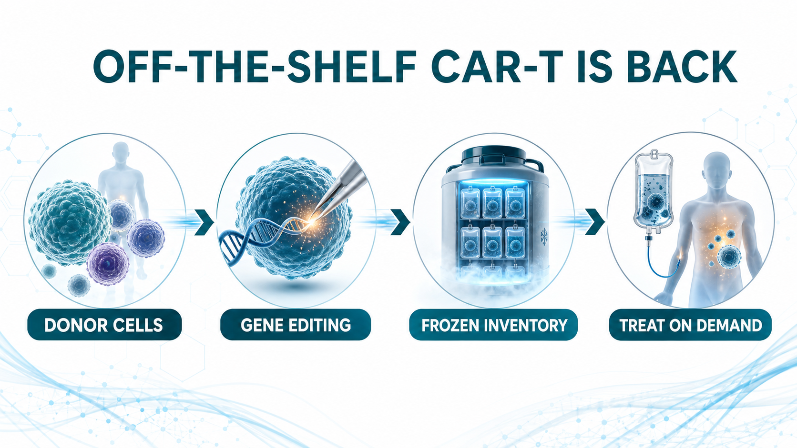
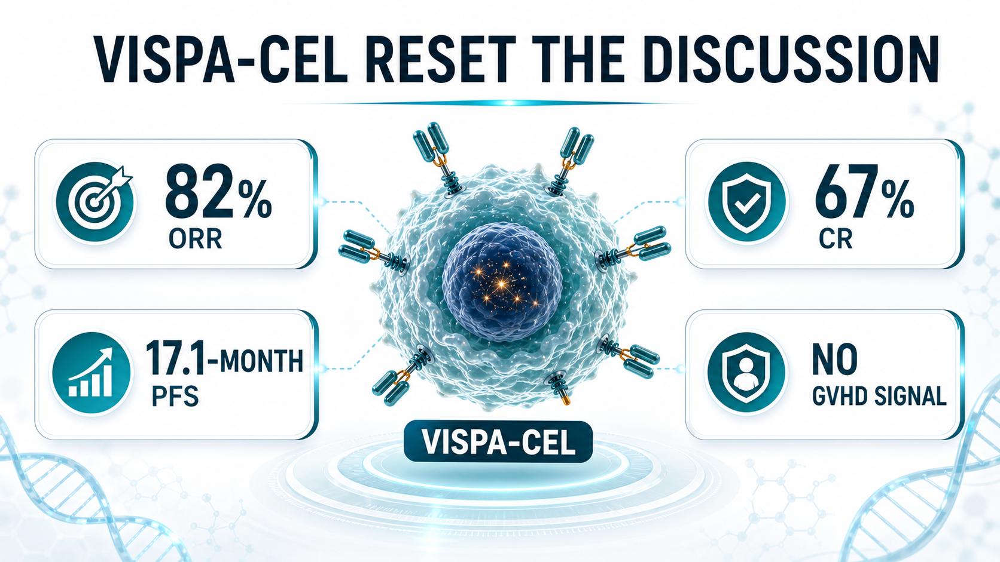
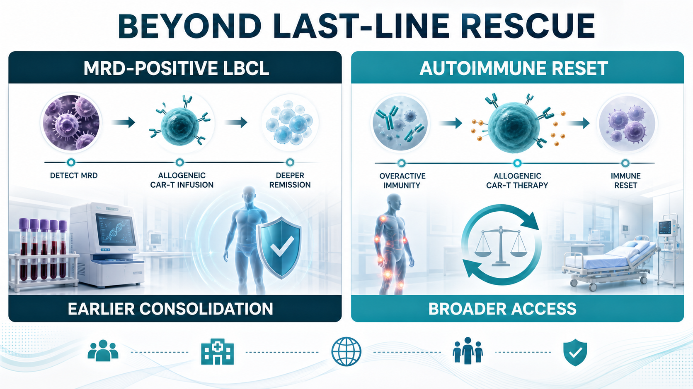
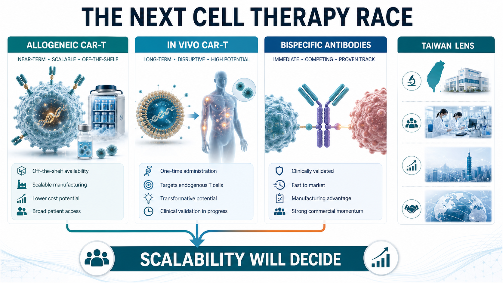

# Off-the-Shelf CAR-T in 2026: Rebounding From the Trough

Off-the-shelf CAR-T is getting warm again.

A few years ago, allogeneic CAR-T was one of the most exciting ideas in cell therapy. The logic was easy to understand. Conventional autologous CAR-T requires a patient’s own T cells to be collected, shipped to a manufacturing site, engineered, expanded, tested, released, and then infused back into the patient. The clinical effect can be powerful, but the process is slow, expensive, and operationally heavy. Patients with rapidly progressing disease, weak T-cell quality, poor access to major centers, or limited manufacturing slots may simply not make it to treatment.

Allogeneic CAR-T was designed to attack that pain point.

Instead of starting from each patient’s own cells, the field uses healthy donor cells as the raw material. Those cells are gene edited and engineered into an inventory product that, in principle, can be manufactured ahead of time, frozen, quality-tested, stocked, and infused when a patient needs it. The vision was beautiful: cell therapy that behaves more like a drug.

That vision also explains why the early market became so excited. But the first wave of allogeneic CAR-T data did not fully convince investors. Durability, host rejection, graft-versus-host disease, in vivo persistence, manufacturing consistency, and safety all became reasons for the market to cool down. Over the past two to three years, the category moved from peak enthusiasm into a very real trough of disillusionment.

Now the setup is changing.

In 2026, Caribou, Allogene, Wugen, and other developers are bringing more mature clinical data and sharper commercial positioning back into view. The field is no longer only asking whether allogeneic CAR-T is technically possible. It is asking a more practical question: can off-the-shelf CAR-T deliver efficacy close enough to autologous CAR-T while offering faster access, broader reach, and a manufacturing model that can scale?

## 01｜Caribou’s vispa-cel: 17.1-Month PFS Puts Hope Back on the Table

The company that has drawn the most attention in this rebound is Caribou Biosciences.

Its lead program, vispa-cel, also known as vispacabtagene regedleucel and formerly CB-010, is a CD19-targeted allogeneic CAR-T therapy for relapsed or refractory B-cell non-Hodgkin lymphoma. What makes the product especially interesting is not only the allogeneic design. Caribou removes the T-cell receptor to reduce graft-versus-host disease risk, inserts an anti-CD19 CAR, and also knocks out PD-1. The PD-1 knockout is meant to reduce premature CAR-T exhaustion and extend anti-tumor activity.

That design matters because the central question for off-the-shelf CAR-T has never been only convenience. It is whether a donor-derived cell product can persist long enough and work deeply enough to compete with the best autologous products. Convenience without durable efficacy would not be enough.

Caribou’s 2026 data in second-line large B-cell lymphoma gave the market a reason to look again. In 27 patients treated with optimized vispa-cel, the reported objective response rate was 82%, the complete response rate was 67%, and median progression-free survival reached 17.1 months. On safety, the company reported no graft-versus-host disease, no grade 3 or higher neurotoxicity, and a 4% rate of grade 3 or higher cytokine release syndrome.

The importance of that dataset is not that vispa-cel has already proven it is superior to autologous CAR-T. Caribou is not really making that claim. The commercial argument is more grounded. If efficacy can approach the autologous benchmark, while the product can be prepared in advance and delivered more quickly, then allogeneic CAR-T does not need to replace every autologous CAR-T use case on day one.

It can first serve the patients who are structurally excluded from autologous CAR-T: patients whose disease is moving too quickly, patients whose cells are not usable, patients far from specialized centers, and patients for whom the manufacturing wait is itself a clinical risk. That is the real target zone for off-the-shelf CAR-T.

## 02｜Allogene: Moving From Relapse Treatment Toward MRD-Positive Early Intervention

Allogene is taking a different route.

Its cema-cel, or cemacabtagene ansegedleucel, is not positioned only as a late-line rescue therapy. Allogene is trying to move allogeneic CAR-T earlier, into patients with large B-cell lymphoma who still have minimal residual disease after first-line therapy.

This strategy is strategically important. CAR-T has traditionally been used after relapse or treatment failure. But if MRD positivity signals a meaningful risk of relapse, then the clinical question changes. Instead of waiting for visible disease to return, can a one-time allogeneic CAR-T infusion be used as consolidation therapy before the relapse becomes radiographically obvious?

Allogene’s ALPHA3 program is built around that question. The company has described cema-cel as an off-the-shelf product that can be administered immediately once MRD is detected after six cycles of R-CHOP or another first-line chemoimmunotherapy regimen. This is a very different way to frame CAR-T. It is not only a salvage weapon. It could become a tool for erasing residual disease in high-risk patients.

The interim ALPHA3 data cited in the original Drugnews analysis showed a day-45 MRD conversion rate of 58.3% for cema-cel versus 16.7% for observation, a 41.6-percentage-point absolute difference. The company also described a clean safety profile, with no cytokine release syndrome, neurotoxicity, or graft-versus-host disease of any grade reported in that interim analysis.

If this path works, the market space changes. A product used earlier in the treatment journey can reach more patients, create a clearer workflow for community and academic centers, and shift the discussion from rescue therapy to disease-control strategy. For allogeneic CAR-T, that would be a more powerful commercial identity.

## 03｜Wugen: T-Cell Malignancies Remain One of the Hardest Tests

Wugen is worth watching for a different reason.

Its WU-CART-007, also known as soficabtagene geleucel, is a CD7-targeted allogeneic CAR-T therapy for T-cell acute lymphoblastic leukemia and T-cell lymphoblastic lymphoma. This is a difficult area because the therapeutic cell and the cancer cell share T-cell lineage biology. Developers must address fratricide, manufacturing complexity, and safety risks that are not as straightforward as in B-cell malignancies.

Wugen’s platform attempts to solve these issues through gene editing. The goal is to reduce T-cell receptor-related graft-versus-host disease risk and prevent CD7-driven CAR-T-versus-CAR-T killing. In 2025, Wugen raised $115 million to advance WU-CART-007, and the company has since moved the program toward pivotal development.

Public company materials have reported previously observed anti-leukemic activity in heavily pretreated patients, including an overall response rate of 91% and a composite complete remission rate of 73%. For T-cell malignancies, where patient options are limited and the biology is unforgiving, a credible allogeneic CAR-T signal would be more than an incremental clinical story. It would be a technical validation point for the whole platform.

## 04｜The Value of Allogeneic CAR-T Is Not Only in Blood Cancer

Another shift in 2026 is that off-the-shelf CAR-T is no longer only a hematologic oncology story.

Autoimmune disease is becoming a new battlefield. Autologous CAR-T has already shown immune-reset potential in diseases such as systemic lupus erythematosus, myasthenia gravis, and systemic sclerosis. But if every patient requires custom manufacturing, the cost and access barriers become very large.

That is precisely where allogeneic CAR-T could matter. If healthy donor cells can be manufactured into standardized, quality-controlled products, then a therapy designed to clear pathogenic B cells or plasma cells could potentially become more accessible. For autoimmune disease, the value proposition may be even larger than in certain cancer indications because the patient population is broader and the need for scalable, affordable, repeatable treatment is more obvious.

This is why many companies are extending targets such as CD19, BCMA, and CD20 from blood cancer into autoimmune disease. The future market may not be a single lymphoma indication. It may be the larger medical category of immune reset.

## 05｜After the In Vivo CAR-T Boom, Does Off-the-Shelf CAR-T Still Have a Role?

The hottest concept in cell therapy today is in vivo CAR-T.

The logic is even more radical. Instead of removing cells from the patient and engineering them outside the body, developers use lipid nanoparticles, viral vectors, extracellular vesicles, or other delivery systems to send the CAR construct directly into T cells inside the patient. The immune cells are reprogrammed in the body.

On paper, that sounds closer to the endgame.

No cell factory.

No ex vivo manufacturing.

No long waiting period.

Lower theoretical cost.

Broader access.

That is why large drugmakers such as Novartis, Gilead, BMS, J&J, AbbVie, AstraZeneca, and Lilly are all paying attention to the field.

Does that mean off-the-shelf CAR-T will be replaced by in vivo CAR-T? Not necessarily. The more reasonable view is that these are different solutions on different timelines.

Allogeneic CAR-T is more clinically mature. It has more human data, more defined manufacturing and quality-control pathways, and a clearer near-to-mid-term route to commercialization. In vivo CAR-T has larger imagination value, but it remains early. Delivery efficiency, cell selectivity, duration of expression, controllability, safety, and repeat dosing all need deeper validation.

Over the next several years, allogeneic CAR-T may be the more realistic bridge toward scalable cell therapy, while in vivo CAR-T remains the longer-term disruptive route. These are not mutually exclusive roads. They may be two stages in the broader effort to make cell therapy usable beyond a small number of specialized centers.

## 06｜The Bigger Threat May Be Bispecific Antibodies, Not In Vivo CAR-T

The biggest competitive threat to off-the-shelf CAR-T may not be in vivo CAR-T.

It may be bispecific antibodies.

In multiple myeloma, lymphoma, and parts of autoimmune disease, bispecific antibodies are already moving quickly. They do not require cell manufacturing. They do not require a custom product release process. Operationally, they look much more like conventional biologic drugs.

That matters in real healthcare systems. Physicians can prescribe them more readily, hospitals can manage them more easily, and payers may find the workflow more familiar. If bispecific antibodies provide sufficiently strong response rates and durability, they will naturally take part of the market that CAR-T developers hoped to capture.

This is the practical challenge facing the entire CAR-T family.

Autologous CAR-T has to compete with bispecific antibodies.

Allogeneic CAR-T has to compete with bispecific antibodies.

Future in vivo CAR-T will also have to compete with bispecific antibodies.

That means the core argument for CAR-T cannot be “the efficacy is good” in a general sense. CAR-T products need to prove something sharper: deeper responses, longer durability, fewer treatment cycles, a higher chance of treatment-free remission, or better total healthcare cost. Only then can CAR-T defend its place under bispecific pressure.

## 07｜How Taiwan Should Read the Trend: Yushibo-KY and Ever Supreme as the Closest Local Angles

For Taiwan, the most relevant names are not ordinary oncology drug developers. The closer strategic comparisons are companies that sit near the off-the-shelf or scalable cell therapy theme.

The first is Yushibo-KY, ticker 6976, the Taiwan-listed company discussed in the original Chinese article. Its cell-therapy angle is not a traditional CAR-T copy. The more relevant point is the use of antibody-cell conjugation and gamma delta T-cell platform logic to create an off-the-shelf immune-cell therapy product. In concept, that sits near the same direction as allogeneic CAR-T: standardized cells, potential cryopreservation, scalable manufacturing, and possible expansion beyond a single oncology use case.

The second is Ever Supreme Bio Technology, ticker 6712. Ever Supreme has built more commercial cell-therapy experience in Taiwan, including special-regulation cell therapy services and CDMO-related cash flow, while also advancing cell therapy drug development. Its allogeneic CAR-T candidate CAR001 has entered Phase 1 enrollment, and the company has discussed the possibility of international licensing if the data are strong enough.

The more forward-looking point is that Ever Supreme is also exploring in vivo CAR-T concepts. Publicly described work around EXO 001 uses an extracellular-vesicle platform to deliver CAR.BiTE genetic instructions in vivo, allowing T cells to be immunologically programmed inside the patient. This remains early, but it lines up with the global direction of in vivo CAR-T.

So the Taiwan angle is not that local companies already have globally de-risked products. They do not. The right framing is that Taiwan has two relevant routes close to the international theme. Yushibo-KY represents the allogeneic, ready-made immune-cell therapy direction. Ever Supreme represents both allogeneic CAR-T and in vivo CAR-T exploration. Both still carry clinical and commercialization risk, but at least they sit on the same global strategic line.

## Conclusion｜Off-the-Shelf CAR-T Did Not Exit. It Is Finding Its Real Place.

Off-the-shelf CAR-T in 2026 is no longer the same story that once depended mainly on vision.

Its positioning is becoming clearer. It is not simply a replacement for autologous CAR-T, and it is not necessarily about to be erased by in vivo CAR-T. Its strongest value is more specific: delivering cell therapy faster, in a more standardized form, to patients who might otherwise never receive CAR-T at all.

The lifecycle of this category will not be decided by terminology. It will be decided by how many real clinical problems these products solve.

If allogeneic CAR-T can allow more patients to access treatment, reduce waiting risk, keep cost and workflow under control, and still deliver durable efficacy, it will not be merely a transition product.

It will become one of the key steps in making cell therapy broadly usable.

References:

1. Original Drugnews Facebook post, Off-the-Shelf CAR-T in 2026: https://www.facebook.com/permalink.php?story_fbid=pfbid025GPiNgvtt3Bm4sXCkZLuPWfnLRJmp6FELtp6G3TCh4zV3SquoEJvzsDm1PwBykeJl&id=61568446257142
2. Caribou Biosciences pipeline, vispa-cel / CB-010 and ANTLER clinical program: https://www.cariboubio.com/pipeline/
3. Allogene ALPHA3 trial page, cema-cel for MRD-positive LBCL / DLBCL after first-line therapy: https://allogene.com/alpha3/
4. ClinicalTrials.gov, ALPHA3 study record: https://clinicaltrials.gov/study/NCT06127693
5. Wugen pipeline, WU-CART-007 allogeneic CD7-targeted CAR-T program: https://wugen.com/pipeline/
6. Wugen press release, first patients dosed in pivotal WU-CART-007 trial and previously reported response data: https://wugen.com/wugen-announces-dosing-of-first-patients-in-pivotal-trial-of-off-the-shelf-allogeneic-cd7-targeted-car-t-cell-therapy-wu-cart-007/

---

This article is for industry research and knowledge sharing only. It is not investment, medical, fundraising, or individual stock advice.
