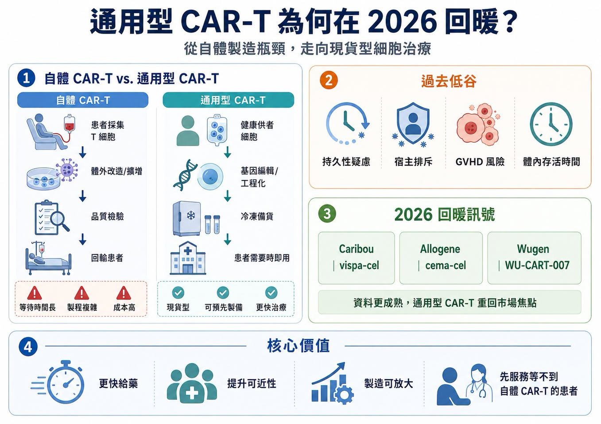
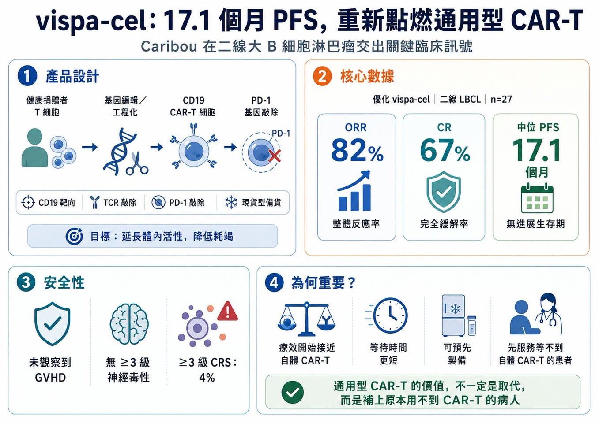
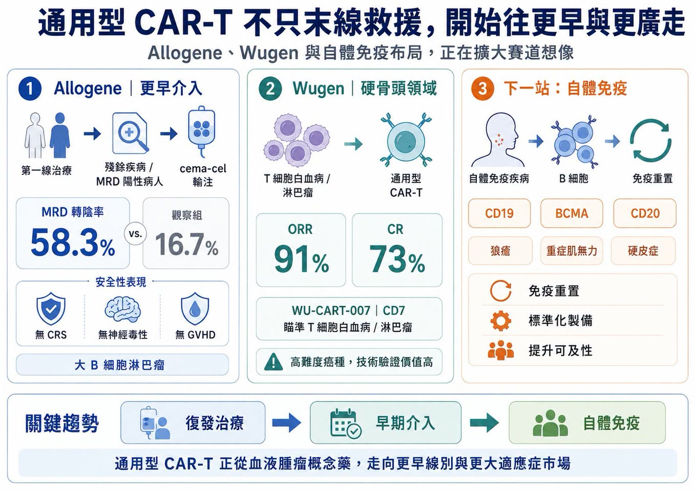
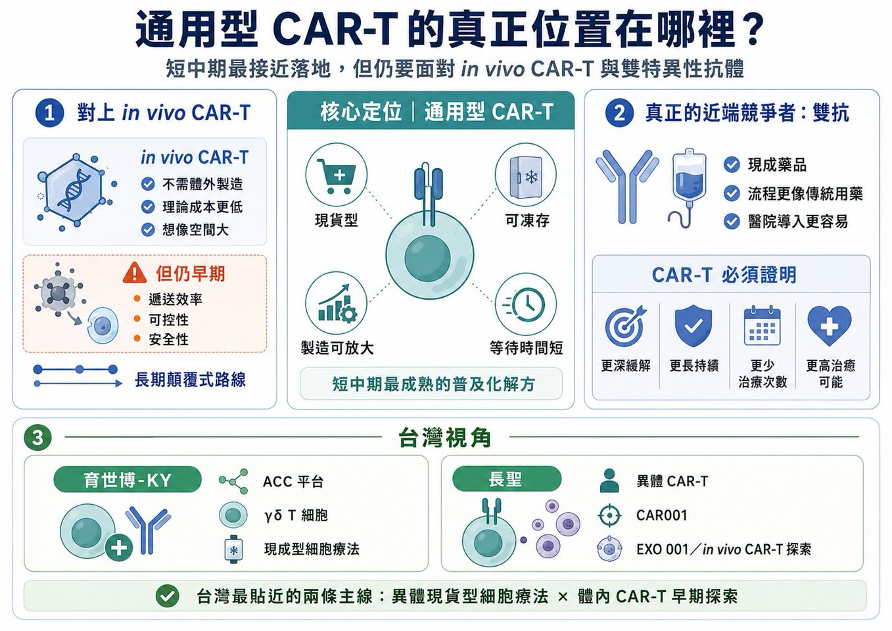

# 通用型 CAR-T 的 2026 從低谷回暖

通用型 CAR-T 又熱起來了。

幾年前，這曾是細胞治療領域最受期待的方向之一。

邏輯很簡單：傳統自體 CAR-T 需要取出患者自己的 T 細胞，送到工廠改造、擴增、檢驗，再回輸到患者體內。療效可以很強，但等待時間長、成本高、製程複雜，病情進展太快或 T 細胞品質太差的患者，常常等不到治療。

通用型 CAR-T 想解決的，就是這個痛點。

它用健康供者細胞作為原料，經過基因編輯與工程化改造後，做成「現貨型」細胞藥物。理想狀態下，醫師不需要等病人自己的細胞被送去製造，產品可以像藥品一樣提前備貨，患者需要時就能使用。這個願景太美，所以早期市場非常興奮。但第一批通用型 CAR-T 資料並沒有完全打動市場。療效持久性、宿主排斥、移植物對抗宿主病、細胞在體內存活時間、安全性，都讓投資人逐漸冷靜。過去兩三年，這條賽道一度從高峰跌入「幻滅低谷」。

現在，情況開始變了。

2026 年，Caribou、Allogene、Wugen 等公司陸續拿出更成熟的臨床資料，通用型 CAR-T 重新回到桌面上。它不再只是概念，而是開始回答一個真正關鍵的問題：通用型 CAR-T 能不能在療效接近自體 CAR-T 的同時，提供更快、更可及、更容易放大的治療選項？

## 01｜Caribou 的 vispa-cel：17.1 個月 PFS，讓市場重新看見希望

這輪回暖最受矚目的公司，是 Caribou Biosciences。

其核心產品 vispa-cel（vispacabtagene regedleucel，原名 CB-010）是靶向 CD19 的通用型 CAR-T，用於復發或難治性 B 細胞非何杰金氏淋巴瘤。這款產品的特別之處，在於它不只敲除 T 細胞受體以降低移植物對抗宿主病風險，還加入 PD-1 gene knockout，也就是把 PD-1 基因敲除，希望降低 CAR-T 細胞過早耗竭，延長抗腫瘤活性。Caribou 在 2026 年 EHA 公布的二線大 B 細胞淋巴瘤資料，讓市場重新興奮。27 名接受優化 vispa-cel 的患者中：

客觀緩解率達 82%。

完全緩解率達 67%。

中位無惡化存活期達 17.1 個月。

安全性方面，未觀察到移植物對抗宿主病，也沒有 3 級以上神經毒性；3 級以上細胞激素釋放症候群比例為 4%。這個資料的重要性，在於中位無惡化存活期已經接近、甚至不輸部分自體 CAR-T 歷史數據。

Caribou 並沒有說 vispa-cel 一定比自體 CAR-T 更好。它的商業邏輯更務實：如果療效可以接近自體 CAR-T，但等待時間更短、產品能提前製備，就能服務那些原本根本用不上自體 CAR-T 的患者。這才是通用型 CAR-T 的靶心。它不是先去搶所有自體 CAR-T 患者，而是先服務那些因病情太急、採血困難、地理距離、製程等待或醫療可近性問題，被排除在自體 CAR-T 之外的人。

## 02｜Allogene：從復發治療，往 MRD 陽性早期介入前進

Allogene 走的是另一條路。

它的 cema-cel（cemacabtagene ansegedleucel）不是只盯著末線治療，而是嘗試把通用型 CAR-T 放到更早的位置：一線治療後仍有微小殘留病灶的大 B 細胞淋巴瘤患者。

這個策略很有意思。傳統 CAR-T 通常用在已經復發或治療失敗的患者身上，但如果 MRD 陽性代表疾病仍有復發風險，那是否能在肉眼影像還看不到復發前，用通用型 CAR-T 做「鞏固治療」？

Allogene 的 ALPHA3 中期資料顯示，第 45 天時：

cema-cel 組 MRD 轉陰率為 58.3%。

觀察組為 16.7%。

絕對差距達 41.6 個百分點。

公司也指出，該試驗安全性乾淨，未出現任何級別的細胞激素釋放症候群、神經毒性或移植物對抗宿主病。這代表通用型 CAR-T 不一定只能當「最後一線救援」。它也可能成為高風險患者早期清除殘存疾病的工具。如果這條路走通，市場空間會完全不同。

## 03｜Wugen：T 細胞惡性腫瘤，仍是通用型 CAR-T 的硬骨頭

另一個值得看的是 Wugen。

它的 WU-CART-007 是靶向 CD7 的通用型 CAR-T，主攻 T 細胞白血病與淋巴瘤。這個方向很難，因為 T 細胞癌症本身和治療用 T 細胞來源同源，容易出現自相殘殺、製程困難與安全性問題。Wugen 透過基因編輯平台，試圖解決 TCR 相關移植物對抗宿主病與 CD7 自相殘殺問題。2025 年，公司完成 1.15 億美元融資，目標就是推動這款 off-the-shelf CAR-T，也就是現貨型 CAR-T，走向 FDA 申請。

公開報導指出，WU-CART-007 在早期臨床中曾於 heavily pretreated，也就是接受多線治療後的患者中，達到 91% 客觀緩解率與 73% 完全緩解率。T 細胞惡性腫瘤患者選擇有限。若通用型 CAR-T 能在這個高難度領域跑出來，會是很強的技術背書。

## 04｜通用型 CAR-T 的價值，不只在血液腫瘤，也在自體免疫疾病

2026 年另一個變化，是通用型 CAR-T 不再只看血癌。

自體免疫疾病開始成為新的戰場。自體 CAR-T 在紅斑性狼瘡、重症肌無力、硬皮症等疾病中已經展現免疫重置的潛力，但若每位患者都要客製化製造，成本與可近性會是巨大障礙。這正是通用型 CAR-T 的機會。如果能用健康供者細胞製備標準化產品，快速清除致病性 B 細胞或漿細胞，再讓免疫系統重新建立平衡，通用型 CAR-T 在自免疾病裡的價值可能比腫瘤更大。因為自免患者人數更大，也更需要「可及、可負擔、標準化」的治療模式。這也是為什麼很多公司開始把 CD19、BCMA、CD20 等靶點從血液腫瘤延伸到自體免疫疾病。未來真正的大市場，可能不是單一血癌適應症，而是「免疫重置療法」這個更大的醫療場景。

## 05｜體內 CAR-T 爆紅後，通用型 CAR-T 還有位置嗎？
現在細胞治療領域最火的新概念，是 in vivo CAR-T，也就是體內 CAR-T。它的邏輯是：不再把細胞取出體外改造，而是用 LNP、病毒載體、外泌體或其他遞送系統，把 CAR 基因直接送進患者體內的 T 細胞，讓免疫細胞在身體裡完成改造。

這聽起來更像真正的終局方案。

不用細胞工廠。

不用體外製造。

不用等待。

成本理論上更低。

可及性更高。

因此，Novartis、Gilead、BMS、J&J、AbbVie、AstraZeneca、Lilly 等大藥廠都在布局。

那麼，通用型 CAR-T 會不會被體內 CAR-T 取代？

答案不一定，更合理的看法是：兩者不是你死我活，而是不同時間尺度上的解法。

通用型 CAR-T 技術更成熟，已有更多臨床資料，製程與品質控制相對可掌握，短中期更接近落地。

體內 CAR-T 想像空間更大，但仍處於早期，遞送效率、細胞選擇性、體內表達時間、可控性、安全性、重複給藥等問題，都還需要長時間驗證。

所以未來幾年，通用型 CAR-T 可能是更接近商業化的普及解方；體內 CAR-T 則是更長遠的顛覆式路線。這不是兩條互斥道路，而是細胞治療普及化的兩個階段。

## 06｜真正的威脅，可能不是體內 CAR-T，而是雙特異性抗體
通用型 CAR-T 最大競爭者，未必是體內 CAR-T。

反而可能是 bispecific antibody，也就是雙特異性抗體。在多發性骨髓瘤、淋巴瘤與部分自體免疫疾病中，雙抗已經快速崛起。它不需要細胞製造，不需要客製化流程，使用上更像傳統藥品。

醫師能更快開立，醫院流程也更容易負擔。如果雙抗能提供足夠好的反應率與持久性，它自然會搶走一部分 CAR-T 市場。這也是整個 CAR-T 家族面臨的現實問題：

自體 CAR-T 要對抗雙抗。

通用型 CAR-T 要對抗雙抗。

未來體內 CAR-T 也要對抗雙抗。

因此，CAR-T 的核心競爭力不能只說「療效好」。

它還要證明：

更深緩解。

更長持續時間。

更少治療次數。

更高治癒可能。

更好的總醫療成本。

只有能在這些地方做出差異，CAR-T 才能在雙抗壓力下保住自己的位置。

## 07｜台灣可以怎麼看？育世博與長聖，是最貼近的兩條路線
第一個是育世博-KY（6976）。

育世博不是傳統 CAR-T 公司，而是走 ACC 抗體細胞連結技術與 γδ T 細胞平台。其技術特色是不需要對 T 細胞做基因工程改造，而是用抗體細胞連結技術，把抗體接到免疫細胞上，形成「現成型」細胞治療產品。育世博官網也強調，其 ACC 平台能強化標靶效應，並改善血液腫瘤與實體腫瘤治療上的安全性與泛用性。更重要的是，育世博的 ACE1831 用於復發／難治型 CD20 表現之 B 細胞瘤，已完成第一期臨床試驗最終報告，安全性符合預期；相關臨床資料預計於 2026 年 ACR 年會發表。

這和通用型 CAR-T 的核心方向很接近：

現貨型。

異體。

可凍存。

可放大製造。

未來可能延伸至自體免疫疾病。

第二個是長聖（6712）。

長聖是台灣細胞治療商業化經驗較完整的公司之一，一邊有特管法細胞治療與 CDMO 現金流，另一邊也推進細胞新藥。其異體 CAR-T 新藥 CAR001 已進入一期臨床收案，公司曾表示若資料亮眼，有機會啟動國際授權。

更值得注意的是，長聖也在探索 in vivo CAR-T，也就是體內 CAR-T。中國醫藥大學附設醫院與長聖團隊公開介紹 EXO 001，以外泌體平台在體內遞送 CAR.BiTE 基因，讓 T 細胞在患者體內完成免疫編程，形成多靶向 CAR-T 細胞。

這雖仍屬早期研發，但方向與國際 in vivo CAR-T 熱潮高度一致。

所以台灣最值得放進這篇的，不是一般腫瘤藥，而是：

育世博代表異體現貨型細胞療法。

長聖代表異體 CAR-T 與體內 CAR-T 雙線探索。

這兩家公司都還有臨床與商業化風險，但它們至少站在通用型細胞治療這條國際主線上。

## 結語｜通用型 CAR-T 沒有退場，它正在找自己的真正位置
2026 年的通用型 CAR-T，已經不是當年只靠願景支撐的故事。

通用型 CAR-T 的定位正在變清楚：它不是自體 CAR-T 的簡單替代品，也不一定會被體內 CAR-T 立刻取代。

它最有價值的地方，是用更快、更標準化、更可及的方式，把細胞治療送到那些原本用不上 CAR-T 的患者面前。真正決定這類產品生命周期的，不是技術名詞，而是它解決了多少臨床問題。如果它能讓更多患者用得上、等得到、負擔得起，而且療效足夠持久，通用型 CAR-T 就不會只是過渡產品。

它會成為細胞治療走向普及化的重要一站。

參考資料：

1. 藥時事 Facebook 原文，通用型 CAR-T 的 2026 從低谷回暖：https://www.facebook.com/permalink.php?story_fbid=pfbid025GPiNgvtt3Bm4sXCkZLuPWfnLRJmp6FELtp6G3TCh4zV3SquoEJvzsDm1PwBykeJl&id=61568446257142
2. Caribou Biosciences pipeline，vispa-cel / CB-010 and ANTLER clinical program：https://www.cariboubio.com/pipeline/
3. Allogene ALPHA3 trial page，cema-cel for MRD-positive LBCL / DLBCL after first-line therapy：https://allogene.com/alpha3/
4. ClinicalTrials.gov，ALPHA3 study record：https://clinicaltrials.gov/study/NCT06127693
5. Wugen pipeline，WU-CART-007 allogeneic CD7-targeted CAR-T program：https://wugen.com/pipeline/
6. Wugen press release，first patients dosed in pivotal WU-CART-007 trial and previously reported response data：https://wugen.com/wugen-announces-dosing-of-first-patients-in-pivotal-trial-of-off-the-shelf-allogeneic-cd7-targeted-car-t-cell-therapy-wu-cart-007/

---

本文僅供產業研究與知識分享，不構成投資、醫療、募資或個股建議。
