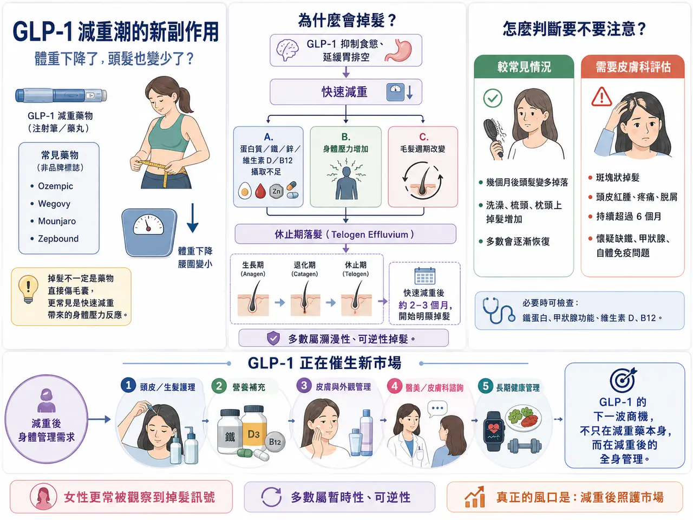
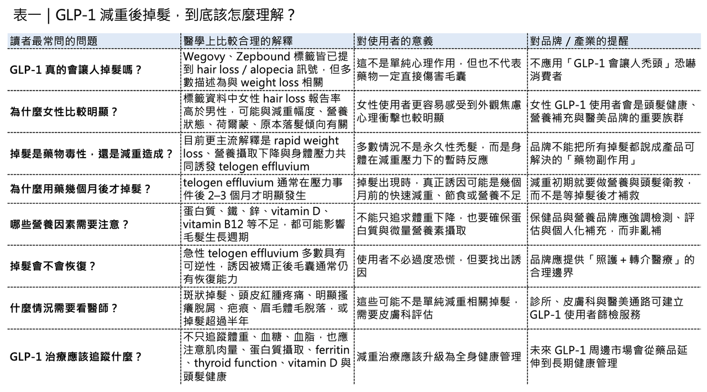
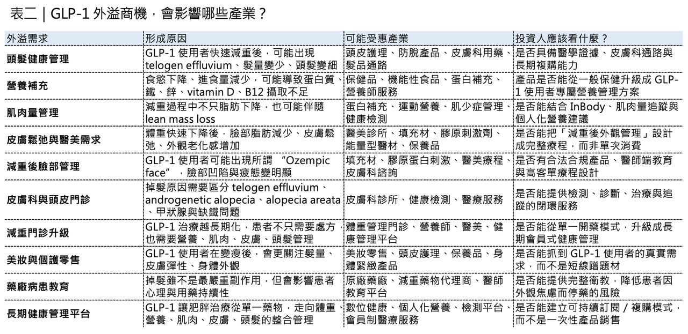

# 減肥藥新副作用，意外帶出新賽道？

## GLP-1 減重潮的新副作用：頭髮變少，卻意外催生一個新風口

過去幾年，全球代謝藥物市場幾乎被幾個名字改寫：Ozempic（semaglutide）、Wegovy（semaglutide）、Mounjaro（tirzepatide）、Zepbound（tirzepatide）。它們最醒目的標籤，是血糖控制、體重管理、心血管保護、睡眠呼吸中止症，以及更廣泛的心腎代謝疾病想像。但當 GLP-1 藥物從糖尿病與肥胖治療，逐漸走進日常消費語境後，一個更私人、也更容易引發焦慮的問題開始浮現：體重下降了，頭髮也變少了。

這件事不是單純的社群焦慮。Wegovy 與 Zepbound 的美國藥品標籤，都已經提到 hair loss／alopecia 相關訊號，而且標籤裡使用的關鍵描述，是這類 hair loss adverse reaction 與 weight loss 相關。這句話很重要，因為它暗示：掉髮不一定是 GLP-1 對毛囊的直接毒性，更可能與快速減重、營養攝取下降、身體壓力與毛髮週期改變有關。

換句話說，這不是簡單一句「GLP-1 會讓人禿頭」可以解釋的問題。更精準的說法是：GLP-1 帶來的快速減重，正在讓一群使用者提前面對頭髮、皮膚、肌肉與營養管理問題。也正因如此，GLP-1 的影響已經不只停留在藥品市場。它正在外溢到美容、頭皮護理、營養補充、醫美、皮膚科與個人化健康管理。

## 藥時事 與 CMoney 全曜財經共同打造減肥藥賽道投資課程

藥時事團隊深度分析全球 減肥藥市場現況、新藥開發進程、臨床使用情況，並且完整講解了減肥藥物的投資邏輯，以及市場正在著重關注的標的。藥時事團隊的深度課程將能夠讓您成為專業的生技減肥藥專業達人、投資人：

線上課程 - 理財寶｜提供全方位投資線上課程

https://www.cmoney.tw/course-media/17141/intro

www.cmoney.tw

## 01｜GLP-1 掉髮：是藥物傷毛囊，還是身體被迫「省電」？

GLP-1 治療期間出現掉髮，最容易讓人直覺聯想到「藥物副作用」。

但目前比較合理的醫學解釋，並不是 GLP-1 直接傷害毛囊，而是快速減重造成身體壓力，進一步引發 telogen effluvium（休止期落髮）。Wegovy 的美國標籤顯示，在 Wegovy 7.2 mg injection 試驗中，hair loss 報告率為 5.8%；Wegovy 2.4 mg 為 3.3%；placebo 為 1.0%。Zepbound 標籤也提到，female patients 的 alopecia 報告率在 Zepbound 組為 7.1%，placebo 為 1.3%；male patients 分別為 0.5% 與 0。

這些數字說明兩件事。

💊 第一，GLP-1 減重治療期間的掉髮不是少數人的幻想。

💊 第二，女性患者更容易被觀察到這個問題。

但真正要拆解的，是掉髮背後的機制。GLP-1 藥物會降低食慾、延緩胃排空，讓使用者更容易減少進食。當體重下降速度很快，飲食結構也常跟著改變。蛋白質、鐵、鋅、維生素 D、維生素 B12 等營養素若不足，毛囊就可能進入一種「先保命、暫停長頭髮」的狀態。頭髮對身體來說，不是生存必要器官。當身體感覺能量不足、營養不足或壓力增加時，它會優先維持心臟、大腦、肌肉與內臟運作，頭髮自然會被放到比較後面。所以，GLP-1 相關掉髮更像是一個代謝治療後的身體訊號。

🧬 它提醒我們：減重不能只看體重計，也要看營養、肌肉、皮膚與頭髮。

## 02｜為什麼不是一開始就掉，而是幾個月後才發現？

很多 GLP-1 使用者的經驗是：一開始體重下降很開心，但幾個月後，突然發現洗澡地漏、枕頭、梳子上的頭髮變多了。這個時間差，正好符合休止期脫髮的特徵。人的頭髮不是一直處於生長狀態。毛囊會在 anagen phase（生長期）、catagen phase（退化期）、telogen phase（休止期）之間循環。

正常情況下，大多數頭髮處於生長期，少部分處於休止期並自然脫落。但當身體經歷快速減重、手術、重大疾病、壓力、懷孕、生產、甲狀腺異常、缺鐵性貧血、營養不良或維生素 D 缺乏時，一部分原本在生長期的頭髮會提前進入休止期。頭髮不會當天立刻掉，而是通常在誘因後約 2 到 3 個月開始明顯脫落。JAMA 的病人衛教資料也指出，diffuse hair loss 中最常見的是 telogen effluvium，誘因包括嚴重疾病、大手術、甲狀腺疾病、妊娠、缺鐵性貧血、營養不良、快速減重與維生素 D 缺乏。

Cleveland Clinic 也指出，acute telogen effluvium 通常持續少於 6 個月，常在身體壓力或變化後 2 到 3 個月發生；95% 的急性案例會緩解，頭髮通常會重新長回來。這一點對患者很重要。因為 GLP-1 治療期間掉髮，大多數情況不是永久性禿髮。它比較像身體在快速減重過程中的一種壓力反應。但這並不代表可以完全忽略。如果掉髮是瀰漫性、短期內變多，且剛好發生在快速減重後幾個月，確實比較符合 休止期脫髮。

但如果是斑狀落髮、頭皮紅腫疼痛、明顯搔癢脫屑、疤痕形成、眉毛與體毛也大量脫落，或掉髮持續超過半年，就不能只歸因於 GLP-1 或減重，應該接受皮膚科評估。因為 androgenetic alopecia（雄性禿／女性型落髮）、alopecia areata（圓禿）、甲狀腺疾病、自體免疫疾病、缺鐵、維生素 D 缺乏、產後狀態，都可能和 GLP-1 治療期間的掉髮同時存在。

## 03｜GLP-1 正在把「減重」變成一套完整的身體管理市場

GLP-1 的商業影響，已經超過藥物本身。

🪞 最早，市場只看減重。

🪞 接著，市場開始看心血管、腎臟、脂肪肝、睡眠呼吸中止症。

🪞 現在，市場開始看減重後的身體變化：臉部脂肪減少、皮膚鬆弛、肌肉流失、頭髮變稀疏。

這就是 GLP-1 產業外溢最有趣的地方。使用者體重下降後，身體不是只變輕，而是變得陌生。

🪞 臉可能變凹。

🪞 皮膚可能變鬆。

🪞 肌肉可能流失。

🪞 頭髮可能變少。

這些變化不一定是嚴重醫學問題，卻會強烈影響患者對治療的感受，尤其是頭髮，體重下降是別人稱讚你的地方，頭髮變少卻是自己每天照鏡子都會看到的焦慮。

所以 GLP-1 帶來的脫髮焦慮，很自然地開始進入美容與個護市場。L’Oréal 旗下 Redken 推出 Acidic Grow Full System，主打讓頭髮看起來更豐盈、更厚；Nutrafol 則直接把 GLP-1 使用者納入 促進頭髮生長的營養保健品 的溝通場景，強調 GLP-1 減重期間的頭髮健康管理；Ulta Beauty 也在 2026 年公開提到，GLP-1 熱潮正在帶動消費者對 頭髮護理、皮膚彈性 等產品需求的變化。

🧴 這代表：GLP-1 已經不只是糖尿病與肥胖藥物，它正在重塑一整套「減重後照護」市場。

## 04｜真正有價值的風口，不是恐嚇消費者，而是建立醫學化管理

不過，這個市場也有風險。

因為只要和掉髮、減重、女性焦慮、美容有關，就很容易被誇大行銷。GLP-1 使用者確實可能掉髮。但不代表每一個掉髮的人都需要買一整套昂貴產品，也不代表某一瓶精華液、某一款洗髮精、某一種保健品，就能解決所有 GLP-1 相關落髮，這裡要分清楚三個層次。

🧴 第一，是外觀照護。

讓頭髮看起來蓬鬆、減少斷裂、改善髮絲質感、維持頭皮清潔，這是 hair care 品牌可以合理切入的地方。

🧴 第二，是營養支持。

如果 GLP-1 使用者因食慾下降而蛋白質不足、鐵不足、維生素 D 不足、B12 不足，補充營養可能有幫助。但前提是先知道自己缺什麼，而不是亂吃一堆補充品。

🧴 第三，是醫學治療。

如果同時有 androgenetic alopecia、女性型落髮或其他皮膚科疾病，可能需要 minoxidil、口服藥物或其他醫療處置。JAMA 的資料也提到，休止期脫髮 應處理可矯正誘因，例如補充缺鐵、處理維生素 D 缺乏、控制甲狀腺疾病；部分 休止期脫髮 合併 脫髮模式 的患者，也可能受益於 局部用米諾地爾 （topical minoxidil）。

所以，真正有價值的 GLP-1 頭髮健康市場，不是單純賣「防脫焦慮」，而是更接近醫學化管理：

🧴 減重門診要提醒蛋白質攝取。

🧴 營養師要協助飲食調整。

🧴 皮膚科要判斷掉髮類型。

🧴 醫師要排除甲狀腺、缺鐵、維生素 D 缺乏與自體免疫問題。

必要時才使用 minoxidil 或其他證據更明確的治療，這樣的市場才會長久。因為它不是建立在恐懼上，而是建立在 GLP-1 長期治療帶來的新照護需求上。

## 05｜對藥廠來說，掉髮不是最嚴重副作用，但可能影響真實世界用藥體驗

對 Novo Nordisk、Eli Lilly 這些 GLP-1 藥廠來說，hair loss 不會是最核心的安全性議題。GLP-1 類藥物更常被關注的，還是 噁心、嘔吐、腹瀉、便秘等腸胃道不良反應，以及 膽囊疾病、胰臟炎、糖尿病視網膜病變風險等需要醫師管理的問題。但掉髮有一個特殊性：它未必最危險，卻很容易影響患者心理。

一個患者用 Wegovy（semaglutide）或 Zepbound（tirzepatide）成功減重 15%、20%，理論上健康風險下降，但如果同時覺得頭髮變少、臉變凹、皮膚變鬆，就可能開始懷疑自己是不是「變瘦但變老」。

這會影響患者對治療的滿意度，也會影響長期依從性，GLP-1 治療越長期化，病患教育越重要。

醫師不能只告訴患者體重會下降，也要提醒：

🧴 不要過度節食。

🧴 要確保蛋白質攝取。

🧴 要監測肌肉量。

🧴 如果出現明顯掉髮，不要恐慌，但也不要忽視。

🧴 必要時要抽血檢查 鐵蛋白、甲狀腺功能、維生素D、維生素B12 等指標。

這些看似不是藥廠的核心事務，但在真實世界中，會影響患者是否願意繼續治療，未來 GLP-1 市場競爭不只比療效，也會比整體治療體驗。

## 06｜🇹🇼 台灣市場可以怎麼看？醫美、保健品與皮膚科通路的新需求

這個主題也可以放回台灣資本市場來看，GLP-1 外溢效應，它可能影響幾類公司。

🌱 第一類，是保健品與營養補充相關公司。

GLP-1 使用者若食量下降，蛋白質、鐵、維生素 D、B12、鋅等營養素管理會變得更重要。對大江、葡萄王這類保健品與機能性食品公司來說，真正值得看的不是「蹭 GLP-1 題材」，而是能不能推出更醫學化、精準化、可被營養師或診所場景採用的體重管理支持方案。

🌱 第二類，是醫美與皮膚科通路。

GLP-1 使用者在減重後可能出現臉部凹陷、皮膚鬆弛、頭髮變稀疏，這會讓醫美需求與皮膚科諮詢增加。佐登-KY、麗豐-KY、科妍這類與醫美、保養、皮膚填充材料或美容通路相關的公司，未來若要承接 GLP-1 外溢需求，關鍵不是只做廣告，而是要把「減重後身體管理」變成更完整的療程設計。

🌱 第三類，是醫療服務與健康管理。

未來 GLP-1 使用者不會只需要一張處方。他們可能需要體重管理、營養、肌肉量監測、頭髮健康、皮膚管理、醫美諮詢與長期追蹤。這對台灣診所、醫美集團、健康管理平台來說，是一個新型態服務包的機會。

這裡要特別強調：

這不是要投資人看到 GLP-1 掉髮，就立刻去追所有生髮股、美容股或保健品股，真正值得看的，是誰能把這個需求做成長期服務，而不是短線行銷。

## 結語｜GLP-1 的下一個戰場，不只是變瘦，而是「變瘦之後怎麼維持健康與外觀」

GLP-1 藥物正在改變全球代謝疾病市場，但它帶來的影響，不會停在體重下降。當越來越多人使用 Wegovy（semaglutide）、Zepbound（tirzepatide）、Ozempic（semaglutide）、Mounjaro（tirzepatide），市場會開始看見一整串新的照護需求：

🌱 掉髮。

🌱 皮膚鬆弛。

🌱 肌肉流失。

🌱 營養不足。

🌱 臉部凹陷。

🌱 長期治療心理壓力。

這些問題不一定會阻止 GLP-1 成為超級大藥，但它會改變 GLP-1 周邊市場。真正成熟的產業機會，不是恐嚇消費者「用了 GLP-1 就會掉髮」。而是幫助使用者理解：

🌱 掉髮可能和快速減重、營養不足、身體壓力有關。

🌱 多數 telogen effluvium 是可逆的。

🌱 但持續、嚴重或異常型態的掉髮，需要醫療評估。

🌱 頭髮健康應該和體重、肌肉、營養、皮膚一起管理。

GLP-1 的第一波商機，是藥物本身，第二波商機，會是減重後的全身管理，從這個角度看，頭髮只是入口，真正的新風口，是 GLP-1 把肥胖治療從單一藥物市場，推向一個更大的健康、美容、營養與長期管理市場。

---

參考資料：

[0]: 各公司官網＆公開資料

[1]:

www.accessdata.fda.gov

https://www.accessdata.fda.gov/drugsatfda_docs/label/2026/215256s029lbl.pdf

www.accessdata.fda.gov

[2]:

Patient Information: Common Causes of Hair Loss

This JAMA Patient Page describes patterned, diffuse, and focal hair loss and the treatments available for each.

jamanetwork.com

[3]:

Arrow Down

Telogen effluvium is rapid hair loss caused by stress or a change to your body. Your hair will usually grow back in three to six months.

my.clevelandclinic.org

[4]:

Redken Professional Hair Care, Hair Styling & Color Products

Discover professional hair care & styling solutions at Redken. Explore our innovative products for beautiful, healthy hair. Transform your look today!

www.redken.com

[5]:

Patient Information: Common Causes of Hair Loss

This JAMA Patient Page describes patterned, diffuse, and focal hair loss and the treatments available for each.

jamanetwork.com

本文僅供產業研究與知識分享，不構成投資、醫療、募資或個股建議。
