# 減肥藥新副作用，意外帶出新賽道？

GLP-1 讓減重市場爆發，但副作用與長期用藥問題也正在催生新的產品定位與輔助治療機會。

## 副作用不是只有風險，也可能揭露新需求

GLP-1 類藥物改變了肥胖治療，但胃腸道不適、停藥反彈、肌肉量下降與長期依從性，讓市場開始意識到減重不只是把體重壓下來。

當一個市場快速放大，副作用會變成下一輪創新的入口。能不能減少不適、保留肌肉、改善代謝品質，可能決定下一代產品的差異化。

- 副作用會影響長期用藥率。
- 肌肉保留與身體組成會成為新終點。
- 輔助療法與組合療法可能形成新市場。

## 從減重到代謝品質

早期市場最重視體重下降百分比，但當同類產品越來越多，競爭會轉向更細的問題：減掉的是脂肪還是肌肉？停藥後能不能維持？是否改善脂肪肝、心血管與發炎風險？

這些問題會把市場從單一 GLP-1 競賽，推向多機制組合與周邊照護。

- 體重下降只是第一層指標。
- 代謝共病改善會提高藥物價值。
- 患者體驗會影響真實世界滲透率。

## Drugnews 的判斷

減肥藥市場的下一波機會，可能不是單純更瘦，而是更安全、更可持續、更接近健康代謝。副作用訊號看似負面，但對產業來說，也常常是新產品定位開始成形的地方。

- 副作用會催生新適應症與配套療法。
- 下一代競爭會從公斤數走向身體組成與長期維持。

## 小結

這篇文章的重點不是把單一新聞看成短線題材，而是回到 Drugnews 一直強調的分析方法：從臨床證據、商業定位、競爭格局與監管風險四個面向，判斷一個生技醫藥事件是否真的會改變公司價值。

本文僅供產業研究與知識分享，不構成投資、醫療、募資或個股建議。
