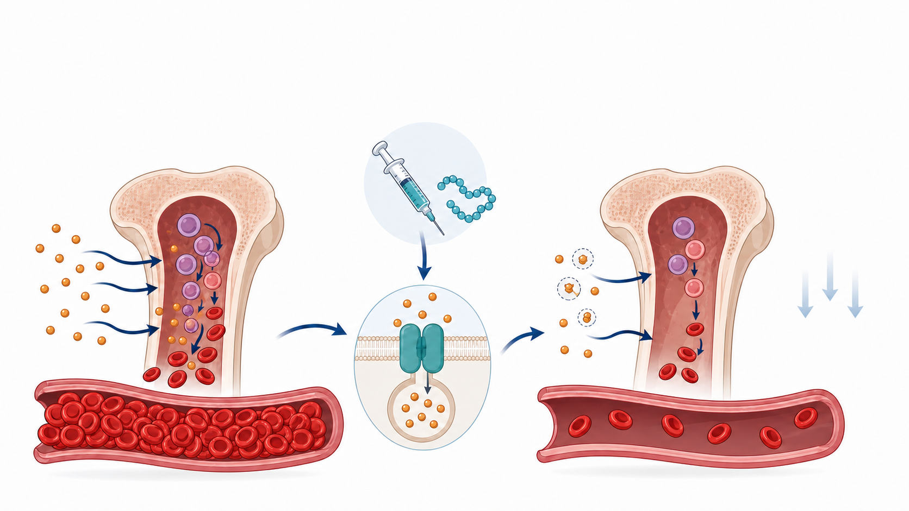
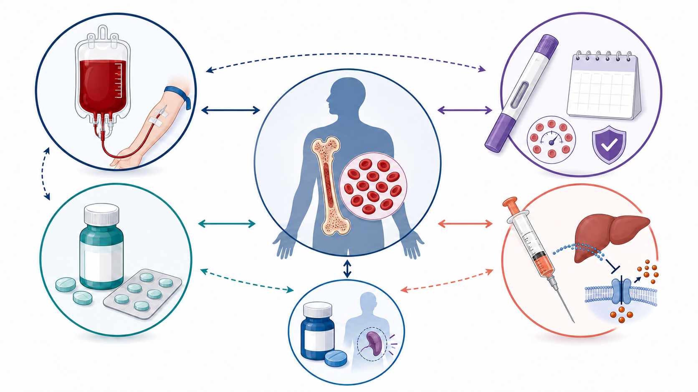

# A New Rival for PharmaEssentia? What Zealand Actually Sold for $100 Million

With rusfertide approaching the final stretch of FDA review, Zealand Pharma has already signed a transaction worth up to $100 million, selling selected economics tied to the drug to Royalty Pharma.

The transaction closed on August 12, 2026. Zealand received $50 million at closing and is due another $50 million on the first anniversary.

But Zealand did not sell the drug itself.

What changed hands were regulatory and sales milestones inherited from an earlier collaboration, plus a 1% royalty on global net sales. Takeda—not Zealand—holds the exclusive worldwide rights to develop and commercialize rusfertide.

The more useful questions are therefore different: Why would a buyer pay up to $100 million for a 1% stream that is still waiting for an FDA decision and has not begun generating sales? And if rusfertide is approved, how could it affect Taiwan-listed PharmaEssentia and BESREMi?

## 01 | The $100 Million Is Not a Drug Price

Zealand transferred two sets of rights: regulatory and commercial milestones tied to rusfertide, and a 1% royalty on global net sales.

The company retained a narrow slice of upside. If annual worldwide net sales exceed $1.5 billion, Zealand will continue to receive 0.25% on the amount above that threshold, while Royalty Pharma receives 0.75%.

That $1.5 billion figure is a contractual breakpoint. It is not Zealand's peak-sales guidance, and it should not be presented as evidence that management privately expects at least $1.5 billion in sales.

The transaction is fundamentally an exchange of time and risk.

Zealand monetized exposure to FDA review, launch pricing, reimbursement, uptake and competitive risk before those uncertainties were resolved. Royalty Pharma, supported by a portfolio spanning more than 35 marketed products and development-stage assets, can absorb single-asset uncertainty within a much broader pool.

Royalty Pharma does not need to build a rusfertide sales force. If Takeda commercializes the drug successfully, product sales can convert directly into royalty income.

For Zealand, this was a non-core asset over which it had no operating control. At the end of June, the company held DKK 14.457 billion in cash, cash equivalents and marketable securities. The deal was not emergency financing; it allowed Zealand to concentrate capital on its obesity and metabolic pipeline, including petrelintide, which is approaching Phase 3, and the late-stage asset survodutide.

## 02 | One Drug, Three Very Different Economic Positions

Rusfertide's economics cannot be understood by looking at Zealand alone.

Protagonist Therapeutics advanced the drug into Phase 3 and entered a global collaboration with Takeda in 2024. On April 28, 2026, Protagonist formally exited the 50:50 U.S. profit-and-loss sharing arrangement, giving Takeda exclusive worldwide development and commercialization rights.

The opt-out triggered an immediate $200 million payment. If the FDA approves rusfertide, Protagonist can receive another $200 million opt-out payment and a $75 million milestone. It is also eligible for royalties ranging from 14% to 29% on annual worldwide net sales; at $1.5 billion in sales, the weighted-average rate would be about 21%.

The three positions are therefore distinct:

- **Takeda** bears the post-approval launch, pricing and global commercialization responsibilities.
- **Protagonist** exchanged U.S. profit-and-loss exposure for substantial payments and a large global royalty stream.
- **Royalty Pharma** acquired Zealand's much smaller 1% tail interest and can wait for long-term cash flow within a diversified portfolio.

Both Protagonist and Zealand monetized future value, but they sold very different bundles of rights. The $100 million Zealand transaction cannot be compared directly with Protagonist's much larger payments because the scope, royalty rate and original contribution are not equivalent.

## 03 | Strong Clinical Data Still Leave Regulatory and Commercial Gates

Rusfertide is a once-weekly subcutaneous hepcidin mimetic. By restricting iron availability for erythropoiesis, it is designed to reduce excessive red-blood-cell production, stabilize hematocrit and lower the need for phlebotomy.

The Phase 3 VERIFY trial enrolled 293 patients with polycythemia vera, or PV, who remained phlebotomy-dependent because their hematocrit was inadequately controlled despite current treatment.

Between weeks 20 and 32, 76.9% of patients receiving rusfertide plus standard therapy achieved a clinical response defined by the absence of a phlebotomy indication, compared with 32.9% on placebo plus standard therapy. From baseline through week 32, the mean number of phlebotomies was 0.5 versus 1.8, while 62.6% versus 14.4% of patients maintained hematocrit below 45%.

At 52 weeks, the most common adverse events were injection-site reactions in 47.4% of patients, anemia in 25.6% and fatigue in 19.6%. Most were Grade 1 or 2, while serious adverse events occurred in 8.1%.

The FDA granted priority review. Protagonist's formal filings described the PDUFA timing as August 2026, while Takeda referred to the third quarter. As of the article's August 15 fact-check cutoff, neither the companies nor the FDA had publicly disclosed a precise calendar date or announced an approval.

Clinical risk has been reduced substantially, but regulatory risk has not disappeared. Even after a potential approval, pricing, reimbursement, treatment sequencing and patient acceptance of weekly injections will shape commercial performance.

## 04 | What Rusfertide Could Mean for PharmaEssentia

PharmaEssentia's BESREMi is FDA-approved for adults with PV and received approval for a prefilled injection pen in June 2026. It is a long-acting interferon with a broad adult label and a growing body of long-term hematologic and molecular-response data. The FDA label states that the mechanism by which interferon alfa treats PV is not fully understood.

Rusfertide offers a different value proposition: rapidly stabilizing hematocrit and reducing phlebotomy by directly restricting the iron available for red-cell production.

In the near term, competition is most likely among patients who need treatment escalation. If physicians consider reducing phlebotomy the most urgent objective, rusfertide could compete for new prescriptions and payer budgets.

That does not mean BESREMi would be displaced directly.

VERIFY allowed rusfertide to be layered on top of existing care, including phlebotomy, hydroxyurea, interferon and ruxolitinib. It was not a head-to-head trial against BESREMi. For patients already receiving interferon but still struggling with hematocrit control, rusfertide could become an add-on rather than a substitute.

Four questions matter most for PharmaEssentia investors:

1. Will the final FDA label limit rusfertide to phlebotomy-dependent patients with inadequate control?
2. Will guidelines and payers position it as first-line, later-line or add-on therapy?
3. In real-world use, will weekly injections deliver enough phlebotomy reduction and persistence to sustain adoption?
4. Can BESREMi turn its adult PV label, long-term response data and newly approved pen into deeper market penetration?

There is also a strategic offset. PharmaEssentia's supplemental biologics application to expand BESREMi into essential thrombocythemia, or ET, has an FDA target date of August 30, 2026. If successful, the company's growth would no longer depend on PV alone.

## Investment Takeaway | Follow the Cash-Flow Rights, Not the Headline

Zealand's choice was financially rational. It converted a non-core stream with limited operating control into up to $100 million: $50 million at closing, another $50 million one year later, plus a retained 0.25% on annual sales above $1.5 billion.

Royalty Pharma is buying a long-duration cash-flow claim that can sit inside a diversified portfolio. It is not simply making a binary bet on an unresolved regulatory event.

For PharmaEssentia, rusfertide is a real competitive entrant, but not a one-line story in which a new launch automatically replaces BESREMi. The two products differ in mechanism, treatment objective and likely place in therapy. The commercial outcome will depend on the final FDA label, guidelines, reimbursement and prescribing sequence.

Two catalysts were still ahead at the August 15 fact-check cutoff: the FDA decision on rusfertide and the potential ET label expansion for BESREMi.

One will determine whether a new mechanism enters the PV market. The other could determine whether PharmaEssentia expands its growth platform beyond PV.

## Primary Sources

1. [Zealand Pharma | August 12 royalty transaction](https://www.globenewswire.com/news-release/2026/08/12/3344048/0/en/zealand-pharma-enters-into-a-usd-100-million-royalty-purchase-and-sale-agreement-with-royalty-pharma-for-the-economics-related-to-rusfertide.html)
2. [Zealand Pharma | First-half 2026 financial results](https://www.globenewswire.com/news-release/2026/08/13/3344209/0/en/zealand-pharma-announces-financial-results-for-the-first-half-of-2026.html)
3. [Takeda / Protagonist | FDA priority-review announcement](https://www.takeda.com/newsroom/newsreleases/2026/nda-rusfertide/)
4. [Protagonist Therapeutics | First-quarter 2026 Form 10-Q](https://www.sec.gov/Archives/edgar/data/1377121/000110465926055661/ptgx-20260331x10q.htm)
5. [VERIFY Phase 3 primary abstract](https://ascopubs.org/doi/10.1200/JCO.2025.43.17_suppl.LBA3)
6. [Takeda / Protagonist | 52-week data](https://www.takeda.com/newsroom/newsreleases/2025/ash-rusfertide/)
7. [BESREMi | Latest FDA label](https://www.accessdata.fda.gov/drugsatfda_docs/label/2026/761166s010lbl.pdf)
8. [PharmaEssentia | BESREMi Pen approval](https://us.pharmaessentia.com/pharmaessentia-announces-fda-approval-and-u-s-launch-of-besremi-pen-ropeginterferon-alfa-2b-njft-for-polycythemia-vera/)
9. [PharmaEssentia | FDA target date for the BESREMi ET application](https://us.pharmaessentia.com/fda-confirms-a-pdufa-goal-date-of-august-30-2026-for-the-sbla-submission-of-ropeginterferon-alfa-2b-njft-in-essential-thrombocythemia-et/)
10. [PharmaEssentia | Long-term BESREMi molecular-response data](https://www.pharmaessentia.com/news/20251119)
11. [Protagonist Therapeutics | First-quarter 2026 earnings exhibit](https://www.sec.gov/Archives/edgar/data/1377121/000110465926055629/tm2613550d1_ex99-1.htm)

Fact-check cutoff: August 15, 2026.

> Disclaimer: This article is biotechnology industry and company-fundamentals research. It does not constitute investment, medical or treatment advice. As of the August 15, 2026 fact-check cutoff, rusfertide remained under FDA review. BESREMi and rusfertide have not been compared in the same head-to-head trial, so cross-trial figures should not be used to rank them directly.
