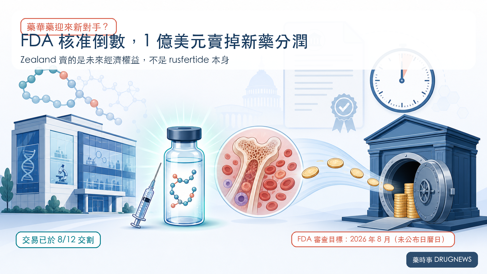
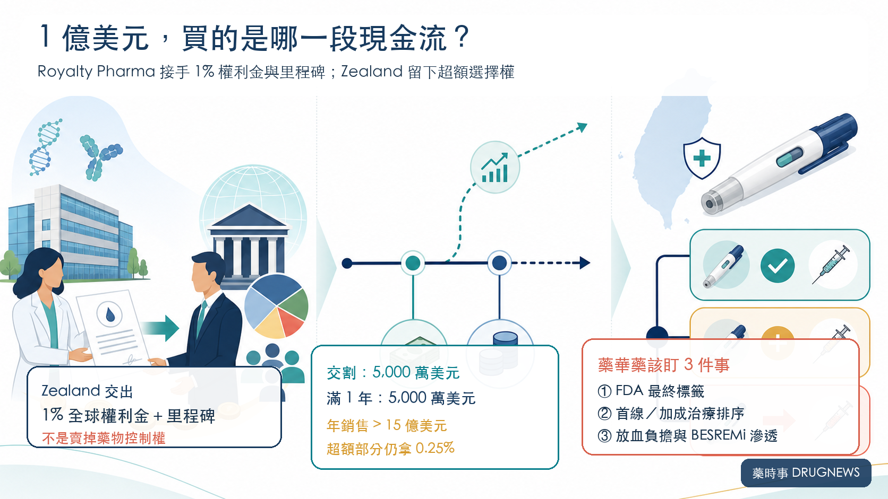
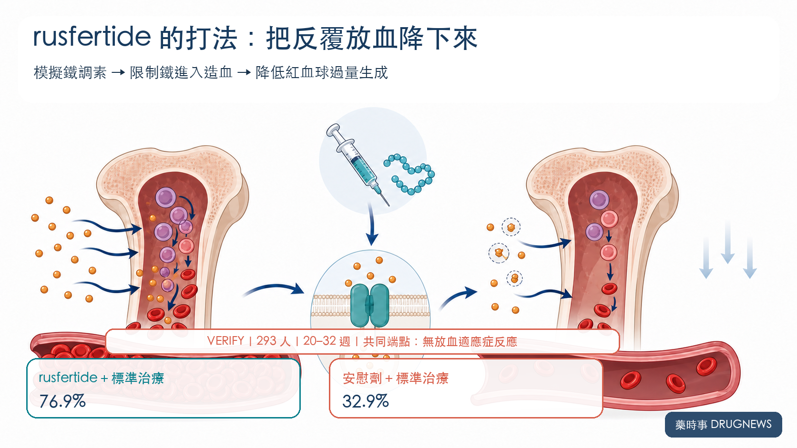
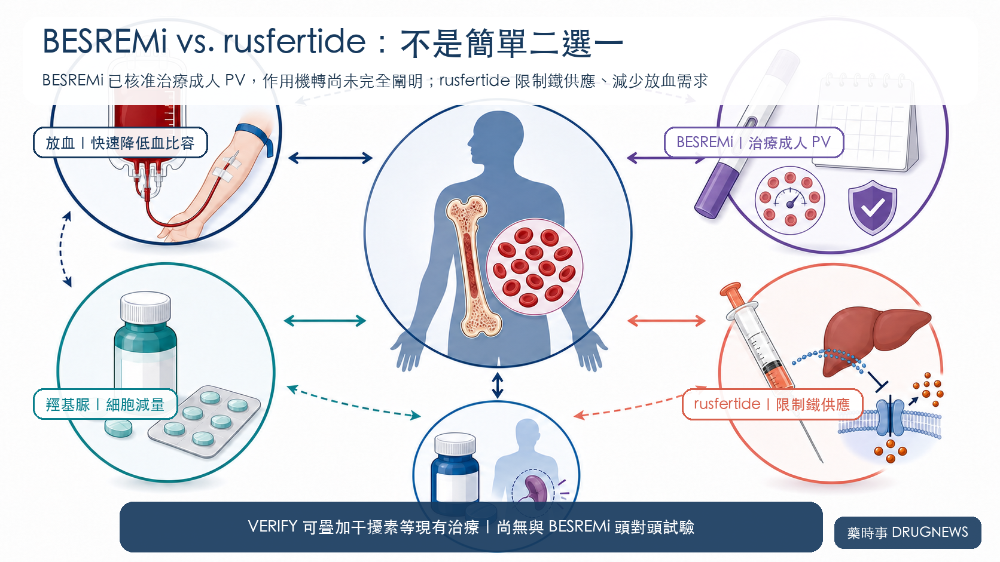

# 藥華藥迎新對手？1 億美元賣分潤

FDA 審查只差最後一段，Zealand Pharma 卻先簽下總對價 1 億美元的交易，把 rusfertide 的經濟權益賣給 Royalty Pharma。

交易已在 2026 年 8 月 12 日完成交割：5,000 萬美元立即支付，另外 5,000 萬美元在交割滿一周年時支付。

但這不是「賣掉一款新藥」。

Zealand 交出的是歷史合作留下的監管與銷售里程碑，以及全球淨銷售額 1% 的權利金；武田才是 rusfertide 的全球獨家開發與商業化權利人。

投資人真正該問的，是一條等待 FDA 決定、尚未開始銷售的 1% 現金流，為什麼買方願意給出總對價 1 億美元？以及 rusfertide 若核准，會怎麼影響台股藥華藥（6446）的 BESREMi？

## 一、1 億美元不是藥價，是未來現金流的折現

Zealand 交出的權利包括兩部分：rusfertide 的監管與商業里程碑，以及全球淨銷售額 1% 的權利金。

公司仍留下一小段上行空間：如果年度全球淨銷售額超過 15 億美元，超出部分 Zealand 可繼續拿 0.25%，Royalty Pharma 拿 0.75%。

這個 15 億美元是合約門檻，不是 Zealand 對峰值銷售的公司指引，更不能拿來推論管理層「內心至少看 15 億美元」。

交易的本質，是時間與風險交換。

Zealand 把 FDA 審查、上市定價、給付、放量速度與競品風險提前折現；Royalty Pharma 則依靠 35 款以上已上市產品與開發中資產組合，承接單一藥物的不確定性。

對 Royalty Pharma 而言，它不需要自己養銷售團隊。只要武田把藥賣出去，銷售額就能轉成權利金收入。

對 Zealand 而言，這是一項非核心、也沒有營運控制權的資產。公司截至 6 月底握有 144.57 億丹麥克朗現金、約當現金與有價證券，並不缺救命錢；它選擇把資本放回肥胖與代謝主線，包括即將進入第三期的 petrelintide 與後期資產 survodutide。

## 二、一款藥，三家公司拿的是三種不同報酬

rusfertide 的經濟鏈不能只看 Zealand。

Protagonist 將產品推進到第三期，2024 年再與武田簽下全球合作。2026 年 4 月 28 日，Protagonist 已正式退出美國 50:50 損益分攤，武田因此取得全球獨家開發與商業化權利。

Protagonist 行使退出權後，立即觸發 2 億美元付款；若 FDA 核准，還可再拿 2 億美元退出款與 7,500 萬美元里程碑。後續全球年淨銷售額權利金為 14% 至 29%，15 億美元銷售情境的加權平均約 21%。

三方定位因此很清楚：

- **武田**承擔核准後的上市、定價與全球商業化執行。
- **Protagonist** 把美國損益風險換成高額付款與厚實的全球權利金。
- **Royalty Pharma** 買下 Zealand 的 1% 尾端權益，以組合資金等待長期現金流。

同樣是「把未來變現」，Protagonist 與 Zealand 的籌碼厚度完全不同。1 億美元不能直接拿去和 Protagonist 的數億美元付款比較，因為兩者出售的權利範圍、權利金比例與原始貢獻都不一樣。

## 三、臨床數據夠強，但 FDA 與商業化仍是兩道門

rusfertide 是每週皮下注射的鐵調素模擬胜肽，透過限制鐵供應來降低紅血球過量生成，目標是穩定血比容並減少放血。

第三期 VERIFY 納入 293 名即使接受現有治療，仍因血比容控制不佳而依賴放血的真性紅血球增多症（PV）患者。

第 20 至 32 週，rusfertide 加標準治療組有 76.9% 達到「沒有放血適應症」的臨床反應；安慰劑加標準治療組為 32.9%。0 至 32 週平均放血次數為 0.5 次對 1.8 次，維持血比容低於 45% 的比例為 62.6% 對 14.4%。

52 週最常見不良事件為注射部位反應 47.4%、貧血 25.6% 與疲倦 19.6%，多為 1 至 2 級；嚴重不良事件發生率為 8.1%。

FDA 已給予優先審查。Protagonist 正式文件把 FDA 審查目標日（PDUFA）寫在 2026 年 8 月，武田對外寫第三季；截至 8 月 15 日，沒有公司或 FDA 一級來源公開精確日曆日，也沒有核准公告。

因此，臨床風險已大幅下降，監管風險仍未歸零。即使獲准，商業化還要回答價格、給付、處方排序與每週注射接受度。

## 四、對藥華藥的影響：競爭、互補、分層同時存在

藥華藥 BESREMi 已獲 FDA 核准治療成人 PV，2026 年 6 月再取得預充填注射筆核准。它是長效干擾素，擁有廣泛成人標籤，也累積了長期血液學與分子反應資料；FDA 標籤明載，干擾素治療 PV 的作用機轉仍未完全闡明。

rusfertide 的賣點不同：快速穩定血比容、減少放血，直接處理紅血球過量生成。

短期看，競爭最可能出現在需要升級治療的患者。若醫師認為「先減少放血」更迫切，rusfertide 可能分走新增處方與保險預算。

但這不等於 BESREMi 會被直接替代。

VERIFY 允許 rusfertide 疊加在放血、羥基脲、干擾素或 ruxolitinib 等現有標準治療上，並不是把它和 BESREMi 做頭對頭。對已使用干擾素、血比容仍控制不佳的患者，rusfertide 反而可能成為加成治療。

對 6446 的真正觀察點有四個：

1. FDA 最終標籤是否限制在放血依賴、控制不佳的族群。
2. 指引與支付方把 rusfertide 放在首線、後線，還是加成位置。
3. 真實世界中，每週注射能否換來足夠明顯的放血減量與持續用藥。
4. BESREMi 能否把成人 PV 標籤、長期血球控制資料與 2026 年新核准的注射筆便利性，轉成更高滲透率。

還有一個對沖變數：BESREMi 擴張至原發性血小板增多症（ET）的補充生物製劑申請，FDA 目標日是 2026 年 8 月 30 日。若成功，藥華藥的成長來源將不再只押 PV。

## 投資結論｜別急著判斷誰賣飛，先看誰掌握現金流

Zealand 的選擇很理性：用總對價 1 億美元把非核心、低控制權的未來現金流提前定價，其中 5,000 萬美元在交割支付、另 5,000 萬美元一年後支付，再保留年銷售超過 15 億美元部分的 0.25% 上行權利。

Royalty Pharma 看中的，是能放進多資產組合、長期收取的權利金，不是押一場尚未落幕的核准事件。

對藥華藥而言，rusfertide 是真競爭，但不是「一上市就取代 BESREMi」的單線劇本。兩者機制、使用目標與治療位置不同；最後的商業勝負，會由 FDA 標籤、指引、支付與醫師處方順序共同決定。

最值得追的兩個催化，恰好都落在 8 月：rusfertide 的 FDA 決定，以及 BESREMi 的 ET 標籤擴張。

一個決定 PV 市場會不會加入新機制；另一個決定藥華藥能不能把成長版圖往 PV 之外推進。

## 主要參考資料

1. [Zealand Pharma｜8 月 12 日交易公告](https://www.globenewswire.com/news-release/2026/08/12/3344048/0/en/zealand-pharma-enters-into-a-usd-100-million-royalty-purchase-and-sale-agreement-with-royalty-pharma-for-the-economics-related-to-rusfertide.html)
2. [Zealand Pharma｜2026 上半年財報](https://www.globenewswire.com/news-release/2026/08/13/3344209/0/en/zealand-pharma-announces-financial-results-for-the-first-half-of-2026.html)
3. [Takeda／Protagonist｜FDA 優先審查公告](https://www.takeda.com/newsroom/newsreleases/2026/nda-rusfertide/)
4. [Protagonist｜2026 第一季 10-Q](https://www.sec.gov/Archives/edgar/data/1377121/000110465926055661/ptgx-20260331x10q.htm)
5. [VERIFY 第三期原始摘要](https://ascopubs.org/doi/10.1200/JCO.2025.43.17_suppl.LBA3)
6. [Takeda／Protagonist｜52 週資料](https://www.takeda.com/newsroom/newsreleases/2025/ash-rusfertide/)
7. [BESREMi 最新 FDA 標籤](https://www.accessdata.fda.gov/drugsatfda_docs/label/2026/761166s010lbl.pdf)
8. [藥華藥｜BESREMi Pen 核准公告](https://us.pharmaessentia.com/pharmaessentia-announces-fda-approval-and-u-s-launch-of-besremi-pen-ropeginterferon-alfa-2b-njft-for-polycythemia-vera/)
9. [藥華藥｜BESREMi 擴張 ET 的 PDUFA 公告](https://us.pharmaessentia.com/fda-confirms-a-pdufa-goal-date-of-august-30-2026-for-the-sbla-submission-of-ropeginterferon-alfa-2b-njft-in-essential-thrombocythemia-et/)
10. [藥華藥｜BESREMi 長期分子反應資料公告](https://www.pharmaessentia.com/news/20251119)
11. [Protagonist｜2026 第一季財報附件](https://www.sec.gov/Archives/edgar/data/1377121/000110465926055629/tm2613550d1_ex99-1.htm)

查證截止：2026 年 8 月 15 日。

> 免責聲明：本文為生技醫藥產業與公司基本面研究，不構成投資、醫療或用藥建議。rusfertide 截至 2026 年 8 月 15 日仍在 FDA 審查中；不同藥物沒有同一場頭對頭試驗，不可直接以跨試驗數字判定優劣。
