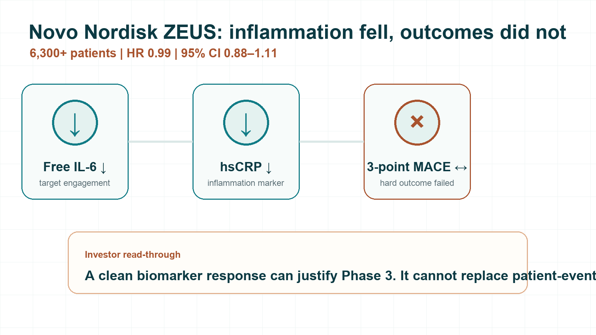
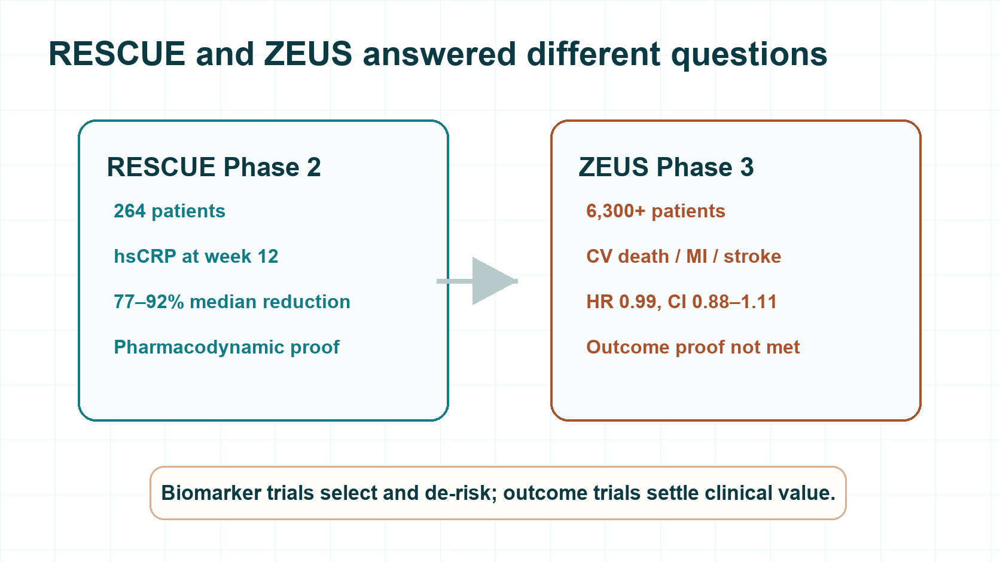
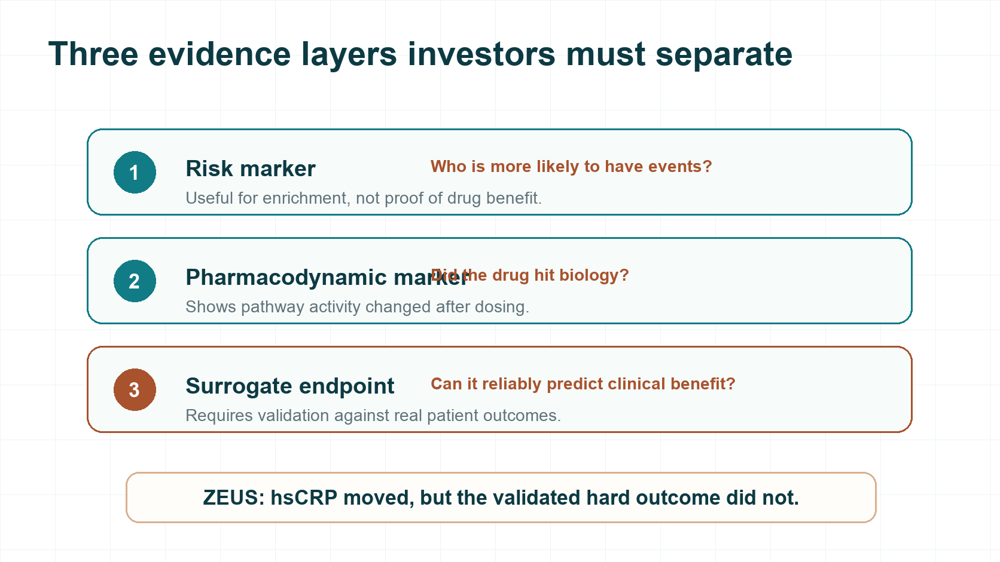
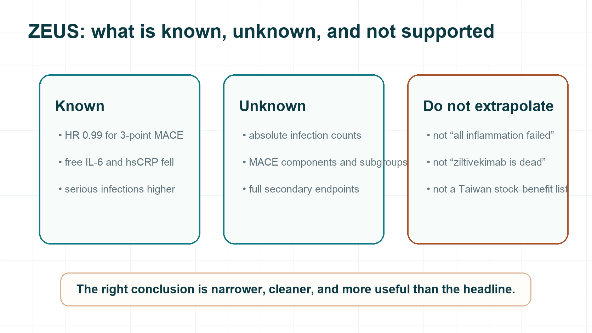

# Novo Nordisk’s Phase 3 Setback: A 6,300-Patient Textbook Lesson

On July 31, 2026, Novo Nordisk disclosed the Phase 3 ZEUS outcome trial for ziltivekimab.

The drug had looked almost ideal in Phase 2: inflammation markers fell sharply, dose response was clear, and the same pharmacodynamic signal was reproduced in Japanese participants. The market was waiting for the next step: proof that lowering inflammation could translate into fewer heart attacks or strokes.

What ZEUS delivered instead was blunt.

More than 6,300 patients. Primary endpoint hazard ratio 0.99. 95% confidence interval 0.88–1.11.

In this patient population, at this dose, under this follow-up structure, ziltivekimab did not prove that it could reduce major adverse cardiovascular events.

The harder contrast is that pharmacology was still there. Novo Nordisk said free IL-6 and high-sensitivity C-reactive protein, or hsCRP, fell as expected. Yet the three-point MACE endpoint—cardiovascular death, non-fatal myocardial infarction, and non-fatal stroke—did not move.

This drug hit the IL-6 pathway. It did not make patients suffer fewer heart attacks or strokes. For biotech investors, that kind of failure is more useful than a simple “the drug did nothing” story.

The question is not whether the biomarker moved. The question is why a nearly perfect biomarker story could not carry a hard outcomes trial.

*Figure 1 | ZEUS enrolled more than 6,300 patients; inflammation markers fell, but three-point MACE did not improve.*

## 01 | A Phase 2 star, a Phase 3 miss

ZEUS was a large, randomized, double-blind, placebo-controlled, event-driven cardiovascular outcomes trial.

Participants had established atherosclerotic cardiovascular disease, chronic kidney disease, and hsCRP of at least 2 mg/L. All patients received standard-of-care therapy. The study compared monthly subcutaneous ziltivekimab 15 mg with placebo.

The primary endpoint was three-point MACE: cardiovascular death, non-fatal myocardial infarction, and non-fatal stroke.

The final hazard ratio was 0.99.

That number should not be translated into “precisely zero effect.” The 95% confidence interval of 0.88–1.11 still allows for limited benefit or limited harm. But for development and regulatory purposes, the conclusion is clear: ZEUS did not demonstrate the prespecified primary endpoint benefit.

Safety also matters. Novo Nordisk said overall adverse events and serious adverse events were similar between groups, and all-cause mortality did not differ. But serious infections were higher in the ziltivekimab arm.

The most important lesson is that the drug appeared to engage the IL-6 pathway, yet patient outcomes did not improve.

## 02 | RESCUE really was strong, but it answered a different question

Ziltivekimab’s key Phase 2 study was RESCUE.

RESCUE was a randomized, double-blind, placebo-controlled study in 264 patients with stage 3 to 5 chronic kidney disease who were not on dialysis and had hsCRP of at least 2 mg/L. Patients were assigned to placebo or ziltivekimab 7.5 mg, 15 mg, or 30 mg every four weeks for up to 24 weeks.

The primary endpoint was change in hsCRP at week 12. The study was designed to ask whether the IL-6 pathway could be suppressed, how dose should be selected, and what short-term safety looked like.

The result was strong.

At week 12, median hsCRP reductions were 77%, 88%, and 92% for the 7.5 mg, 15 mg, and 30 mg groups, respectively. Placebo fell only 4%. Fibrinogen, serum amyloid A, haptoglobin, secretory phospholipase A2, and lipoprotein(a) also fell in a dose-related way.

From a pharmacodynamic perspective, that is an impressive answer: target engagement, a large inflammation-marker response, clear dose response, and 15 mg approaching a pharmacologic plateau.

But RESCUE proved that the drug could suppress the IL-6 pathway. It did not prove that patients would have fewer heart attacks, strokes, or cardiovascular deaths.

A 264-patient, 12-week biomarker trial was never built to answer that question. ZEUS was.

*Figure 2 | RESCUE and ZEUS answered different questions: biomarker response is not outcome proof.*

## 03 | Three layers investors must not confuse

ZEUS is easy to misread because investors often compress three different kinds of evidence into one story.

The first layer is a risk marker.

A higher value identifies patients who are more likely to have future events. It helps describe who is at risk.

The second layer is a pharmacodynamic marker.

A marker changes after dosing, showing that the drug has produced a biological effect. The reductions in free IL-6 and hsCRP belong here.

The third layer is a surrogate endpoint.

This is a much higher bar. A surrogate must be supported by enough evidence to reliably predict clinical benefit.

A marker can predict risk and respond beautifully to therapy, yet still fail to stand in for heart attack, stroke, or death.

ZEUS drew that line clearly. hsCRP helped identify a high-risk inflammatory population. It also showed that the IL-6 pathway was being suppressed. But a large hsCRP reduction did not translate into fewer three-point MACE events.

Could imaging have solved the gap? Not automatically.

Atherosclerosis is not a straight line where smaller plaque always means fewer events. Plaque vulnerability, local inflammation, thrombosis, and blood flow all matter. A local image also cannot represent the entire arterial system.

Darapladib is a warning. Early biomarker and plaque-related signals were not enough. In the large Phase 3 STABILITY trial, the primary cardiovascular endpoint was not significantly improved.

Imaging can strengthen an evidence package. Unless it has been validated as a surrogate endpoint, it still cannot replace major cardiovascular event trials.

*Figure 3 | Risk markers, pharmacodynamic markers, and surrogate endpoints sit on different evidence layers.*

## 04 | Two hypotheses, neither proven yet

There are two intuitive explanations for ZEUS.

First, the IL-6–CRP axis may be associated with risk without being the dominant driver of the next event in this ASCVD-plus-CKD population. In that case, the inflammatory marker can fall while the disease process that produces myocardial infarction or stroke continues.

Second, the drug may have delivered some anti-inflammatory or antithrombotic benefit, but that benefit may have been offset by infection or by other liabilities not captured by the biomarkers that were measured.

Both are plausible. Neither is proven yet.

Novo Nordisk has disclosed a higher proportion of serious infections in the ziltivekimab arm, but not the absolute event counts, types, timing, or enough detail to prove that infections offset cardiovascular benefit. Small and short biomarker studies are not designed to reveal low-frequency, long-term risk with confidence.

The only firm conclusion today is that ZEUS missed its primary endpoint. The mechanism of failure still needs the full dataset.

## 05 | Cardiovascular history is full of beautiful markers that failed

ZEUS is not an isolated case.

The first example is the HDL cholesterol hypothesis. In ILLUMINATE, torcetrapib increased HDL-C by 72.1% and lowered LDL-C by 24.9%. Cardiovascular events increased by 25%, and all-cause mortality increased by 58%.

The second is triglycerides. In PROMINENT, pemafibrate lowered triglycerides by 26.2%, but the primary endpoint hazard ratio was 1.03. ApoB rose 4.8%. Lowering lipid content and lowering atherogenic particle burden are not the same thing.

The third is inflammation and plaque-related biology. Varespladib moved certain biomarkers in the intended direction, but VISTA-16 did not improve the primary endpoint and showed increased myocardial infarction risk. The trial was terminated early.

The fourth is homocysteine. NORVIT lowered homocysteine by about 27% with folic acid and B vitamins. The primary endpoint still did not improve.

The same lesson keeps coming back: changing a number associated with risk is not the same as changing patient fate. Between the two are causality, disease modification, and net clinical benefit.

ZEUS also does not kill the inflammation hypothesis.

CANTOS gave positive evidence. In patients with prior myocardial infarction and persistently elevated hsCRP, canakinumab 150 mg significantly reduced the primary cardiovascular endpoint, with an HR of 0.85. Fatal infection increased, and all-cause mortality did not significantly differ.

LoDoCo2 also showed that low-dose colchicine reduced the primary composite endpoint in chronic coronary disease: 6.8% versus 9.6%, HR 0.69.

Those trials show that certain anti-inflammatory interventions can reduce events in specific patients. Ziltivekimab still had to answer for itself.

The more precise conclusion is this: a biomarker must sit on a validated causal pathway, the drug must modify the disease process, and the clinical benefit must survive the subtraction of infection or other harm.

## 06 | Three questions before trusting a beautiful Phase 2 curve

The next time a Phase 1 or Phase 2 study lowers a biomarker by 80% or 90%, investors should not automatically price in Phase 3 success.

Ask three questions first.

One: is this number merely a risk marker, or has it been validated as a surrogate endpoint through hard-outcome trials?

Two: is the drug modifying a causal disease unit, or only changing a signal left behind by the disease process?

Three: is there an unbooked liability that the biomarker does not show—serious infection, toxicity, metabolic harm, or off-target biology—that only a large Phase 3 trial can settle?

If any of those answers is unclear, the Phase 2 curve can justify moving forward. It should not be discounted as if Phase 3 success were already earned.

## Conclusion | Every beautiful early chart is only a premise

Ziltivekimab’s Phase 2 data were not fake. They still matter.

They proved that the antibody could engage the IL-6 pathway. They did not prove that patients would have fewer myocardial infarctions, strokes, or cardiovascular deaths.

In cardiovascular drug development, that final question is the only one that settles the account.

Risk signal, target engagement, biomarker movement, and patient outcome are four different evidence layers. A beautiful earlier layer cannot prepay success in the next one.

ZEUS has simply confirmed the old rule again: in cardiovascular medicine, the final invoice is paid in patient events. The beautiful numbers before that only earn a drug the right to enter the final.

*Figure 4 | What ZEUS tells us, what remains unknown, and what investors should not extrapolate.*

## References

1. [Novo Nordisk ZEUS headline results](https://www.novonordisk.com/news-and-media/news-and-ir-materials/news-details.html?id=916587)
2. [ZEUS study registration](https://clinicaltrials.gov/study/NCT05021835)
3. [RESCUE phase 2 trial](https://pubmed.ncbi.nlm.nih.gov/34015342/)
4. [ILLUMINATE](https://www.nejm.org/doi/full/10.1056/NEJMoa0706628)
5. [PROMINENT](https://pubmed.ncbi.nlm.nih.gov/36342113/)
6. [STABILITY](https://www.nejm.org/doi/full/10.1056/NEJMoa1315878)
7. [VISTA-16](https://pubmed.ncbi.nlm.nih.gov/24247616/)
8. [NORVIT](https://www.nejm.org/doi/full/10.1056/NEJMoa055227)
9. [CANTOS](https://www.nejm.org/doi/full/10.1056/NEJMoa1707914)
10. [LoDoCo2](https://www.nejm.org/doi/full/10.1056/NEJMoa2021372)

## Disclaimer

This article is for biotech industry and capital-market analysis only. It is not medical advice, investment advice, or a recommendation to buy or sell securities. Clinical and investment decisions require full source data and professional judgment.
