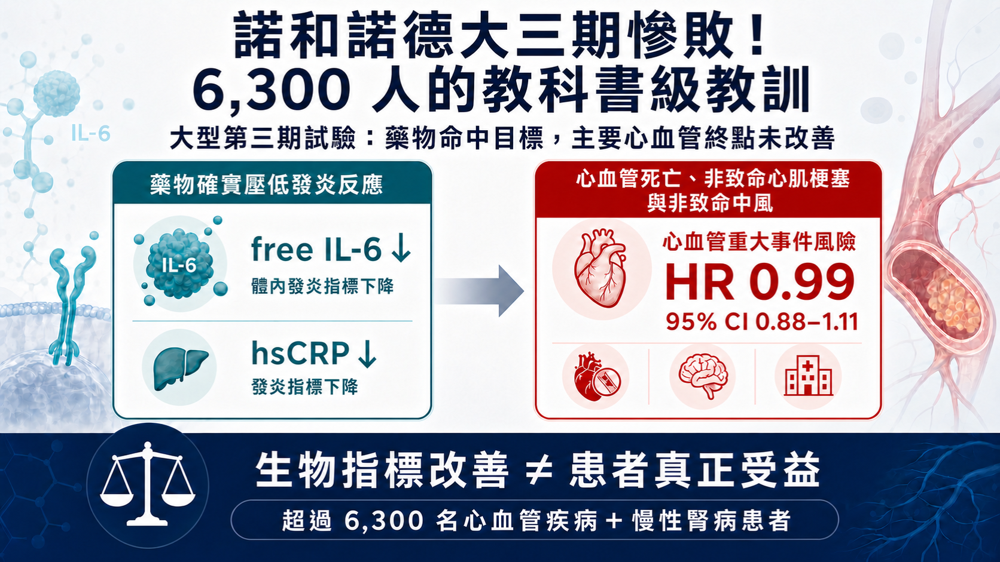
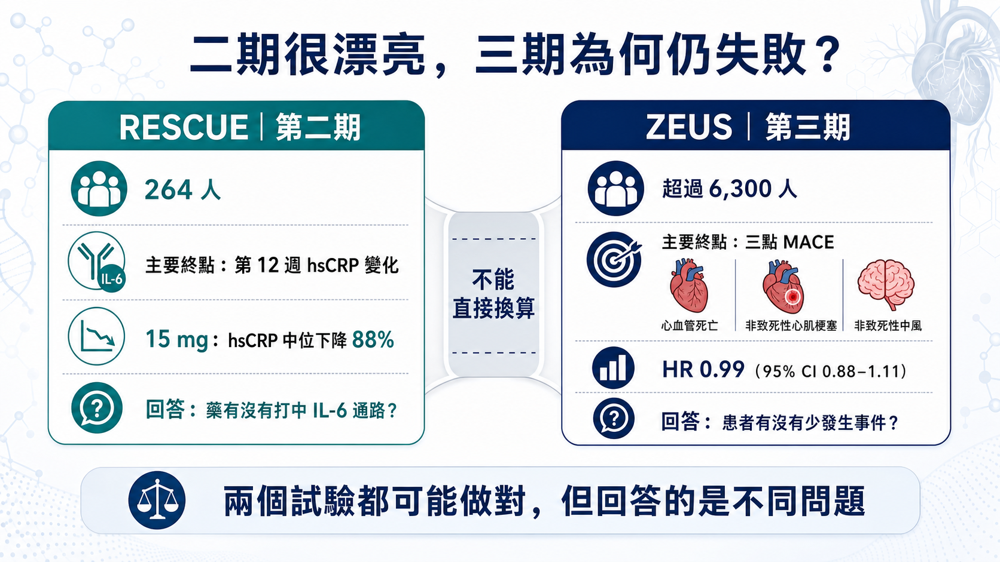
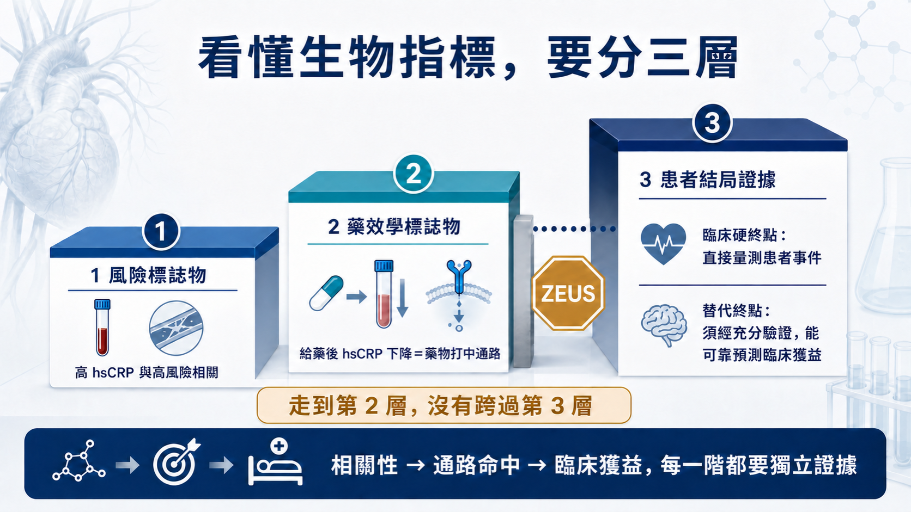
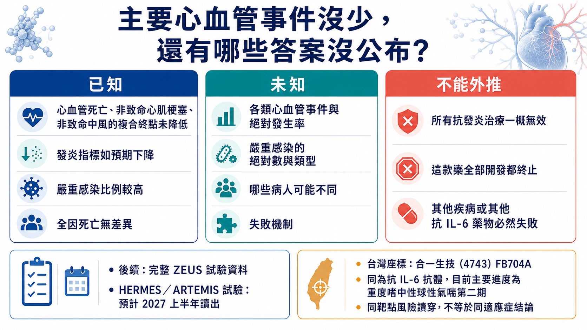

諾和諾德大三期慘敗！6,300 人的教科書級教訓

2026 年 7 月 31 日，諾和諾德公布 ziltivekimab 的 ZEUS 第三期結果。

這款藥在第二期幾乎交出一張滿分成績單：發炎指標大幅下降、劑量反應清楚，日本受試者也重現相同訊號。市場原本等著它證明「降發炎可以少一次心肌梗塞或中風」，最後等到的卻是——

超過 6,300 人，主要終點風險比（HR）0.99，95% 信賴區間 0.88–1.11。

ZEUS 給的答案很乾脆：在這群患者、這個劑量與追蹤條件下，ziltivekimab 沒有證明能降低重大心血管事件。

更強烈的反差是：藥效學訊號仍在。諾和諾德表示，游離 IL-6 與高敏感度 C 反應蛋白（hsCRP，常用的發炎指標）都如預期下降；但由心血管死亡、非致命心肌梗塞與非致命中風構成的三點重大心血管事件（MACE），就是沒有跟著下降。

這款藥確實打中 IL-6 通路，卻沒讓患者少一次心肌梗塞或中風。對生技產業來說，這種失敗比「藥完全沒作用」更值得記住。

為什麼第一、二期把發炎指標幾乎打穿，仍然推不出第三期硬終點成功？ZEUS 是最新的一堂課。

*圖1｜ZEUS 超過 6,300 人、HR 0.99，發炎指標下降但三點 MACE 未降低*

## 01｜二期明星，三期翻車

ZEUS 是一項大型、隨機、雙盲、安慰劑對照、事件驅動的心血管結局試驗。

受試者已確診動脈粥樣硬化心血管疾病（ASCVD），同時患有慢性腎臟病（CKD），而且 hsCRP 至少 2 mg/L。所有人都接受標準治療，再比較每月一次皮下注射 ziltivekimab 15 mg 與安慰劑。

主要終點是三點 MACE：心血管死亡、非致命心肌梗塞與非致命中風。

最後 HR 是 0.99。

這個數字不能被翻成「精確證明零效果」。95% 信賴區間 0.88–1.11，仍容納有限的效益或有限的傷害；但在開發與監管上，結論已經很清楚：ZEUS 沒有證明預設的主要終點獲益。

安全性也出現一筆不能忽視的帳。公司表示，兩組整體不良事件與嚴重不良事件比例相近，全因死亡沒有差異，但 ziltivekimab 組的嚴重感染比例較高。

這場失敗最值得研究的地方，正是藥物命中了 IL-6 通路，卻沒有換來患者結局的改善。

*圖2｜RESCUE 與 ZEUS 回答不同問題，二期 biomarker 不能直接外推三期硬終點*

## 02｜第二期有多漂亮？幾乎把發炎指標打穿

Ziltivekimab 的核心第二期研究是 RESCUE。

這項隨機、雙盲、安慰劑對照試驗納入 264 名第三至第五期慢性腎臟病、尚未透析且 hsCRP 至少 2 mg/L 的高風險患者，分成安慰劑與 7.5、15、30 mg 三個劑量組，每四週注射一次，最長治療 24 週。

主要終點是第 12 週 hsCRP 變化，回答的是能否壓住 IL-6 路徑、劑量怎麼選與短期安全性。

結果非常強。

第 12 週，7.5、15、30 mg 組的 hsCRP 中位降幅分別為 77%、88% 與 92%；安慰劑組只有 4%。纖維蛋白原、血清澱粉樣蛋白 A、觸珠蛋白、分泌型磷脂酶 A2 與脂蛋白(a)也出現劑量相關下降。

從藥效學角度看，這是一張漂亮答卷：靶點命中、發炎指標大降、劑量反應清楚，15 mg 也接近藥效平台。

RESCUE 真實證明了藥物能壓低 IL-6 通路；264 人、12 週的設計，原本就無法回答心肌梗塞、中風、死亡與低頻長期感染。ZEUS 接手的正是這張考卷。

*圖3｜風險標誌物、藥效學標誌物與替代終點是三種不同證據層級*

## 03｜三種指標，一定要分開看

這場失敗之所以容易被誤讀，是因為三種性質完全不同的指標，常被市場混成同一件事。

第一種是風險標誌物。

某個數值較高的人，未來比較容易出事；它先描述的是「誰風險較高」。

第二種是藥效學標誌物。

給藥後指標照預期改變，證明藥物產生生物學作用。游離 IL-6 與 hsCRP 下降，就屬於這一層。

第三種才是替代終點。

它的門檻最高：必須經過足夠試驗證明，改善這個指標能可靠預測患者結局也會改善。

風險預測與藥效反應都可能很準，仍不足以取代心肌梗塞、中風與死亡等臨床事件。

ZEUS 正好把這條界線劃得很清楚：hsCRP 幫研究團隊找到帶有全身性發炎的高風險患者，也忠實反映 IL-6 被壓下去；但 hsCRP 大幅下降，並沒有讓三點 MACE 跟著下降。

接著看 hsCRP 與血管斑塊。

hsCRP 能標出高風險患者，也受腎臟病、代謝與感染影響。它可能只是伴隨訊號，或只涵蓋部分致病路徑；目前完整 MACE 分項、事件率與亞組尚未公布，因此這些都只是待驗證的解釋。

影像能不能補上這一格？

如果抽血指標不夠，直接看血管斑塊影像可以嗎？

答案仍然是：可以增加證據，但不能自動取代臨床事件。

動脈粥樣硬化不是「斑塊越大，事件一定越多」的直線關係。斑塊脆弱度、局部發炎、血栓與血流都會影響事件；局部影像也無法代表全身動脈。

Darapladib 就是警告：早期曾出現酵素與斑塊訊號，後來大型第三期 STABILITY 的主要心血管終點仍未顯著改善。

影像仍能補強證據；只要尚未被充分驗證為替代終點，它就不能取代實際的重大心血管事件試驗。

## 04｜ZEUS 為什麼失敗？目前只有兩個假說

回到 ZEUS，目前有兩種最直觀的解釋。

第一種，IL-6—CRP 軸雖然和風險相關，卻可能沒有主導這群 ASCVD＋CKD 患者的下一次事件；發炎指標降下來，造成心肌梗塞或中風的核心病程仍繼續往前。

第二種，藥物可能帶來部分抗發炎或抗血栓效益，但被感染或其他未被目前生物指標捕捉的代價抵銷，最後讓淨效益回到接近零。

兩種說法都合理，但現在都還不能被當成定論。

公司只說嚴重感染比例較高，尚未公布絕對人數、類型與時序，也沒有證明「感染抵銷效益」。小型、短期試驗本來就難以看清低頻風險。

現在能確定的只有主要終點失敗；失敗機制仍待完整資料回答。

## 05｜漂亮數字翻車，心血管史上早有前例

把 ZEUS 放回心血管藥物開發史，它並不孤單。

第一類是「好膽固醇」假說。

Torcetrapib 在 ILLUMINATE 讓 HDL-C 上升 72.1%、LDL-C 下降 24.9%，心血管事件反而增加 25%，全因死亡增加 58%。

第二類是三酸甘油酯。

PROMINENT 中，pemafibrate 讓三酸甘油酯下降 26.2%，主要終點卻是 HR 1.03；ApoB 反而上升 4.8%。降低脂質含量，和減少顆粒數並不是同一件事。

第三類是發炎與斑塊相關指標。

Varespladib 曾讓相關生物指標朝有利方向變化，最後 VISTA-16 既沒改善主要終點，心肌梗塞風險還增加，試驗提前終止。

第四類是同半胱胺酸。

NORVIT 用葉酸與維生素 B 群把同半胱胺酸降低約 27%，主要終點仍沒有獲益。能預測疾病的指標，不一定位在可改變結局的因果鏈上。

這一系列歷史試驗反覆提醒同一件事：一款藥改變了與風險相關的數字，和它改變了患者命運，中間還隔著因果、疾病修飾與淨臨床效益三道關卡。

可是，ZEUS 也沒有推翻整個發炎假說。

如果因此得到「所有生物指標都不可信」或「抗發炎治心血管全部無效」的結論，又會犯另一種錯。

CANTOS 提供過正面證據。IL-1β 抗體 canakinumab 在既往心肌梗塞、hsCRP 持續升高患者中，150 mg 組顯著降低主要心血管終點，HR 0.85；但致命性感染增加，全因死亡沒有顯著差異。

LoDoCo2 也顯示，慢性冠狀動脈疾病患者使用低劑量 colchicine，主要複合終點為 6.8% 對 9.6%，HR 0.69。

這些研究證明特定抗發炎介入能在特定患者降低事件；ziltivekimab 仍必須靠自己的試驗作答。

更精準的結論是：生物指標必須代表經過驗證的因果通路，藥物也要改變疾病過程，最後再扣掉感染或其他傷害，才可能預測患者獲益。

## 06｜看到漂亮的第二期，先問這三題

下一次看到第一、二期把某個生物指標壓低 80%、90%，先不要把第三期成功當成預設答案，而要先問三件事：

第一，這個數字是風險標誌物，還是已被硬終點試驗驗證過的替代終點？

第二，藥物改變的是疾病的致病單元，還是病程留下的伴隨訊號？

第三，有沒有一筆生物指標沒寫在帳上的負債——感染、毒性、代謝或其他脫靶風險——會等到大型第三期才結算？

這三題只要有一題答不清楚，漂亮的第二期曲線可以支持「值得進第三期」，卻不應被直接折算成「第三期理應成功」。

*圖4｜ZEUS 目前已知、未知與不能外推的結論邊界*

## 結語｜前面每一張漂亮圖，都只是前提

Ziltivekimab 的第二期資料沒有造假，也沒有失去價值。

它證明這款抗體能命中 IL-6 通路，卻沒有證明患者能少一次心肌梗塞、中風或心血管死亡。

而在心血管領域，這恰恰是最後唯一能結帳的問題。

風險訊號、靶點命中、生物指標與患者結局，是四層不同證據。前一層再漂亮，也不能替下一層預支成功。

ZEUS 只是再一次確認：

心血管新藥最後能結帳的，仍是患者事件；前面的漂亮數字，只負責把它送進決賽。

## 參考資料

1. [Novo Nordisk，ZEUS 第三期結果](https://www.novonordisk.com/news-and-media/news-and-ir-materials/news-details.html?id=916587)
2. [ZEUS 登錄](https://clinicaltrials.gov/study/NCT05021835)
3. [RESCUE](https://pubmed.ncbi.nlm.nih.gov/34015342/)
4. [ILLUMINATE](https://www.nejm.org/doi/full/10.1056/NEJMoa0706628)
5. [PROMINENT](https://pubmed.ncbi.nlm.nih.gov/36342113/)
6. [STABILITY](https://www.nejm.org/doi/full/10.1056/NEJMoa1315878)
7. [VISTA-16](https://pubmed.ncbi.nlm.nih.gov/24247616/)
8. [NORVIT](https://www.nejm.org/doi/full/10.1056/NEJMoa055227)
9. [CANTOS](https://www.nejm.org/doi/full/10.1056/NEJMoa1707914)
10. [LoDoCo2](https://www.nejm.org/doi/full/10.1056/NEJMoa2021372)
